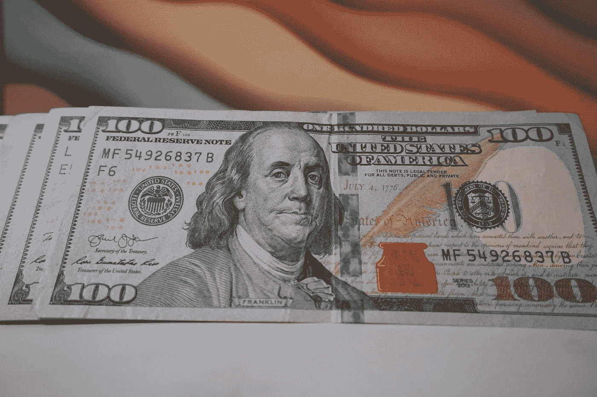

# 2022 年 7 月最佳 2 只分红股票

> 原文：<https://medium.com/coinmonks/best-2-dividend-stocks-in-july-2022-7c872bf74b6e?source=collection_archive---------11----------------------->

Source photo Unsplash.com

# 奥驰亚

这是股息投资者的最爱，因为奥驰亚(纽约证券交易所代码:MO)以股息形式支付令人印象深刻的 8.02%。奥驰亚是一只罪恶的股票，罪恶现在风靡一时，所以寻找市场触发因素的投资者很快就会爱上它。

《华尔街日报》最近抨击奥驰亚在其产品中依赖香烟…