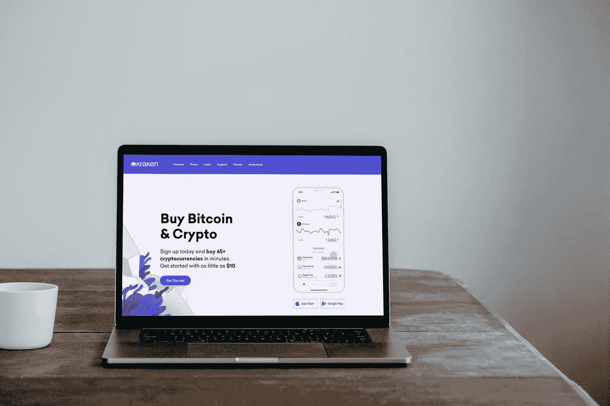

# 2022 年 12 月购买的最佳 3 种替代硬币

> 原文：<https://medium.com/coinmonks/best-3-altcoins-to-buy-in-december-2022-f022cea8b8f6?source=collection_archive---------22----------------------->

Source photo [HD photo by PiggyBank (unsplash.com)](https://unsplash.com/photos/c6-y-FXHsIs)

# 卡尔达诺

Cardano 的创新方法和基础设施帮助其在拥挤的加密货币市场中迅速脱颖而出。在过去 12 个月中，它已成为市场上交易最活跃的加密货币之一。2021 年，当著名的阿隆佐硬叉子首次发布时，ADA 的价格飙升至创纪录的 3.10 美元。