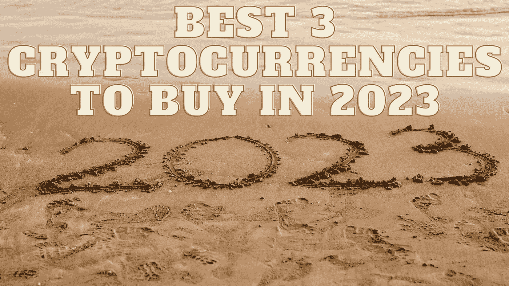

# 2023 年最值得购买的 3 种加密货币

> 原文：<https://medium.com/coinmonks/best-3-cryptocurrencies-to-buy-in-2023-5b664ff3ddb5?source=collection_archive---------19----------------------->

Source photo Unsplash.com

# 币安硬币(BNB)

很少有加密货币可以与币安硬币的长寿和快速扩张相媲美。虽然到 2021 年底，它只活跃了四年多一点，但硬币的价格已经比其 ICO 水平上涨了 45，000%以上。它熬过了始于 2021 年初的严冬和始料未及的市场崩溃…