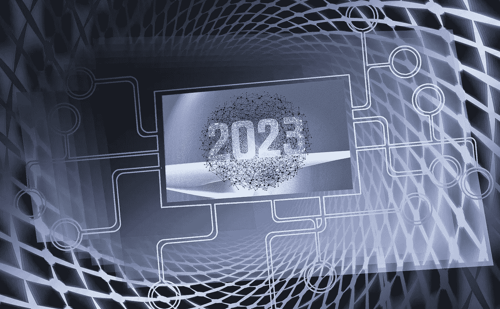

# 2023 年最值得购买的 3 种加密货币，12 月 13 日更新

> 原文：<https://medium.com/coinmonks/best-3-cryptocurrencies-to-buy-in-2023-update-13th-of-december-bf0a38fc53ed?source=collection_archive---------21----------------------->

Source photo [Ziua De Anul Nou 2023 Reţea — Imagine gratuită pe Pixabay](https://pixabay.com/ro/illustrations/ziua-de-anul-nou-2023-re%c5%a3ea-7580782/)

# 以太坊

当提到唯一的另一种主要加密货币时，以太坊通常被用作以太的简写，以太是以太坊网络上的原生硬币。虽然比特币超过 1900 亿美元的市值令所有其他货币相形见绌，但莱特币超过 1500 亿美元的市值是第二大代币的三倍多(不包括…