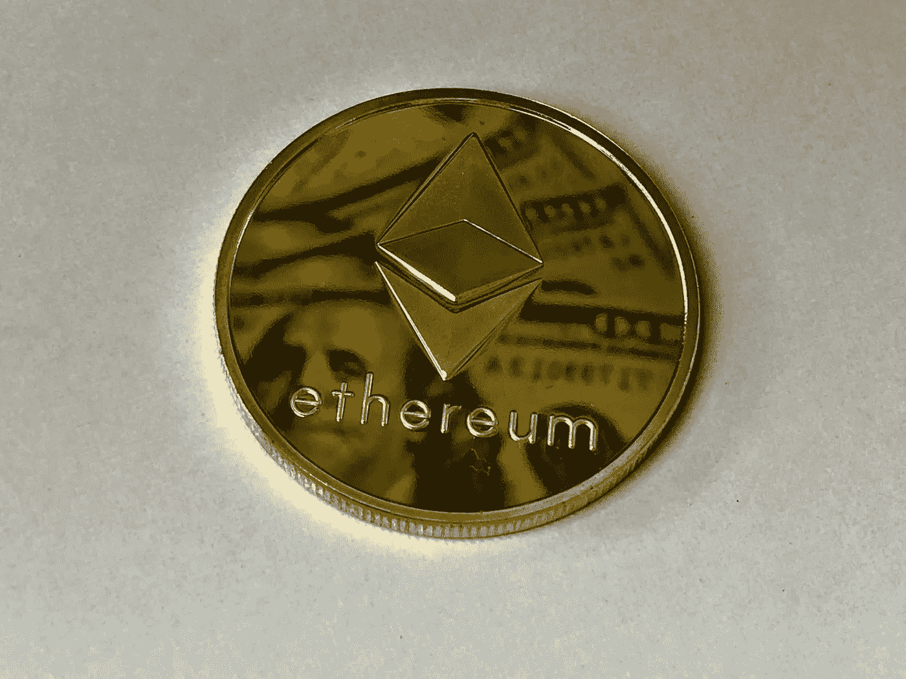

# 现在最值得购买的 3 种加密货币

> 原文：<https://medium.com/coinmonks/best-3-cryptocurrencies-to-buy-right-now-6f8d1fb09694?source=collection_archive---------20----------------------->

# 以太坊

Source photo [Round Gold-colored Ethereum Ornament · Free Stock Photo (pexels.com)](https://www.pexels.com/photo/round-gold-colored-ethereum-ornament-730552/)

以太坊(ETH)是一种已经存在了一段时间的加密货币，用于开发分散网络上的智能合同。今年，它经历了一次被称为“合并”的升级，其中包括采用利益相关者共识机制。凭借更具可扩展性和能效的基础，ETH 现在可以更好地面向未来。