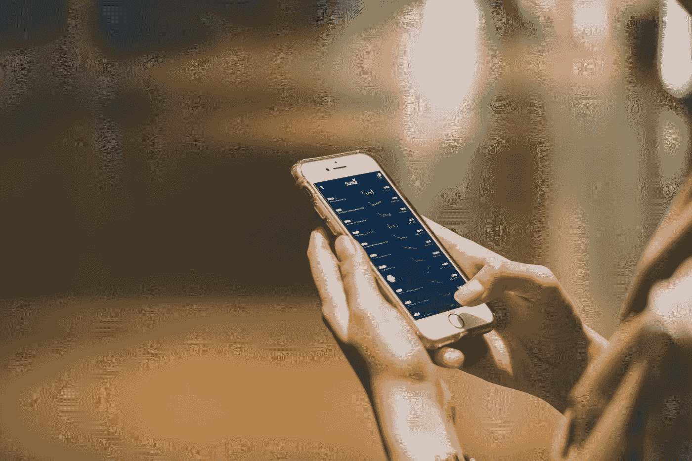

# 今天，12 月 14 日，购买最佳的 3 种密码

> 原文：<https://medium.com/coinmonks/best-3-cryptos-to-buy-today-14th-of-december-486091fab7b3?source=collection_archive---------31----------------------->

Source photo [Afaceri Smartphone Mâini — Fotografie gratuită pe Pixabay](https://pixabay.com/ro/photos/afaceri-smartphone-m%c3%a2ini-tehnologie-7304257/)

# 币安硬币(BNB)

币安硬币是该交易所的专有令牌，也是世界上交易量最大的加密货币。最初，币安币只是交易费用折扣的象征，现在已经发展成为世界上最受欢迎和最广泛采用的智能合约平台之一 Binance.com 背后的驱动力。用 BNB 做酒店…