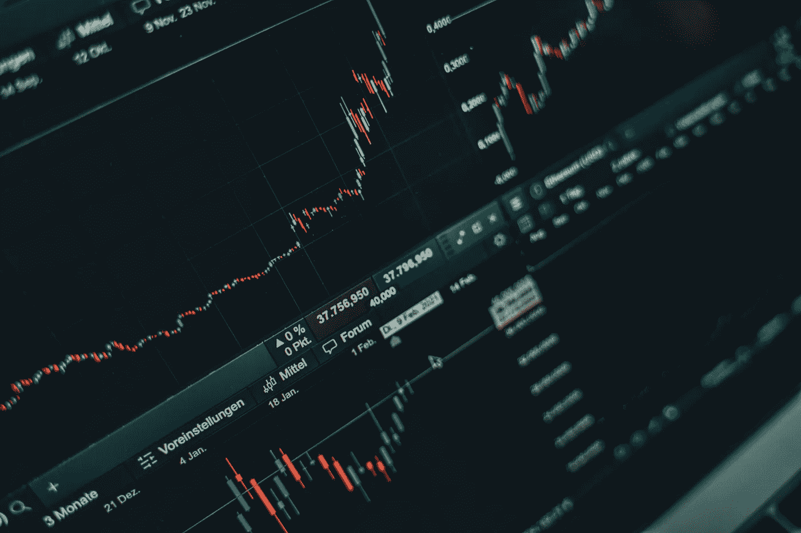

# 2023 年 1 月最值得购买的 3 只股票

> 原文：<https://medium.com/coinmonks/best-3-stocks-to-buy-in-january-2023-68614ce16bce?source=collection_archive---------13----------------------->

Source photo [Multiple Graphs on a Laptop Screen · Free Stock Photo (pexels.com)](https://www.pexels.com/photo/multiple-graphs-on-a-laptop-screen-6770610/)

# 字母表(谷歌，谷歌)

尽管 Alphabet 曾经是世界上最具创新性的公司中家喻户晓的品牌，但它现在处于未知的水域。从股票价值来看，GOOG(C 类)股票自今年年初以来下跌了 38%。核心业务仍可能是 2023 年买入的最佳科技股之一。