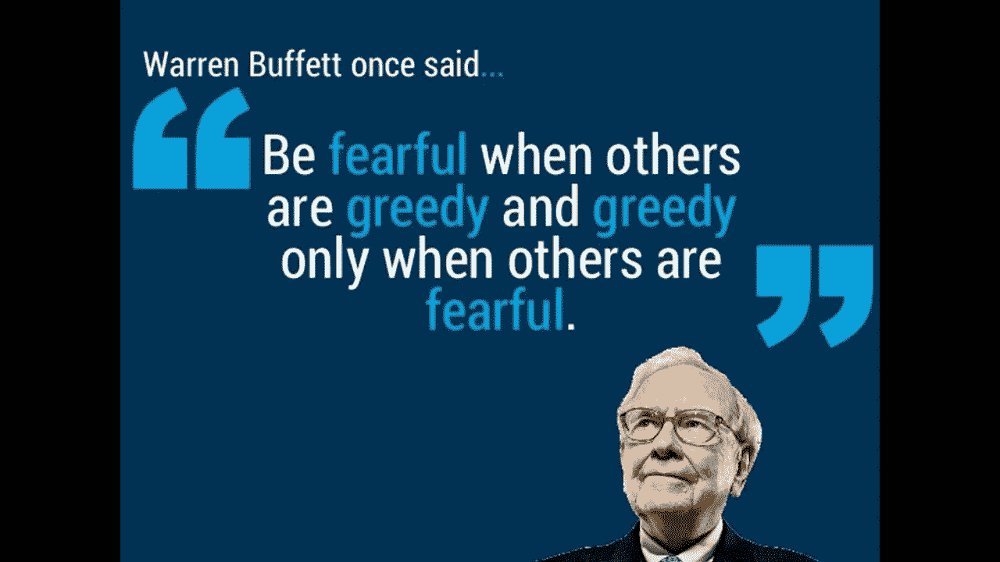

# 2023 年前你投资组合中必须拥有的 4 只最佳沃伦·巴菲特股票

> 原文：<https://medium.com/coinmonks/best-3-warrent-buffett-stocks-that-you-must-have-in-portfolio-before-2023-a0e0b090d79f?source=collection_archive---------22----------------------->

Source photo [warren buffett quotes — Bing images](https://www.bing.com/images/search?view=detailV2&ccid=IEdHaubZ&id=6010BB48248D5B0776D101545219A81D38FE8164&thid=OIP.IEdHaubZwkdoKO2LRUn0_AHaEK&mediaurl=https%3A%2F%2Fi.ytimg.com%2Fvi%2FWcgNrKj0svA%2Fmaxresdefault.jpg&cdnurl=https%3A%2F%2Fth.bing.com%2Fth%2Fid%2FR.2047476ae6d9c2476828ed8b4549f4fc%3Frik%3DZIH%252bOB2oGVJUAQ%26pid%3DImgRaw%26r%3D0&exph=720&expw=1280&q=warren+buffett+quotes&simid=608034960089029847&form=IRPRST&ck=3EC9A29370E306033E7DCF346BC989B3&selectedindex=20&ajaxhist=0&ajaxserp=0&pivotparams=insightsToken%3Dccid_OsH8TSHr*cp_3167FF9A7C1477E77DD44C81224A8C0C*mid_EAF704BCE86060540AD9D0678D2D91ABE7F37A86*simid_608045817779531243*thid_OIP.OsH8TSHr1Lk-4krxqpVIGAHaCx&vt=0&sim=11&iss=VSI&ajaxhist=0&ajaxserp=0)

# 苹果公司(AAPL)

苹果公司(纳斯达克代码:AAPL)发布了全新的 iPhone 14 系列。对于许多持有 AAPL 股票的人来说，这是一个关键指标。这是由于消费者对 iPhones 的需求上升是苹果收入和利润率增长的首要因素。因此，投资者的信心受到了…