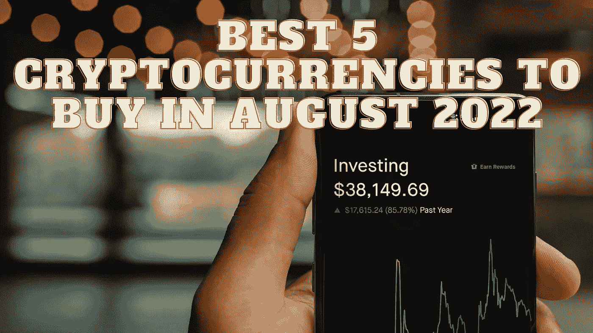

# 2022 年 8 月最值得购买的 5 种加密货币

> 原文：<https://medium.com/coinmonks/best-5-cryptocurrencies-to-buy-in-august-2022-8d143166272?source=collection_archive---------14----------------------->

Source photo Unsplash.com

# 比特币(BTC)

截至 8 月 13 日，比特币(BTC)在所有加密货币中市值最高。

比特币(BTC)已经从 6 月份的市场崩盘中恢复了 30%，大多数分析师都认为这种加密货币已经达到了熊市底部。此外，令人鼓舞的 CPI 数据也起到了推动作用。比特币(BTC)被很多人看…