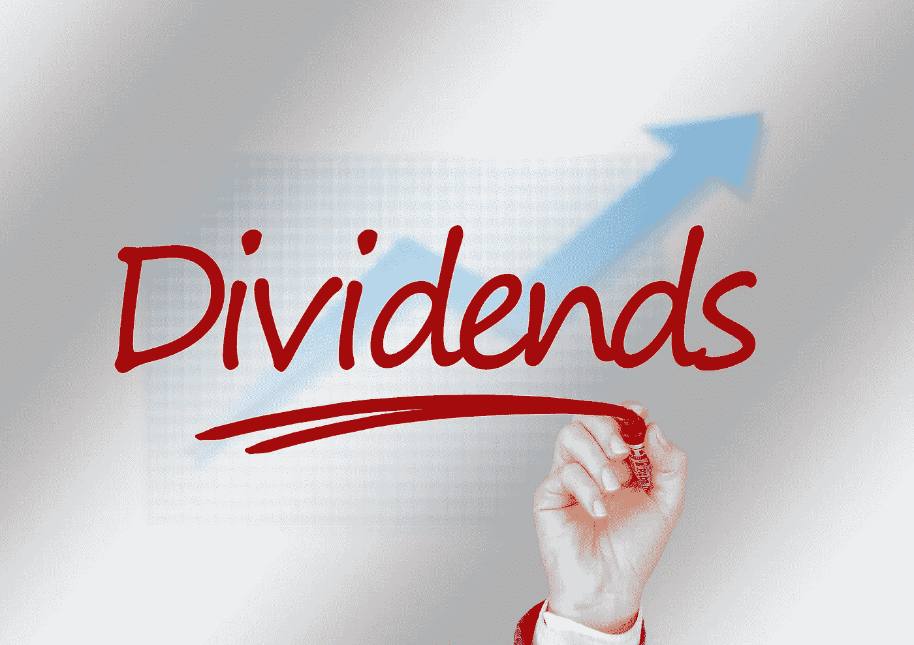

# 现在最好买的 5 只分红股票

> 原文：<https://medium.com/coinmonks/best-5-dividend-stocks-to-buy-right-now-3c412948d2e7?source=collection_archive---------22----------------------->

Source photo [Mark Marker Hand — Free image on Pixabay](https://pixabay.com/illustrations/mark-marker-hand-write-glass-804936/)

# 麦当劳(MCD)

如果说我多年来一直关注麦当劳(NYSE:MCD)的股票学到了什么的话，那就是这家公司总是在投资者最意想不到的时候出现。以今年为例。尽管餐饮业普遍低迷，但该股同比上涨约 1%。MCD 股票现在创下了 276.67 美元的历史新高。