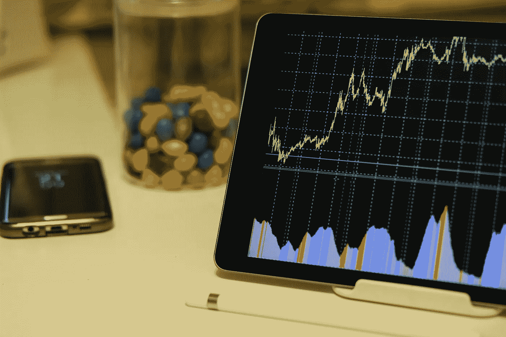

# 现在最好买的 5 只股票

> 原文：<https://medium.com/coinmonks/best-5-stocks-to-buy-right-now-61aae659272f?source=collection_archive---------35----------------------->

Source photo [White Android Tablet Turned on Displaying a Graph · Free Stock Photo (pexels.com)](https://www.pexels.com/photo/white-android-tablet-turned-on-displaying-a-graph-186464/)

# 洛克希德·马丁公司

乌克兰以及美国与中国、朝鲜和俄罗斯之间持续的地缘政治紧张局势给洛克希德·马丁公司(纽约证券交易所代码:LMT)带来了好处，洛克希德·马丁公司是世界上最大和最知名的国防承包商之一。

仅在过去的两天里，伦敦金属交易所就获得了两项总额分别为 4.3 亿美元和 1.39 亿美元的合同