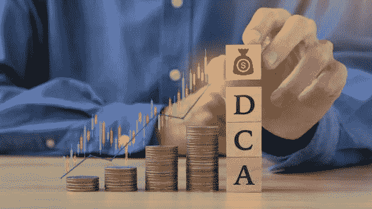

# 最佳熊市策略；美元成本平均法

> 原文：<https://medium.com/coinmonks/best-bear-market-strategy-dollar-cost-averaging-fa894e203fc6?source=collection_archive---------12----------------------->

## 如何在熊市期间建立强大的投资组合并持续获利？

image by [witsarut sakorn](https://www.istockphoto.com/portfolio/witsarutsakorn?mediatype=photography) on iStock

对投资者和交易者来说，一个非常普遍的问题是正确地把握市场时机。这与以最佳价格买卖都有关系。

美元成本平均法(DCA)通过分散你的平均买入价格和限制波动对你的投资组合的影响来帮助解决这个问题。

> 美元成本平均法是在一段时间内定期用等量的法定货币购买/投资一项资产，忽略价格。

这种方法可以限制一次投入大量资金的不良交易对投资的影响。

**成本平均法的工作原理**

让我们解释一个使用 DCA 的例子:

假设你想投资一个金额为 12000 美元的比特币。你每月分摊一次，持续一年——这意味着每个月，无论价格如何，你都可以购买价值 1000 美元的比特币。

这也可以每天或每周传播。

此外，你可能每月都有收入，并希望每月从收入中投资一笔固定金额的资产，这也是有效的。

因为市场的时机是一个即使是交易老手都面临的问题，DCA 无论是在短期交易还是长期投资中都可以帮到你。

在短线交易中，即使你已经分析了市场的走向，选择合适的时机和进入也是很困难的。

当市场波动和横向移动时，使用 DCAcan 平滑你的进场价格。

这也可以帮助你卖出或锁定利润——这最终取决于你的交易风格。

在长期投资中，DCA 可能是买入并持有的投资者的最佳策略，因为他们知道市场将长期上涨。分散他们的资本，间隔买入，利用了波动性。

**如何在秘密熊市中使用美元成本平均法**

秘密熊市以暴跌的价格和横盘走势而闻名。在等待下一个牛市的时候，建立一个稳固的投资组合是明智的。因此，当它到来的时候，你的收获会超过月亮。

DYOR——做自己的研究(DYOR)是建立一个好的投资组合的第一步。这使你能够投资正确的资产。

建立投资组合:根据你所做的研究，建立一个由 3-4 项你将定期投资的资产组成的投资组合——这样做的原因是多样化。这应该是蓝筹(低风险)资产(如$比特币)和第一层(中等风险)资产(如$AVAX)的混合

第三步是每月分散你的资金。为什么？因为根据过去的事件，在另一轮牛市开始之前，加密市场至少需要两年时间。因此，每月投资固定金额会给你一个不错的平均买入价格。这应该在你的投资组合资产中平均分配。

为了说明这一点:

你已经做了调查，你想用$比特币、$BNB 和$索尔建立一个投资组合。

您每月有 10，000 美元的固定金额用于 DCA，为期两年(24 个月)。

10，000 美元分成 24 份，每月可得 416.7 美元。

416.7 美元平均分配到你的 3 个投资组合资产中，每个月你可以得到 138.9 美元。

简而言之——两年内，每月将有 138.9 美元投入到你的每项资产中。

这可以在像币安这样的交易所实现自动化。

如果你是一个月收入者，你没有大量的资金投入，你可以从你的月收入中为每个投资组合资产留出固定的金额。

dcabtc.com 的[有一个简单易用的比特币平均成本计算器。这为您提供了 DCA 策略在一段时间内将如何执行的详细信息。您可以指定时间范围/间隔和数量，并获得结果。随着时间的推移，这一策略已经奏效。](http://dcabtc.com)

总之，使用 DCA 策略在秘密熊市中建仓已被证明是有利可图的，因为它利用了波动性和低价，并在牛市到来时实现利润最大化。然而，研究是实现这一目标的一部分。

> 交易新手？试试[密码交易机器人](/coinmonks/crypto-trading-bot-c2ffce8acb2a)或[复制交易](/coinmonks/top-10-crypto-copy-trading-platforms-for-beginners-d0c37c7d698c)