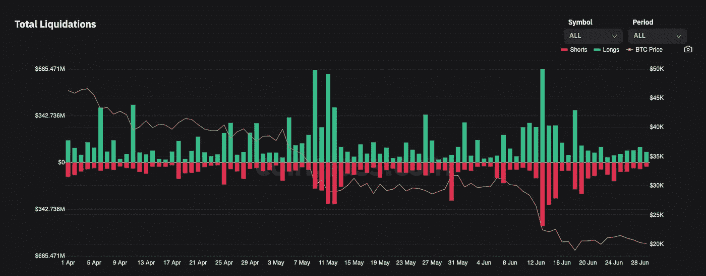

# 我对比特币未来的看法——加密货币的熊市和牛市

> 原文：<https://medium.com/coinmonks/best-bitcoin-fundamental-technical-analysis-in-2022-bear-and-bull-case-for-cryptocurrency-c72cdfbecddc?source=collection_archive---------9----------------------->

## 2022 比特币基本面分析和技术分析你需要知道的一切


```
Bitcoin Fundamental & Technical Analysis - 2022
1.[Bitcoin Macro-economic Outlook 2022](#0418)
2.[Fundamentals Has NOT changed !!!](#ad5a)
3.[Bitcoin Technical analysis — Current Price Movements](#b326)
4.[Price Targets for BTC — Bull case and Bear case](#c7fb)
5.[Things to look out for in 3Q, 4Q22](#5da3)
6.[Conclusion & Strategy](#797d)
```

# 2022 年比特币宏观经济展望

过去一年，比特币和美国股票的相关性越来越强，纳斯达克和 BTC 之间的相关性目前已达到 0.9。人们并不认为比特币是一种通胀对冲或避险资产，相反，比特币与其他科技股一样，被定价为一种风险资产。市场目前将 BTC 视为一只科技股，该股受到衰退担忧和美联储加息的严重影响。


Bitcoin & NASDAQ correlation chart

随着 DXY 指数飙升，达到 20 年来的最高水平，市场正在转向避险投资环境。BTC 已从历史高点下跌 74%，过去一周一直横盘整理。

# 基本面没有变！！！

虽然比特币的价格受到了重创，但比特币的基本面正在不断改善。

纵观历年**活跃地址数**。虽然目前不是最高水平，但活跃地址的数量呈上升趋势。表明比特币的使用率有所上升。


Bitcoin number of active addresses

**交易所净头寸变化**目前正着眼于接近 COVID 崩溃水平至-15 万流出量/月左右。这表明人们在交易所买买买，但不在交易所卖 BTC。或者，鉴于最近的 Celsius 事件，这只是表明人们正在避免 CeFi 交易所持有他们的密码。[转到我的另一个[故事](/@tvstsang/celsius-network-crash-what-happened-to-celsius-network-adc363387c21)来了解[摄氏度](/@tvstsang/celsius-network-crash-what-happened-to-celsius-network-adc363387c21)发生了什么，所以我会说这在当前的熊市周期中不会是一个准确的指标，但总体而言，它表明了 DeFi 和 Crypto 的增长和需求。


Bitcoin Net outflow from Exchanges

尽管基本面坚实，我仍然保持谨慎，因为这是比特币第一次经历真正的熊市或潜在的衰退。在加密领域，事情可能会变得很糟糕。

# 比特币技术分析——当前价格变动

通过使用比特币价格图表和技术指标，我能够勾勒出比特币价格的范围。我再次长期看好比特币，但鉴于糟糕的宏观经济环境，很难相信比特币会在未来几个月暴涨。

该图表在 5 月份形成了一个**熊市旗**，因此上升通道被打破后，价格随之下跌。价格走势确实遵循了熊市的预测，跌破了上一个周期的峰值 19，700 美元。BTC 价格迅速反弹至 20，000 美元，并一直在该水平附近盘整至今。


Bitcoin Bear flag formed in May 2022

# BTC 的价格目标——牛市和熊市

这是我画的图表。在跌至 1.7 万至 1.8 万美元之前，我认为 1.9 万至 2 万美元是一个重要的阻力。如果 19，000-20，000 美元不成立，我将关注 12，000-13，000 美元的地区。

对于希望投资 5 至 10 年的长期投资者来说，有些人会慢慢增加 1.2 万至 2 万美元的区间。你可以参照时间期限或价格水平来做 DCA，这真的取决于你想要什么。

如果价格真的突破了 12，000 美元的阻力，我会考虑 10，000 美元，最坏的情况是 6，500 美元，以获得进一步的支持。


Bitcoin Chart Support and Resistance

根据下面的技术分析，12000 美元将是我的目标。比特币的价格此前一直被拒绝偏离蓝色趋势线，然后最终被 200 天形状记忆合金(紫色)拒绝。

我使用的分析被称为**计量移动**，我们假设先前的移动与未来的移动以美元计算具有相同的幅度。我们看到-35，800 美元从之前的高点移动到低点。然后我们形成红色的**空头旗帜图案**，失去上行通道支撑后价格下跌。如果我们预计同样的下跌幅度为-35，800 美元，我们将达到 12，000 美元的水平。


Bitcoin Measured Move

对于短期交易者，我认为在这种不确定性中，最好控制你的仓位大小。我认为，我们至少会反弹至 23，000 美元的阻力位，如果我们要突破，我会考虑 30，000 美元——至多 33，000 美元的水平。如果我们被拒绝离开 23，000 美元的水平，并失去 19，000-20，000 美元的流动性区域，我们将看到 12，000 美元的水平。12000 美元的水平对我来说是一个中期目标，我认为股票和比特币在未来几周或几个月内会有一个轻松的反弹。我认为最好交易从阻力(红线)的回调或交易支持(绿线)的重新测试。


Short Term Trading Strategy

**比特币的主导地位**被描述为比特币的市值与其他密码货币市场的比值。与 Alts 相比，这是比特币走强的一个很好的指标。与之前的熊市相似，比特币很可能会比 Alts 更强大。我预计比特币的主导地位将在短期内爆发，因此我将主要持有我长期投资组合中的比特币。


Bitcoin Dominance Chart 2022

# **在 3Q、4Q22** 中需要注意的事项

显而易见的事情是要注意美联储对进一步加息和通胀数据的态度，因为 Crypto 现在正在关注股市以及市场上的风险与非风险游戏。

> 市场大多预计，在即将到来的会议上，利率将上调 75 个基点。

CPI 数据和就业数据将是更广泛的经济环境的一个关键指标。当前市场对“好消息”的反应就像是对“坏消息”的反应一样，这意味着低失业率将为大幅加息提供更大的空间，这将对股票和密码市场不利。


Jerome Powell — FED FOMC meeting

另一个东西是**清算数据**。我的建议是密切关注鲸鱼钱包，寻找潜在的清算机会。正如我在[的上一篇文章](/@tvstsang/celsius-network-crash-what-happened-to-celsius-network-adc363387c21)中提到的，在多个价格点都有大量的清算。这些清算将推动价格到一个严重超卖的水平，这是你想购买的地方，或者在他们清算前做空他们持有的硬币。**加密市场倾向于支持杠杆率较低的一方**，因为他们可以利用杠杆率挤压这一方。



Total Bitcoin Liquidation Data 2022

我从最近的崩盘中学到的教训是，有一个冰冷钱包的重要性。多家 CeFi 加密贷款公司和风险投资公司如 Celsius 和 3AC 正面临清算和暂停提款，所以如果你真的想现在投资，我建议你使用冷钱包。再次， ***【不是你的钥匙，不是你的硬币】*** *。*


CeFi Crypto institutions

# 结论和策略

从长期来看，我仍然看好比特币，但同时我对短期宏观风险和 CeFi 崩溃保持谨慎。对于**短线游戏**，我会在比特币再次测试时从 20，000 美元支撑反弹时做多，或者在被 23，000 美元或 25，000 美元阻力拒绝时做空。 **DCA** 是我目前的长期策略，我会在 20，000 美元以下开始慢慢买入。我把我的钱分成几份，在不同的时间买入，而不是全部买入。

熊市可能会持续一两年，现在就开始学习更多关于加密市场的知识。[在](/@tvstsang) [Medium](/@tvstsang) 和 [Twitter](https://twitter.com/tvstsang) 上关注我，获取更多加密内容和比特币技术分析，为下一轮牛市做好准备！！！

> 祝你好运，注意安全！

#

#

#

在推特上关注我:https://twitter.com/tvstsang

在媒体上跟随我:[https://medium.com/@tvstsang](/@tvstsang)

去看我的[最新故事](/@tvstsang/celsius-network-crash-what-happened-to-celsius-network-adc363387c21)关于**比特币底部指标**:[https://medium . com/@ TVs tsang/best-bit coin-fundamental-technical-analysis-in-2022-bear-and-bull-case-for-cryptocurrency-c 72 cdfbecddc](/@tvstsang/best-bitcoin-fundamental-technical-analysis-in-2022-bear-and-bull-case-for-cryptocurrency-c72cdfbecddc)

去看看我的故事吧，关于摄氏温度发生了什么，以及阿拉米达研究中心如何在其中扮演了角色。:[https://medium . com/@ TVs tsang/celsius-network-crash-what-happed-to-celsius-network-ADC 363387 c 21](/@tvstsang/celsius-network-crash-what-happened-to-celsius-network-adc363387c21)