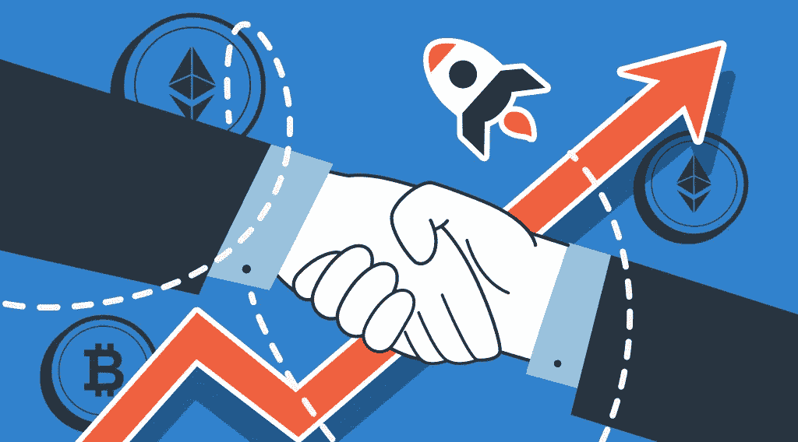

# 最佳加密联盟计划赚钱

> 原文：<https://medium.com/coinmonks/best-crypto-affiliate-programs-to-make-money-bb847f4a1e77?source=collection_archive---------15----------------------->

在过去的十年里，比特币让很多人变成了百万富翁，更不用说其他替代币了。如果你投资了去年暴涨的 Dogecoin，仅仅几年时间你就能赚上千美元。即使市场上的衰退反映了当前的经济状况，加密的冬天将会持续，加密空间仍然提供了投资和赚钱的机会。在这篇文章中，我们收集了最好的加密附属计划，可以帮助你开始用加密赚钱。

# 9 大加密附属计划

# 即时交换——立即改变

ChangeNow 是一项即时加密交换服务，为客户提供加密互换以及用借记卡、信用卡和万事达卡购买加密货币的选项。该平台提供了多种赚钱方式。你可以使用 ChangeNow 的 API 集成到任何服务中，通过在你的网站中插入参考链接来赚钱，或者在你的平台上放置动画小部件和按钮，使其对你的访客更具吸引力。

如果你邀请了一个新人，他们成为了你的客户，你将得到他们每笔交易的 0.4%。您的个人帐户将显示您的所有详细信息。在会员链接、API 或小部件的帮助下，整合是可能的。通过在你的网站上嵌入这项服务的交换部件，你还将获得交易量的 0.4%。该程序使用简单，易于注册，因此它可能会为您的博客或社交媒体档案增添一份精彩。

# Crypto.com

我们已经在之前的一篇文章中提到过这个交换[。Crypto.com 是市场上最受欢迎的加密交易所之一。截至 2022 年，该公司拥有 5000 万客户和 4000 名员工。此外，它还提供自己的加密货币 Cronos (CRO)，可以交易或存储。Cronos 是第一个与以太坊和宇宙生态系统互操作的区块链网络，支持 DeFi、NFTs 和元宇宙。](https://stealthex.io/blog/best-crypto-exchanges-10-crypto-exchange-review/)

该平台还提供了一个可靠的加密推荐程序。一旦你提交了申请，并把它的网站介绍给你的社区，你就可以获得被动收入。当注册 Crypto.com 交易所的会员链接或代码时，新用户可以在 12 个月内享受 10%的交易费折扣。此后，他们只有在至少下注 1000 CRO 的情况下才能获得奖金。奖金是基于他们的第一笔 CRO 赌注，这就是交易所的本地令牌派上用场的地方。

# 简单交换

SimpleSwap 是另一个即时加密交换服务，它可以作为桌面网站使用，也可以作为 iOS 和 Android 的移动应用程序使用。平台上有两种汇率类型:浮动汇率和固定汇率。你总能选择最合适的选项。此外，SimpleSwap 为其客户和合作伙伴提供了一个附属计划和 SimpleSwap 币，作为一个忠诚度计划。

这个平台让你以多种方式赚钱。如果你是一个交换聚合者、博客作者或新闻媒体，你可以使用他们的推荐链接。API 集成可用于钱包、支付系统和加密服务，而横幅和按钮可用于区块链探险者。小工具将证明对媒体网站有益。您将从通过 SimpleSwap 平台进行的每笔交易中获得 0.4%的佣金，这可以根据请求通过 API 进行更改，最高可达 2%。

# StealthEX

[**StealthEX**](https://stealthex.io/) ，一个即时加密交换程序，已经上市 4 年多了，提供了任何加密爱好者都会喜欢的广泛的加密收藏。即时交易在一个时尚和用户友好的界面中处理。没有必要在平台上注册或者分享你的个人信息。

该服务还通过其自己的会员计划提供了一个有吸引力的赚钱机会，该计划的特点是 API 集成、推荐链接和加密小工具。你可以在这篇[详细的文章《如何通过 StealthEX 加盟计划获得加密》中了解更多关于我们的加盟计划的信息。](https://stealthex.io/blog/more-crypto-benefits-with-stealthex-affiliate-program/)

# 交流平台—比特币基地

作为市场上最知名、最值得信赖的加密货币交易所之一，[比特币基地](https://coincodecap.com/go/coinbase)，在 100 多个国家拥有超过 1.03 亿验证用户、14，500 家机构和 245，000 个生态系统合作伙伴。比特币基地自 2012 年成立以来一直引领着加密货币的发展，是美国交易量最大的交易所。仅在 2021 年，最大的交易平台之一就创造了 78 亿美元的收入。

比特币基地提供了一个有利可图的联盟计划，让你在文章中链接到它，创建新的内容，或者在你的网站上放置广告。您的申请获得批准后，您将获得促销资产和影响跟踪软件。当新客户通过您的促销活动加入比特币基地时，您将获得佣金。您可以直接访问您的活动业绩数据，并在前 3 个月获得 50%的推荐人交易费。

# 币安

全球最大的密码交易平台是由 OKCoin 前 CTO 赵昌鹏创建的[币安](https://coincodecap.com/go/binance)。币安在香港成立，并成为世界领先的密码交易所之一。该公司单日处理超过 140 亿美元的现货交易量和近 500 亿美元的衍生品交易量。据估计，截至 2021 年 10 月，币安用户有 2860 万。

该平台提供全面的联盟计划。你可以向你的观众推荐币安，并在每笔合格的交易中赚取高达 50%的终身佣金。使用您的唯一推荐链接注册币安帐户的用户将自动被视为成功推荐。你将从你推荐的每笔交易中获得佣金——包括币安现货、期货、保证金交易，甚至币安池。首先，你通过填写一张特殊的表格来提交你的申请。如果您符合币安的标准，您的申请将被批准，您将能够从您的币安帐户创建和管理您的推荐链接。您可以为您的每个渠道生成自定义推荐链接，或者为您希望与您的社区共享的不同折扣生成自定义推荐链接。

# 库科恩

[库币](https://coincodecap.com/go/kucoin)也被称为‘人民交易所’该平台促进了 1.2 万亿的终身交易量，并支持全球超过 2000 万用户。该公司声称提供技术驱动的交易产品。除了基本的交易选项，该平台还提供保证金、期货和点对点(P2P)交易。用户也可以选择赌注或出借他们的密码来获得奖励。

KuCoin 提供一个加密交换推荐计划，包括 YouTube 视频博主、数字货币社区领袖、媒体作家和其他愿意推广 KuCoin 的内容创作者。你应该有一个超过 5000 名粉丝的社交媒体账户，或者一个超过 500 名成员的社区。与币安的情况一样，您首先要填写一份特殊的表格来申请该计划，然后，您可以在 KuCoin 会员页面上创建和管理您的专属邀请链接。作为会员，您可以根据不同的渠道配置您的个性化推广链接。每当用户通过你的推广链接注册一个 KuCoin 账户，你将从他完成的交易中获得高达 45%的佣金。如果您推荐他人加入该计划，您还将获得额外的 5%附属机构佣金。

# 硬件钱包—分类账钱包

[Ledger](https://coincodecap.com/go/ledger) 成立于 2014 年，总部位于法国巴黎，它为您提供一种安全的方式来存储您的加密资产。你可以购买，交换和增长你的加密安全与一个分类帐硬件钱包，结合分类帐生活应用。该项目为用户提供了大量不同的分类账钱包，包括 Nan X、Nano S 和 Ledger Live。

莱杰的加密联盟计划允许您创建独特的推荐链接，邀请您的观众购买莱杰产品。你所需要做的就是注册这项服务，然后通过你的推荐链接开始赚钱。购买后 1 天，您将收到一封来自该公司的电子邮件，允许您访问推荐平台。推荐计划仅适用于购买 Ledger Nano X 和 Ledger Nano S。接下来，你将获得你的推荐链接，并与 8 个朋友分享。此链接将为您的朋友提供 20%的折扣代码。当你的 4 个朋友通过你的链接购买时，你可以享受 25 美元的折扣。他们收到产品 15 天后，您将收到您的奖励。

# Trezor 钱包

一般来说， [Trezor](https://coincodecap.com/go/trezor) 和 Ledger 是加密货币行业两个比较知名的名字。两家公司都提供安全的硬件钱包，支持 1000 多种硬币，并加入了加密货币交易所。Trezor 是 SatoshiLabs 的一部分，于 2013 年推出，总部位于捷克共和国布拉格。此外，Trezor 和 Ledger 都提供合并交易所。

如果你有一个 YouTube 频道，一个关于加密货币、数字安全、金融、投资或技术的博客，你就可以一边创作内容一边赚钱。通过推广硬件钱包 Trezor，可以获得一些被动收入。每笔销售你将获得 12-15%的推荐佣金，不包括增值税和运费。公司的横幅，文字或者视频都可以。如果你需要特殊的材料，你可以随时问你的客户经理。

# 结论

如你所见，密码世界为个人成长和利润提供了额外的机会。您可以选择只推广您想要的服务，即您正在使用或即将开始使用的服务。有这么多赚钱的机会，你可以很容易地赶上潮流，开始享受旅程。

除了工具会员计划， [StealthEX](https://stealthex.io/) 可以帮助你从我们的加密收藏中购买一种或几种加密货币。你可以私下做这件事，不需要注册服务。我们的加密收藏有超过 450 种不同的硬币，您可以立即和毫无问题地进行钱包到钱包的转账。

# 如何在 StealthEX 购买 Crypto？

只需进入[stealth x](https://stealthex.io/)并遵循这些简单的步骤:

1.  选择要兑换的货币对和金额。例如，BTC 到瑞士联邦理工学院。
2.  按下“开始交换”按钮。
3.  提供要将您的加密传送到的收件人地址。
4.  处理交易。
5.  接收您的加密硬币。

在[媒体](https://stealthex-io.medium.com/)、[推特](https://twitter.com/Stealthex_io)、[电报](https://t.me/StealthEX)、 [YouTube](https://www.youtube.com/channel/UCeES_XBesX76ge7xf1meuSw) 和 [Reddit](https://www.reddit.com/user/Stealthex_io) 上关注我们，了解关于 [StealthEX.io](https://stealthex.io/) 和其他秘密世界的最新消息。

在购买任何密码之前，不要忘记做自己的研究。本文表达的观点和意见仅代表作者个人。

*原载于***👈**

> **交易新手？尝试[加密交易机器人](/coinmonks/crypto-trading-bot-c2ffce8acb2a)或[复制交易](/coinmonks/top-10-crypto-copy-trading-platforms-for-beginners-d0c37c7d698c)**