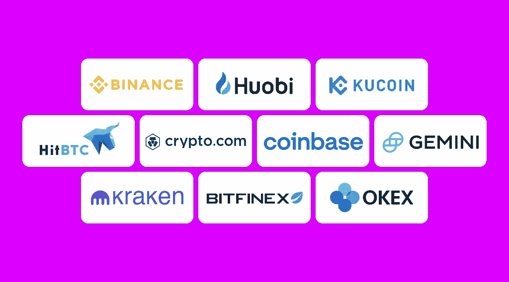

# 最佳加密交易所:10 个加密交易所评论

> 原文：<https://medium.com/coinmonks/best-crypto-exchanges-10-crypto-exchanges-review-1810f9822512?source=collection_archive---------17----------------------->

为了寻找不同的交易选择，许多加密爱好者转向加密货币交易所。他们不仅提供各种加密服务，还提供 24/7 的客户支持和相当高的安全性。在这个最佳加密交易所的回顾中，我们将看看最大和最突出的加密平台的前 10 名。

# 10 大最佳加密交易所

# 币安

[币安](https://twitter.com/binance)是全球最大、最知名的加密货币平台。该机构由赵昌鹏于 2017 年创立，被认为是业内最重要的加密机构之一，并支持了许多新趋势。按交易量计算，币安是全球领先的加密货币交易所，用户来自 180 多个国家和地区，被认为是顶级的加密货币交易所之一。

这个顶级的加密交易所提供了许多服务，币安赚和币安储蓄，用户可以在这里赚取他们的资产。币安 Launchpad 和 Launchpool 是帮助和建议项目团队如何最好地发行和推出他们的令牌的平台。BNB 金库结合了灵活储蓄和 Launchpool 的回报，并为币安客户提供有竞争力的回报。币安 Staking 还提供被动收益的 ETH 2.0 计划，APR(年化利率)高达 5.20%。

该平台还提供自己的币安卡，让用户每次购买商品都能获得高达 8%的 BNB 返现。该平台的客户还可以使用其加密贷款选项进行现货/保证金/期货交易或下注，以赚取高 APY。此外，币安钱包可用于存储、交换和交易您的数字资产。币安的本地加密货币 BNB 代币在市场上价值很高。币安还提供较低的汇率来支付其兑换令牌。

# 火币

[火币环球](https://twitter.com/HuobiGlobal)由 Leon Li 于 2013 年在中国创立。目前，该公司在香港、韩国、日本和美国都设有办事处。加密货币交易平台在塞舌尔注册。2018 年 8 月，它成为一家公开上市的香港公司。目前，该交易所有 600 多种硬币和 1000 多种交易对。虽然该平台不能在美国使用，但它仍然是世界上许多国家的合适选择。

Huobi Global 提供深度流动性，支持大量加密货币，并提供广泛的收益机会，使其成为有经验的加密交易员的一个有吸引力的目的地。

该交易所是一个基于网络的平台，也是 Android 和 iOS 的移动应用程序。加密平台收取 0.2%的基本费用。Huobi Token (HT)持有者可以获得交易费折扣，用户在 exchange 钱包中拥有的 HT 越多，折扣就越少。平台的客户资金位于多签名冷钱包。火币还有一个 2 万的 BTC 安全储备基金，是为了应对极端安全事件而成立的。

# 库科恩

KuCoin 是五大加密交易所之一，在全球拥有超过 2000 万注册用户。它是由蚂蚁金服前技术专家迈克尔·加姆(Michael Gam)创立的。

该交易所于 2017 年 8 月推出，并在塞舌尔注册，拥有 200 多种加密货币和 400 多个市场。该平台提供银行级别的安全性和广泛的加密服务:保证金和期货交易，内置的 P2P 交易所，用信用卡或借记卡购买加密的能力，以及即时交换服务。它的用户可以通过 KuCoin Spotlight 参与新的初始交易(ieo)。

该平台提供了一个方便的购买和销售服务的选项，使用一个核心交易引擎，可以一次处理数百万笔交易。此外，该交易所有自己的本地加密货币 Kucoin Shares (KCS)，如果持有该资产，它会为其持有人提供每日激励。用户可以通过该平台的 Pool-X 贷款或下注来获得加密。你可以向 KuCoin 咨询“哪个加密交易所的费用最低？”Kucoin 提供的收取费用最低，为 0.1%。

# HitBTC

[HitBTC](https://hitbtc.com/) 是一个鲜为人知的加密货币交易平台。它是由英属维尔京群岛的 HiTech Digital Business Ltd 公司于 2013 年推出的。其总部位于中国。

当项目启动时，它通过风险资本投资成功吸引了 600 万美元。该平台复制了纳斯达克(NASDAQ)等全球知名交易所的特征。它成为市场上第一个引入快速强大的 API、添加自动化交易工具、WebSocket、FIX API 和 algo traders 的交易所之一。用户还可以利用其出色的匹配核心引擎，帮助加密货币交易员改善他们的交易体验。

该平台上超过 40%的交易是用比特币(BTC)完成的。没有适用于 Android 或 iOS 的 HitBTC 应用程序，尽管如此，这个平台仍然是世界上最古老、最受信任的加密交易所之一。

# Crypto.com

Crypto.com 是一个非常受欢迎的交易所，还有它的代币 Cronos (CRO)。它由 Bobby Bay、Gary Or、Kris Marszalek 和 Rafael Melo 于 2016 年创立，总部位于新加坡。

这个交易所有 250 多种不同的货币，它以对那些在 CRO 持有大量股份的人收取合理的费用和折扣而闻名。费用限制在 0.40%，并随着高交易量或大量持有 CRO 货币而降低。

此外，Crypto.com 为其客户提供各种基于加密货币的金融服务，包括允许用户买卖不同加密货币的 Crypto.com 应用程序，以及允许用户持有加密资产并从中赚取利息的非托管 DeFi 钱包。该平台的 NFT 市场被加密爱好者用来收集和交易不可伪造的令牌，而 Crypto.com 支付允许用户直接用加密货币发送和接收支付。此外，该交易所发行自己的 Visa 卡，允许用户将加密货币转换为法定货币，在接受 Visa 的零售商处购买。

# 比特币基地

比特币基地是互联网上顶级的加密交易所之一。该公司由布莱恩·阿姆斯特朗和弗雷德·厄尔萨姆于 2012 年创立。这是一家美国上市公司，运营加密货币交易平台。比特币基地是一家分布式公司，所有员工都通过远程工作进行操作。按交易量计算，它也是美国最大的加密货币交易所。

该公司面向零售交易者的产品包括一款用于购买、存储和交易不同加密货币的应用程序，如比特币、比特币现金、以太坊、以太坊经典和莱特币，以及一款用于交易数字资产的专业资产交易平台比特币基地 Pro。此外，它的用户可以将他们的资产存储在平台的钱包中，这是一个允许客户使用 dApp 浏览器访问 dApp 的应用程序，或者互相买卖他们的 NFT。

交易员可以利用比特币基地 Prime，这是一个面向机构客户或比特币基地托管的交易平台，为持有比特币和其他比特币基地加密货币的机构提供专家级服务。该平台还发行借记卡 Visa 卡，允许客户使用加密货币，并允许他们使用比特币基地商务，这是一种针对商家的支付服务。加密货币学习平台比特币基地·欧恩向观看视频和参加测验以了解它们的用户奖励少量替代硬币。

# 双子星座

[Gemini](https://twitter.com/Gemini) 是市场上最受欢迎的加密平台之一，主要是因为与脸书的法律纠纷。它是由两个双胞胎卡梅隆和泰勒·文克莱沃斯在 2014 年创立的。目前，它在美国、加拿大、英国、韩国、香港和新加坡开展业务，总部设在纽约。

该平台在 60 多个国家和美国所有的州都可以使用。Gemini 为其用户提供了两个钱包:一个名为 Gemini 保管的冷藏系统，和一个保险的热钱包，Gemini 钱包。

*   Gemini 保管公司将密码移出网络，由 Gemini 安全保管，每年收取 0.4%的费用。
*   Gemini Wallet 提供高安全性的在线存储和防止数字资产被盗的保险。

此外，加密交易所为其用户提供 70 多种加密货币的交易，以及一个名为 Gemini Earn 的程序，允许加密爱好者从他们的持有物中赚取利息。

这个受欢迎的交易所的一个特点是它的 Cryptopedia，Gemini 的在线学习中心，教人们关于加密货币的知识。该源包括数百篇关于许多加密主题的文章，从简单的解释者到更复杂主题的深入探讨。

# 北海巨妖

[北海巨妖](https://twitter.com/krakenfx)是一家总部位于美国的加密货币交易所和银行，成立于 2011 年。它的创始人兼首席执行官是杰西·鲍威尔。该交易所是首批在彭博终端上市的比特币交易所之一，据报道，截至 2022 年夏季中期，其价值为 110 亿美元。

北海巨妖也是市场上较为成熟的加密交易所之一。该公司提供了一个具有顶级安全性的平台，国内有 120 多种硬币可供选择，国际用户可选择多达 160 种硬币。用户还可以为他们的数字资产下注并获得回报，所有这些都以低于平均水平的价格出售。

该平台的比特币(BTC)提现费用相对较低，并提供广泛的教育材料。北海巨妖也因其安全性而闻名——自 2013 年推出交易业务以来，它没有发生过任何重大黑客事件。这也是因为该交易所提供安全的硬币存储，95%的存款离线保存在遍布全球的冷藏单元中。

# BitFinex

[BitFinex](https://www.bitfinex.com/trading) 是一个私人平台，成立于 2012 年。它由在英属维尔京群岛注册的 iFinex 公司拥有和运营。该平台最初是一个比特币的 P2P 保证金借贷平台，后来增加了对更多加密货币的支持。该平台以其低费用而闻名，大多数交易的费用仅为 0.20%或更低。然而，这种密码交换也与系绳稳定币密切相关。Tether 让该平台陷入了监管机构的麻烦。

Bitfinex 在其活跃的交易平台上支持超过 170 种加密货币，包括比特币、以太坊、Terra、Tether、Solana、莱特币、Ripple 和许多其他货币。

为了增加整体积极的客户体验，该交易所支持加密货币产品和交易选项的大型生态系统，包括现货交易、保证金账户、衍生品等。新的加密货币用户可以用纸面交易无风险地测试平台，Bifinex 的移动应用程序很容易使用。

# OKX

OKX ，原名 OKEx，是一家位于塞舌尔的加密货币交易所，也是我们十大加密交易所名单中的最后一家。OKX 本质上是一个衍生品交易所，提供了一个交易各种工具的平台。

它由杰伊·郝和海德尔·拉菲克于 2017 年创立。虽然它对美国用户不可用，但对于其他寻求购买、持有和交易大量货币的人来说，它可能是一个不错的选择。交易费用从 0.10%开始，随着交易量的增加或 OKX 货币 OKB 币的交易量的增加而减少。

该平台的用户可以用信用卡或借记卡、银行转账、Apple Pay、Google Pay 和其他支持的服务购买加密货币。在某些情况下，当参与下注或保存功能时，它还提供了异常高的收益率。虽然它不是最大的加密货币交易所，也无法与币安和比特币基地相比，但它在支持大量货币和广泛服务方面做得很好。

如果你想找一个地方购买加密软件，例如， [BNB](https://stealthex.io/blog/where-and-how-to-buy-bnb-without-binance/) ，而不在最大的加密平台之一注册，你可以通过 [StealthEX](http://www.stealthex.io/) 来完成。

**没有 KYC 怎么买 BNB？**

只需进入 [StealthEX](https://stealthex.io/) 并遵循这些简单的步骤:

1.  选择要兑换的货币对和金额。例如，BTC 到 BNB。
2.  按下“开始交换”按钮。
3.  提供要将您的加密传送到的收件人地址。
4.  处理交易。
5.  接收您的加密硬币。

在 [Medium](https://stealthex-io.medium.com/) 、 [Twitter](https://twitter.com/Stealthex_io) 、 [Telegram](https://t.me/StealthEX) 、 [YouTube](https://www.youtube.com/channel/UCeES_XBesX76ge7xf1meuSw) 和 [Reddit](https://www.reddit.com/user/Stealthex_io) 上关注我们，了解关于 [StealthEX.io](https://stealthex.io/) 和其他秘密世界的最新消息。

在购买任何密码之前，不要忘记做自己的研究。本文表达的观点和意见仅代表作者个人。

*原载于*[*【https://stealthex.io/blog/】*](https://stealthex.io/blog/best-crypto-exchanges-10-crypto-exchange-review/)*👈*

> *交易新手？尝试[加密交易机器人](/coinmonks/crypto-trading-bot-c2ffce8acb2a)或[复制交易](/coinmonks/top-10-crypto-copy-trading-platforms-for-beginners-d0c37c7d698c)*