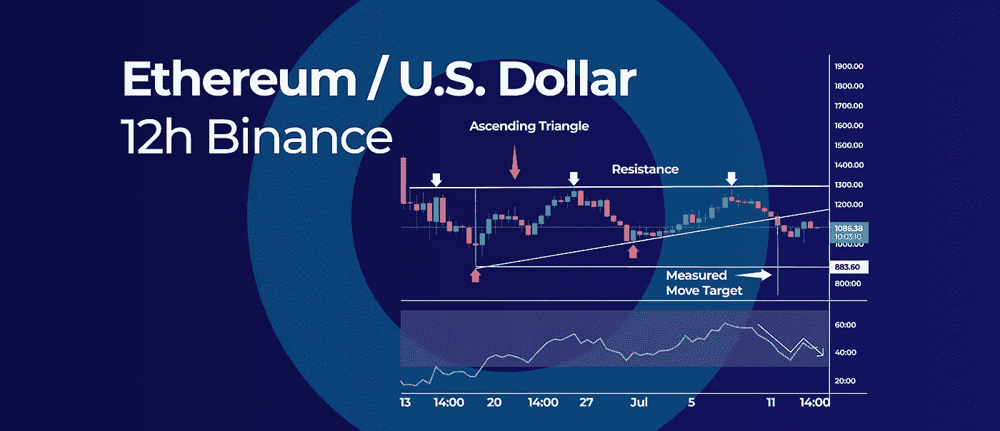

# 最佳加密货币在加密冬天持有|更多在本周加密更新。

> 原文：<https://medium.com/coinmonks/best-cryptocurrencies-to-hold-during-a-crypto-winter-and-more-in-this-weeks-crypto-update-1717dc695a3?source=collection_archive---------40----------------------->

This Weeks Crypto Update

*   IoTeX 看涨隐藏背离和季节性模式
*   以太坊已经确认了上升三角形的突破
*   在加密的冬天持有的最佳加密货币
*   美国 FTX 和 FTX 宣布与 Cryptohopper 整合

## IoTeX 看涨隐藏背离和季节性模式

IoTeX Bullish Hidden Divergence and Seasonal Pattern

io tex(IOTX)价格在其周线图上产生了看涨的隐藏背离，进入了一个强烈的季节性看涨阶段。这可能是未来更多收益的迹象。然而，上行空间也可能在 0.057 美元阻力位附近被限制。

## 看涨隐藏背离

隐藏散度与经典散度相似；然而，较高的低点出现在价格图上，而不是振荡指标上。在我们的例子中，IOTX 做了一个更高的低点，而 RSI 振荡器做了一个更低的低点，跌破了之前的低动量读数。

此外，短期来看，RSI 已经开始上升，但仍低于 50 的中等水平。虽然隐藏的背离是趋势延续的迹象，但我们不能过于乐观，除非 RSI 收复 50 的中级水平。

## 季节性模式

对于 IOTX 来说，7 月份历来都是表现强劲的月份。去年，IOTX 的价格上涨了 840%以上，但我们正处于一个强劲的牛市周期。2020 年，加密货币在 7 月份也经历了 176%左右的大幅上涨。

**展望**:上行可能会在 0.057 美元左右的阻力位，而下行可能会在 0.012 美元——这是 2020 年的高点和 2021 年的低点。这使得它成为一个关键的支撑位，有可能阻止任何进一步的抛售。

## 以太坊已经确认了上升三角形的突破

Ethereum Has Confirmed a Breakout from the Ascending Triangle

以太坊(ETH)自 6 月中旬以来一直在构建一个上升的三角形图表形态，现在已经向下突破。这种模式意味着下一轮下跌可能会瞄准 730 美元的目标。

## 上升三角形模式

上升三角形模式的上下边界已经在多次测试中得到证实。例如，ETH 价格在 1，270 美元左右的上方阻力位进行了三次失败的测试，我们对下方上升支撑趋势线进行了两次测试。

一旦上升三角形形态被确认，通过测量形态价格宽度并将其应用于支撑突破来定位价格目标。

## 什么是上升三角形形态？

上升三角形是当价格在向上倾斜的趋势线和阻力位内盘整时形成的看涨延续形态。这通常发生在强劲反弹或突破之后，因为多头继续推高价格，而空头则稍作休息。当上升三角形形成时，这是多头仍在控制的迹象，我们可以在不久的将来看到另一个高点。

## 上升三角形模式的示例

有很多上升三角形模式的例子。其中最著名的是 2017 年的以太坊图。在这张图表中，你可以看到有一段时间的盘整，然后向上突破。这导致以太坊价格大幅上涨。

## 比较以太坊 2017 年和 2022 年的上升三角形格局

最近几个月，以太坊的价格飙升，看起来这种涨势可能会持续下去。这种乐观的一个原因是以太坊当前的价格图表与 2017 年的价格图表相似。两次，以太坊在向上突破之前都形成了一个上升的三角形形态。2017 年的突破导致了大规模的反弹，许多人认为历史可能在未来几个月重演。然而，与 2017 年相比，现在发生这种情况的可能性较小。这是因为 2017 年整体市场处于强劲反弹，而现在我们处于强劲的熊市。

## ETH 价格目标

上升三角形给了我们一个 730 美元左右的移动目标。然而，1000 美元的心理数字在短期内继续发挥很大作用。只有日破和收盘低于这一水平将有利于更多的下跌；否则，我们可能会继续巩固。

低于 1000 美元的下一个支撑位是 883 美元的年度低点，这应该是另一个具有挑战性的支撑位。

> 交易新手？试试[加密交易机器人](/coinmonks/crypto-trading-bot-c2ffce8acb2a)或者[复制交易](/coinmonks/top-10-crypto-copy-trading-platforms-for-beginners-d0c37c7d698c)

## 在加密的冬天持有的最佳加密货币

Best Cryptocurrencies to Hold During a Crypto Winter

比特币的价格[比其历史峰值下降了 70%以上，加密货币市场整体市值损失了 50%以上，导致了一个加密冬天。因此，如果你想创建一个“耐寒”的加密组合来抵御这些挑战，我们将概述加密货币最重要的特征。](https://www.livemint.com/news/world/the-great-crypto-crash-bitcoin-tumbles-to-lowest-level-in-18-months-here-s-why-11655597130851.html)

## 什么是隐秘的冬天

加密冬天是一个用来描述加密货币市场现状的术语。许多投资者认为市场不景气，价格不会很快反弹。尽管如此，在此期间仍有一些加密货币值得持有。

## 第一大市值

一种有前途的加密货币能够经受住加密冬天的第一个特征是拥有巨大的市值。一家加密公司的市值越大，它降低价格所需的资本就越多。

## #2 易于访问

crypto 能够经受住 crypto 寒冬的第二个特性是它的可访问性。这意味着它需要在主要的加密交易所、流行的交易平台、CFD 平台，甚至交易所交易产品(如 ETF)上可用。

一个密码越容易获得，投资它就越容易，而且这些硬币很可能在下一个牛市周期中首先被买入。

## #3 资金

能够经受住加密寒冬的第三个特征是拥有大量的机构资金。即使在加密的冬天，加密项目也需要资金来生存和继续发展。

## #4 低监管风险

能够经受住加密寒冬的最后一个关键特征是低监管风险。不幸的是，监管机构在加密冬天对一些加密货币的打击使得度过加密冬天变得更加困难。

**底线:**至少，如果你持有具有这四个特征的加密货币，它将有更好的机会度过 2022 年的加密冬天。你也可以阅读我们关于如何建立加密组合的博客。

## 加密交易 101 |如何建立加密投资组合

很难平衡加密市场上所有不同的硬币对，因为太多的硬币来来去去，很容易忘记这些硬币的作用以及它们之间的差异。在这篇文章中，我们会给你一个建立多元化投资组合的指南。

阅读博客[这里](https://www.cryptohopper.com/blog/5717-crypto-trading-101-how-to-build-a-crypto-portfolio)

## 美国 FTX 和 FTX 宣布与 Cryptohopper 整合

领先的加密货币交易所 FTX 和美国 FTX 已经宣布与世界一流的自动交易机器人 Cryptohopper 集成，为所有 3 个交易平台的用户带来巨大利益。

[FTX](https://ftx.com/eu/referrals#a=cryptohopper) 是发展最快的加密货币交易所之一，拥有数百万注册用户。与 Cryptohopper 的集成将使 crypto hopper 用户体验另一个著名的自动交易交易所。

两家公司都有设计直观、用户友好的界面和操作系统，以及允许移动交易的移动应用程序。通过与 Cryptohopper 的集成，FTX 和 FTX 美国公司现在可以接触到更多的潜在客户，同时为现有用户提供不需要特殊编码技能的自动化交易工具。

Cryptohopper 拥有超过 620，000 个账户，并且仍在增长，每月处理数百万笔现货交易。根据世界上引用最多的加密资产价格跟踪网站 CoinMarketCap 的数据，截至 2022 年 7 月 4 日，FTX 和 FTX 美国的 24 小时交易量达到 13 亿美元。

FTX 和 FTX 美国与 Cryptohopper 的新集成将允许 FTX 用户全天候全自动交易，并增加了许多功能，包括:

*   社交交易(复制交易)
*   追踪订单，包括追踪止损
*   按购入证券的美元价格平均计算法
*   战略设计师
*   和人工智能策略设计师

两家交易所的用户也可以加入 Cryptohopper 上的交易锦标赛，与朋友竞争。

# FTX 推广

在 FTX [这里](https://ftx.com/eu/referrals#a=cryptohopper)注册，在 Cryptohopper 上创建一个 FTX 交易机器人。前 500 名注册用户将获得 30 美元的交易费代金券。此促销活动不适用于美国 FTX。

# 关于 FTX

FTX 是由交易者为交易者建立的加密货币交易所。它提供创新产品，包括行业领先的衍生品、期权和波动性产品、令牌化股票、预测市场、杠杆化令牌和场外交易柜台。FTX 致力于为各类用户提供一个直观而强大的平台，并成为业内最具创新性的交易所。

FTX 自成立以来发展迅速，在不到两年的时间里成为世界上最受尊敬的加密货币交易所之一。

# 关于隐跳虫

Cryptohopper 是世界领先的自动化加密交易机器人，使用算法智能来管理加密货币交易，为超过 620，000 名交易者提供服务。

Cryptohopper 是一个完全基于云的 SaaS(软件即服务)，全天候运营，一次可以交易多达 75 种加密货币。它与币安、Bitvavo 和比特币基地 Pro 等全球加密货币交易所建立了许多合作伙伴关系，使交易者能够在一个平台上管理他们所有的加密货币钱包。

在 Cryptohopper 的用户生成功能中，它也是第一个引入信号交易的交易平台——这一功能已在整个行业得到效仿。

该公司由 Ruud 和 Pim Feltkamp 于 2017 年 9 月创立。

订阅我们的媒体每周博客和更新。
在推特[上关注我们](https://twitter.com/cryptohopper) | [脸书](https://www.facebook.com/cryptohopper)|[Reddit](https://www.reddit.com/r/CryptoHopper/)|[insta gram](https://www.instagram.com/cryptohopper/?hl=nl)

在 [Cryptohopper](https://www.cryptohopper.com/) 开始交易！

> 加入 Coinmonks [电报频道](https://t.me/coincodecap)和 [Youtube 频道](https://www.youtube.com/c/coinmonks/videos)了解加密交易和投资

# 另外，阅读

*   [加密货币储蓄账户](/coinmonks/cryptocurrency-savings-accounts-be3bc0feffbf) | [YoBit 审核](/coinmonks/yobit-review-175464162c62)
*   [Botsfolio vs nap bots vs Mudrex](/coinmonks/botsfolio-vs-napbots-vs-mudrex-c81344970c02)|[gate . io 交流回顾](/coinmonks/gate-io-exchange-review-61bf87b7078f)
*   [CoinFLEX 评论](https://coincodecap.com/coinflex-review) | [AEX 交易所评论](https://coincodecap.com/aex-exchange-review) | [UPbit 评论](https://coincodecap.com/upbit-review)
*   [AscendEx 保证金交易](https://coincodecap.com/ascendex-margin-trading) | [Bitfinex 赌注](https://coincodecap.com/bitfinex-staking) | [bitFlyer 审核](https://coincodecap.com/bitflyer-review)
*   [Bitget 评论](https://coincodecap.com/bitget-review) | [双子星 vs BlockFi](https://coincodecap.com/gemini-vs-blockfi) cmd| [OKEx 期货交易](https://coincodecap.com/okex-futures-trading)