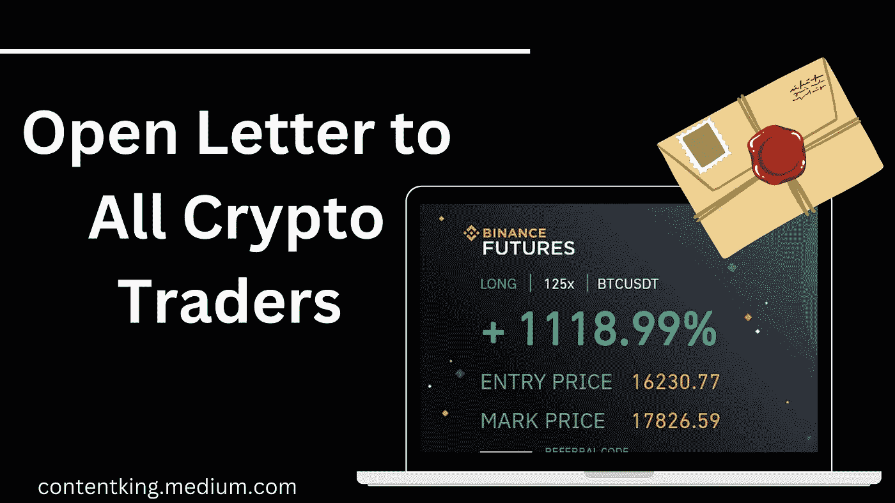
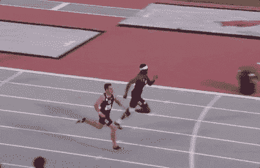

# 世界上最好的加密货币简讯

> 原文：<https://medium.com/coinmonks/best-cryptocurrency-newsletter-in-the-world-8af7dfa67997?source=collection_archive---------32----------------------->

亲爱的加密货币交易商:

通常，你会看到很多加密交易者展示 200%盈利的截图，你会觉得这些人在杀人。

Lols，那是单贸易。他们可能在其他交易中损失惨重:)

我以前也有这种感觉。

嗯，你知道 70%以上的散户都是不盈利的吗？是的，他们不是。所以看到截图一定要冷静。

毕竟，人类不喜欢分享糟糕的交易。

**GIF was made by me:)**

这并不是说他们缺乏好的交易技巧，而是他们太贪婪了，市场有办法扰乱交易者的思维。

你打算在 30 天内将你的加密交易资本翻倍的那一天，就是你让自己面临巨大失败的时刻。

加密货币交易是一场马拉松，而不是短跑。现在把这个写在你的墙上。

**马拉松**

[**Source**](https://tenor.com/search/marathon-runner-gifs)

**不是冲刺**

[**Source**](https://giphy.com/explore/400-meter-hurdles)

我见过那么多新手犯这种错误，我不希望你成为下一个受害者。

我合作过的大多数专业交易者都有一个共同点；他们有现实的目标，总是避免期货市场的高杠杆。

## 你看到了吗？

对 1，000 美元的投资组合设定 5%的月利润目标没有错。所以你的资本太小的想法不是像赌徒一样交易的借口。

如果你能达到每月 20%的目标，这也是不可思议的！

但是不要试图在 30 天内让你的资本翻倍，聪明的交易者可能会让你损失更多的钱。

你将被诱惑使用 20 倍的杠杆，你所建立的一切将开始在你面前崩溃。

因为你贪婪，市场不在乎你的情绪。

你需要赔钱，这样别人才能从你的贪婪和缺乏交易计划中获利。

这是我给你的建议，从一个低的月目标开始，如果你实现了，你会很开心，这种开心会让你很容易保持动力。

当你连续 5 个月达到 5%的月度目标*时，将其增加到 10%，再过 5 个月，将其增加到 15%。*

*如果你有一本交易日志，显示你是多么不可思议。找一份全职工作为大机构交易变得很容易。*

*大公司并不追求 100%的年利润，他们想要的是一个每个月至少能赚 5%的交易者，而不会浪费分配给你的交易资金。*

*看看这个。月利润 5%就是年利润 60%对吧？*

*1000 万英镑的 60%是每年 600 万英镑，是吗？*

*拉出世界上大公司的财务记录，只有 2%左右能在一年内达到 60%的年利润目标。*

> **如此。为什么要自杀？**

*目标是在一个月内使你的交易资金翻 2 倍、3 倍或 10 倍，这让专家们看你就像看 T21 赌徒一样。*

*你不会得到那么多的尊重，因为你的模式在中长期内是不可持续的。*

***知道这一点，交易者和投资者不一样。***

*如果有那么简单。在 1977 年至 2022 年间，阿里科·丹格特(世界上最富有的黑人)的净资产将增加到 1000 亿美元。*

*2010 年，他的身价为 21 亿美元，2022 年，他的身价为 127 亿美元。明白了吗？经商 12 年后。*

*你注意到了什么？*

*他的财富一直在稳步增长，丹格特并没有寻求快速解决方案。*

*如果你的月收入是 500 万英镑的 5%,贫穷就会远离你。*

*当你每月赚到 500 万英镑的 10%时。*

*你会比尼日利亚的顶级银行家挣得多。*

*如果你能证明你在 2-3 年内是盈利的，更多的投资者会在回顾你的交易历史后向你抛出数百万奈拉。*

*事实上，一些富人不会介意每年赚取 25%的利润，他们会很兴奋。*

*我从我的个人经历中与你分享这些，吸收这些信息，你将体验到内在的平静。*

*我要把这个留给你👇*

*加密交易是一场 T2 马拉松，而不是短跑。*

*如果这条消息对你有用，请告诉我，我很乐意与你进行更深入的交谈。这是世界上最好的加密货币简讯，因为它直接触及你的内心。*

*现在就和你的朋友分享这条信息吧。*

*有一个超级奇妙的一天！*

*如果这封信对你有帮助，请在这里 给我买一杯[咖啡](https://ko-fi.com/ojeniyiayobami)*

**

*[**Source**](https://tenor.com/view/coffee-gif-23439328)*

*NB: *我像 WhatsApp 广播一样发送每周简讯，如果你想享受这样有价值的信息，* [***在这里加入广播列表***](https://wa.link/r7xbia) ***。****

# *关于作者*

***Ojeniyi Ayobami Abimbola** 自 2015 年以来一直从事加密货币交易，他是区块链的内容创作者和 Cryptoniche 的加密教练。你可以和他联系:[https://t.me/cryptoniche_hangout](https://t.me/cryptoniche_hangout)*

***CryptoNiche YouTube 频道:**[https://youtube.com/c/CryptoNiche](https://youtube.com/c/CryptoNiche)*

*如果你注册了附属链接，我会从中获得一小笔佣金，这也是从经济上支持这个博客的一种方式。*

***或者加入隐壁龛电报频道:**[https://t.me/cryptoniche_hangouts](https://t.me/cryptoniche_hangouts)*

***在推特上和他联系:**【https://mobile.twitter.com/ojeniyi_ayobami】T2*

*要不要终身被动收入？在这里阅读他的最后一篇文章 [**！！！**](https://contentking.medium.com/this-undoubtly-the-best-way-to-earn-passive-income-through-cryptocurrency-7ce547cedbe)*

*我有一个免费的礼物给你:“如何在年底前成为密码百万富翁。” [**点击这里下载。**](https://ojeniyiayobami.crd.co/)*

*几十个为你制作的加密内容， [**现在就订阅**](https://www.youtube.com/c/CryptoNiche/videos)*

> *交易新手？尝试[加密交易机器人](/coinmonks/crypto-trading-bot-c2ffce8acb2a)或[复制交易](/coinmonks/top-10-crypto-copy-trading-platforms-for-beginners-d0c37c7d698c)*