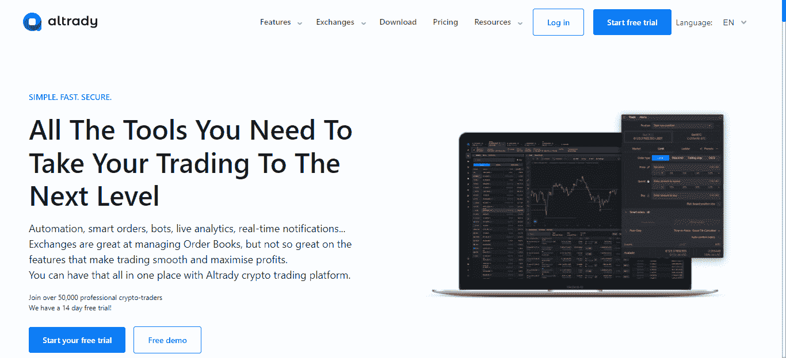

# 目前最好的加密扫描仪前五名

> 原文：<https://medium.com/coinmonks/best-cryptocurrency-scanners-swapzones-rating-be0ea324217a?source=collection_archive---------11----------------------->

初学加密的人在买卖代币的头几个月会注意到一件事:这可能很困难。非常需要观察和人工分析相关的价格变动。

你还需要花时间尽早了解快节奏的市场。所有这些以及更多可能是一场真正的斗争，但有了加密货币扫描仪这样的工具，初学者和有经验的交易者都可以在动荡的加密市场中增加他们的胜算。

随着全球市场最近充斥着不确定性和快速的价格波动，现在可能是获得良好的代币/硬币市场扫描仪帮助的最佳时机。不要担心，这篇文章是你的密码扫描器指南，它们的优点和缺点，以及一些最好使用的。

# 加密扫描仪:追踪市场变化的必备工具

加密扫描仪是交易员用来跟踪不同资产动向的工具。大多数人利用这些波动作为市场信号来执行交易指令和做出明智的决定。

你可以用加密扫描仪追踪很多东西，包括资产的数量和价格。有时，这些工具还带有声音提醒功能，通知用户市场的变化，允许交易者进行交易并从中获利。

如果你是一个依赖相对强弱指数(RSI)和布林线等关键技术指标的经验丰富的交易者，你会发现加密货币扫描仪特别有用。

> 交易新手？试试[加密交易机器人](/coinmonks/crypto-trading-bot-c2ffce8acb2a)或者[复制交易](/coinmonks/top-10-crypto-copy-trading-platforms-for-beginners-d0c37c7d698c)

# 什么是 Swapzone？

[Swapzone](https://swapzone.io/) 是一个越来越受欢迎的即时非托管交换聚合器，它可以帮助用户整理几个受支持的加密对的交换报价。该平台监控数百甚至数千个资产对的一些最佳汇率。

Swapzone 声称用户使用他们的许多服务不需要注册，而且该平台的费用被认为很低。

# 加密扫描程序与加密筛选程序

快速搜索术语 crypto screener 可能会出现许多有关 crypto scanners 的搜索结果。这是因为该术语可与加密扫描器互换使用，但它们的意思是一样的吗？

首先，screener 允许你根据一些用户定义的指标来筛选资产，这样你就可以找到很好的交易机会来利用。另一方面，扫描仪可以让你跟踪和发现一个或多个资产的交易和活动，同时提供及时的警报，以便做出明智的交易决策。

虽然这两个术语不同，但它们帮助交易者在交易中更有目的，更少投机或混乱。

# 就这么简单？加密扫描仪的利弊

加密扫描仪对任何交易者的策略来说都是极好的补充，因为它节省了你计算最佳交易时间的宝贵时间。虽然这个工具很有用，但在断定它是否适合你之前，你必须考虑利弊。以下是使用它们的一些好处和缺点。

# 赞成的意见

*   他们帮助你维持交易纪律。
*   这是一个大大减少可能导致损失的情绪交易的好方法。
*   提高市场进入地位。
*   他们实时提供价格警报和市场数据。

# 骗局

*   有些选项或功能不是免费的
*   没有摆脱像停工期这样的随机失误
*   当新手交易者需要快速帮助时，有些平台可能过于复杂，难以适应。

# 深入探索:加密扫描仪是如何工作的？

扫描仪观察几个交易所的数据，同时识别并跟踪关键的移动指标，如资产价格和交易量。它还关注像 RSI 或相对强弱指标这样的动量指标，以及其他帮助交易者的技术指标。以下是扫描仪允许您做的一些其他事情:

*   轻松找到并识别某个特定时期或更长时间内交易量和价格百分比变化最大的硬币。有了这些信息，交易者可以迅速抓住并利用市场波动。
*   像百分比下跌或上涨这样的指标可以帮助交易者确定某个特定的令牌自前一天交易以来移动了多少。有了这些信息，交易者可以发现波动性高的代币，以及价格已经下跌或正在贬值但能够带来高回报的代币。
*   交易者和用户也可以设置一个买卖比过滤器，显示一级买卖盘之间的特定比率。在像 2 到 3 这样的更高级别上，用户可以获得关于代币或硬币的通知，其中最佳出价订单是要价订单的 2 到 3 倍。

加密扫描仪是提高市场交易时间效率的绝佳方式。用户还可以通过警报请求通知他们想要监控的某些指标的变化。

# 加密货币交易警报

加密交易提醒是交易者确定买卖资产和减少损失的适当时机的好方法。这些警报向交易者发送关于影响资产价值的技术条件、价格行为甚至财务结果的通知。

以下是交易员使用的一些更常见的警报类型及其含义:

*   **价格警报**:当加密市场或特定数字资产/令牌增加或减少一定百分比时，这些警报会通知交易者。
*   **经济结果警报**:经济结果警报通知交易者即将发生的新闻或经济事件可能会引发市场波动。这些即将到来或预期的事件可能是新的利率公告或投资者购买。
*   **技术指标警报**:当某个指标或参数满足某个条件时，这些警报会有效地通知交易者。一个例子是 RSI(相对强弱指标)超买或超卖。

# 加密扫描仪是真的吗？以下是我们的想法

对每个交易者来说，数据是最重要的东西，加密扫描仪以一种经过分析的格式提供给你。

尽管交易量和价格是交易者跟踪的两个最基本的参数，加密扫描仪也可以帮助你观察交易历史，超买，超卖等。所以在我们看来，这是一个真实交易的百万倍。

毫无疑问，在数十家交易所中搜寻哪怕是最轻微的有利动向的压力可能是一项艰巨的任务。尽管如此，扫描仪提高了交易者获取交易动态的效率。

然而，尽管他们可以帮助你完成，他们只是你作为一个成功的秘密投资者或交易者的公式的一部分。你必须投入时间和资源去理解市场如何运作，买家的情绪，以及影响价格变动的因素。

始终如一和坚持不懈地发现机会和工具是很重要的，这些机会和工具会给你在市场上取得成功的机会。

# 目前最好的加密货币扫描仪是什么？

加密货币的最佳扫描仪是那些将显著改善您的交易的扫描仪。虽然市场上有许多扫描软件可供选择和使用，但你需要找到一个更适合你的交易需求的软件。

也就是说，以下是目前最好的六款加密货币扫描仪:

# 1.交易视图

[TradingView](https://www.tradingview.com/) 是加密货币最好的扫描仪之一，拥有令人印象深刻的图表工具，初学者和高级交易者可以利用这些工具实时查看和分享交易想法。该平台及其基于浏览器的图表允许用户在任何地方进行研究，而无需安装或设置。

需要分析艰难的价格模式或搜索最新的价格？TradingView 是您的首选网站，提供 50 多种智能绘图工具、市场分析工具、交易提醒、数百种数据源连接、金融数据和专业新闻。

# 扫描最佳汇率:Swapzone Exchange 聚合器

在动荡的市场中寻找最佳价格的交易者经常使用 Swapzone 这样的交易聚合器。虽然在一些交易者的书里，Swapzone 可能不被认为是扫描仪，但是交易集合器是一个非常重要的工具。

非托管平台将超过 **15 个交易所和超过**700 项资产汇集成一个卓越的平台。Swapzone 只是发送用户的查询，直接从他们的合作伙伴那里接收交易，并根据速度、评级和费率对它们进行分类。

最终，该平台允许用户在不离开网站的情况下做出更明智的购买决定。

# 2.Crypto.com

Crypto.com 是一款多功能扫描仪，允许用户交易、投资和跟踪数百种数字资产。有了这个平台，你可以通过一个移动应用程序来关注大量的资产价格变化和价格目标。

如果你需要有息账户，让你以银行不会给的低利率积累代币，这个平台就是你的。

# 3.阿尔特芬斯

[altFINS](https://altfins.com/) 在教育工具上很有一套，让学习交易和建立多种资产的投资组合变得容易。除了提供扫描服务，该平台还提供扫描服务，交易者可以自行选择。

交易者还可以收到 Twitter 提醒，并创建观察名单，让他们能够随时了解自己偏好的代币的最新市场消息。它的溢价和教育捆绑包应该给你访问扫描仪上的宝贵知识。

# 4.奥尔特拉蒂

有了 [Altrady](https://www.altrady.com/) ，您可以节省时间，同时使用一个方便直观的平台，用户可以在这个平台上筛选和交易数十种数字资产。实时市场数据意味着您永远不会错过交易、价格和订单的更新。

您还可以通过 Altrady 的投资组合管理器监控市场，管理不同交易所的不同资产组合。

它的工具可以帮助交易者很容易地在市场中找到好的进入点，而在你的手机或桌面上及时的价格提醒将帮助你做出明智的决定。该平台有一个 14 天的免费试用期，之后你可以从三个计划中选择。

# 5.硬币电报市场专业版

从 Cointelegraph 新闻平台的马厩中诞生了一个足智多谋的数据驱动工具， [Cointelegraph Markets Pro](https://pro.cointelegraph.com/) 。Cointelegraph Markets Pro 帮助专业和散户交易者找到重要的资产信息，并在需要时进行交易。

该平台提供了一个评分工具，能够衡量 Twitter 上的情绪，令牌分析，以及一个拥有丰富信息和热情社区的 Discord 服务器。Cointelegraph Markets Pro 还为交易者提供关于实际展望价格、推文量、信心和提升以及资产量的有价值信息。