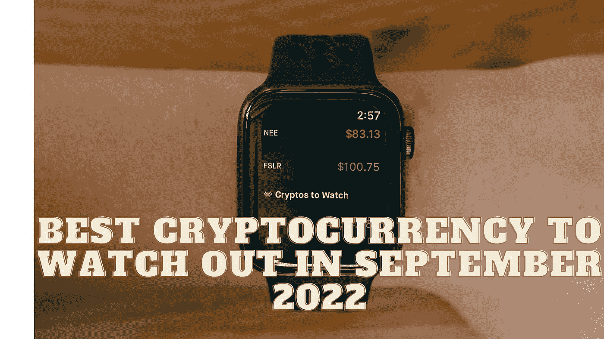

# 2022 年 9 月最值得关注的加密货币

> 原文：<https://medium.com/coinmonks/best-cryptocurrency-to-watch-out-in-september-2022-3eab6341c0b?source=collection_archive---------38----------------------->

Source photo Unsplash.com

以太坊是世界第二大区块链网络，价值 1857 亿美元。直到 2015 年，区块链网络以太坊才被引入。智能合同是双方之间自动执行的计算机程序，最初托管在这个网络上。智能合约本身由一个名为以太坊虚拟机的程序执行。