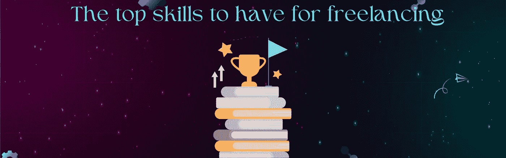

# 2023 年最值得学习的自由职业技能

> 原文：<https://medium.com/coinmonks/best-freelancing-skills-to-learn-in-2023-12b69948d6d9?source=collection_archive---------10----------------------->

best freelancing skills to learn in 2023

自由职业者是指在自己擅长的领域工作的人。一个人可以自由职业作为他们唯一的收入来源或者作为一些被动收入的副业。

老实说，疫情告诉我们，就业市场和工作保障可能会在短短几周内遭到侵蚀。此外，经济衰退仍在持续，这将导致一些公司因削减预算而被迫裁员。因此，学习一些特定的技能将使你获得被动收入，并在为时已晚之前做好准备。

每一个有技能的个体都可以[成为自由职业者](https://uniblok.io/)。然而，并不是所有的技能都能在网上就业市场上找到。这篇文章将提供一份 2023 年需求量很大的最佳自由职业技能清单。发展这些技能将使你能够为自己找到好的网上机会，并在网上赚钱。

# 自由职业者必备的顶级技能

top skills to have for freelancing

为了成为一名自由职业者，一个人可以获得数百种技能。然而，并不是所有这些技能都有潜力让你在网上赚钱。即使有一些方法可以通过他们在网上赚钱，他们通常涉及一些挑战。

例如，一个熟练的电工不能在线提供服务。他不可能在线提供服务，因为他必须亲自提供技能。然而，如果他创建了一个教授他的专业的在线课程，他可以通过出售课程在网上赚钱。

下面列出了 2023 年最热门的自由职业技能，这些技能非常受欢迎，可以在你舒适的家中远程完成。互联网连接和笔记本电脑是所有需要的。

# 数字营销

digital marketing

在广告业，数字营销变得越来越流行。数字营销包括使用在线媒体和社交网络在互联网上推广公司的品牌、产品和服务。

数字营销其实并没有那么难学。需要对互联网、社交媒体、趋势话题、研究和客户行为有透彻的理解。加深对行业的理解是让你成为这项技能大师的关键。

# 区块链和密码学

blockchain and cryptography

我们不能忽视区块链和加密货币等技术对我们生活的影响以及它们对未来的潜力。你一定熟悉区块链技术，特别是因为它在疫情的最初几个月爆炸了。甚至有可能你在过去几年投资了 crypto 并赚了一些钱。虽然区块链有积极和消极的影响，我们不能忽视对区块链程序员的需求。在不久的将来，这项技术有望发展得更快。

你可以毫无困难地学习区块链编程技巧，因为这个过程不像学习一门强大的脚本编程语言那样复杂。关于新兴技术的事情是，它们正在快速发展，并且几乎每天都会添加新的功能。

# **App 开发**

app development

现在，几乎每个人都拥有一部智能手机，它可以用于各种目的，有几个应用程序和游戏。大多数客户和初创公司都在寻找应用程序开发人员，以便在不雇佣永久员工的情况下完成应用程序开发工作。应用程序开发所需的技能包括编程和编码语言、图形设计、用户界面设计等。有了这些技能，你就可以轻松成为一名自由职业的应用开发者。

# **内容写作**

content writing

在内容写作中，你为网站提供书面内容。每个网站都是靠内容来运作的；没有内容，就没有网站。发布在网站上的每一篇博客或文章都是一段服务于各种目的的内容。如果你精通写作，并且能够创作引人入胜的内容，你就可以成为一名内容作家。做一名自由撰稿人是个好主意，因为对内容写作的需求永远不会减少。

# **搜索引擎优化**

search engine optimization

就 SEO 而言，它指的是优化网站及其内容的过程，目的是让网站在搜索引擎的结果页面上针对某个特定的关键词排名更高。搜索引擎优化是一种低成本，长期的营销策略，是当今大多数公司的首选。一般来说，一个网站的 SEO 越好，它在 Google 上的排名就越高。企业从 SEO 中受益，为他们的网站带来有机流量。为了成为一名成功的 SEO 专家，你需要以下技能——内容写作、主题研究、A/B 测试、关键词研究和谷歌排名因素。

# **机器学习&人工智能**

machine learning and AI

随着技术的进步和发展，有理由假设许多以前由人类执行的任务现在将由人工智能和机器学习来处理。这个领域经历了大量的技术进步，例如人工智能现在能够创作艺术品，编写内容，防止灾难，并普遍帮助人类。

机器学习和人工智能领域对程序员的需求已经很高，预计未来这种需求还会增加。在这个困难的领域取得成功的关键是尽可能多地学习流行的编程语言，如 Python 和 C++。

# **平面设计**

graphic designing

有许多不同类型的计算技能可以归类为图形设计。这包括在 2D 进行简单的图像编辑，创作艺术杰作以及 3D 建模和动画。对于自由职业者来说，最有价值的平面设计技能是超越简单的图像编辑的东西。但是，你可以相对容易地学会它。

在网上就业市场，平面设计师需求量很大。最常见的工作类型包括标志设计、营销材料、横幅、小册子、名片、办公室布景、海报和网站图形。

# **数据科学分析师**

data science analyst

数据科学和分析的一个重要方面是在大量数据中寻找有意义的联系。在这方面没有什么新东西，但由于企业和公司越来越依赖数据来提供更好的产品和增加利润，对这一技能的需求不断增加。

学习数据科学和数据分析需要成为一个逻辑思考者，以便识别大型数据集中的联系、异常和关系。如果你是一个快速的学习者，一个批判性的思考者，并且喜欢侵蚀数字和数学公式，你可以为客户做这件事赚很多钱。

# 受雇从事自由职业

你现在已经清楚地了解了作为一名自由职业者你需要的技能。这里有一个指南可以帮助你找到客户并获得一些项目，这样你就可以开始赚钱了。这是你能找到各种自由职业项目的地方。就我而言，Uniblok 和 Fiverr 是现有的最佳选择。

此外，你可以自己找到这些网站之外的客户。通过搜索当地公司，了解是否有当地公司需要你的技能。此外，社交媒体平台是找到企业主并与他们就项目合作进行沟通的绝佳资源。

# 结论

在整篇文章中，我们将为你提供一份对自由职业者来说最重要的技能的简要描述。最后，这里有一个名为 UNIBLOK 的市场，在这里你可以找到工作来运用你的自由职业技能。

访问我们的网站:【https://uniblok.io/ 

在以下网站查看 Uniblok:[insta gram](https://www.instagram.com/uniblok_techpvtltd/)|[脸书](https://www.facebook.com/Uniblok-Tech-Pvt-Ltd-115934447782742/)|[Linkedin](https://www.linkedin.com/company/uniblok-tech-pvt-ltd)|[Twitter](https://twitter.com/UniblokPVTLTD)|[Pinterest](https://in.pinterest.com/UniblokTechPvtLtd/)

> 交易新手？试试[加密交易机器人](/coinmonks/crypto-trading-bot-c2ffce8acb2a)或者[复制交易](/coinmonks/top-10-crypto-copy-trading-platforms-for-beginners-d0c37c7d698c)