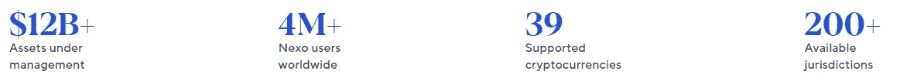

# 最佳高收益加密货币账户:综述[2022 年 7 月]

> 原文：<https://medium.com/coinmonks/best-high-yield-cryptocurrency-accounts-a-review-july-2022-600667342a9e?source=collection_archive---------7----------------------->

通货膨胀正在上升，有效地削弱了我们银行账户里的钱的购买力。鉴于最近公布的 8.6%的 CPI(消费者价格指数)——40 多年来的最高水平——足以说，任何存款账户支付的利率都不会超过这个水平，这对于维护存储在其中的钱的价值是不公平的。除了股票市场和房地产，只有在加密货币的背景下才能实现如此高的收益率，这是一个令人兴奋的领域，也是一个令人困惑的领域，因为许多骗局和陷阱削弱了这个行业。事实上，Terra 最近的垮台引发了一系列事件，导致各种 CeFi 和 DeFi 平台上的加密货币回报下降。我整理了 5 个值得一提的 CeFi 平台，它们目前为您的闲置加密货币提供了最佳利率，并证明了它们在这个熊市中值得一提。

> 交易新手？试试[密码交易机器人](/coinmonks/crypto-trading-bot-c2ffce8acb2a)或者[复制交易](/coinmonks/top-10-crypto-copy-trading-platforms-for-beginners-d0c37c7d698c)

# Nexo

**N** 作为一家获得[许可并受到](https://nexo.io/licenses-and-registrations)监管的透明金融科技公司，Nexo 拥有强大的基本商业模式，由 BitGo 和 Ledger Vault 提供**775，000，000 美元的保险保护。总的来说，他们为各种各样的加密货币提供极具竞争力的利率，最高可达 36%。以太坊网络上每月最多可免费取款**5 次，多边形网络上免费取款[次数不限](/coinmonks/bridging-erc20-matic-the-nexo-multichain-bridge-597ae382bad1)。他们有一个**优秀的客户支持团队**，还有一个**生动活泼的电报组**，可以在这里[找到](https://t.me/nexofinance)。Nexo 卡是一个令人兴奋的新功能！

[**报名奖金**](https://nexo.io/ref/hce5cfdt5o?src=android-link) : **$25 在 BTC 存入$100 存款，持有 1 个月。报名** [**这里**](https://nexo.io/ref/hce5cfdt5o?src=android-link) **！**

要了解更多关于 Nexo 的信息，请点击这里查看我之前的文章。

# 霍德瑙特

H[**odlnaut**](https://www.hodlnaut.com/join/RTbHxuJMX)在这个领域是一个相对较新的玩家，但它已经为自己的名字建立了稳固的声誉。Holdnaut 是一家总部位于新加坡的金融科技公司，已获得新加坡金融管理局(MAS)的原则批准，获得主要支付机构牌照。Hodlnaut 对主流加密货币币提供**最高 7.25%** 的分级利率，每月 **1 次免费提现**；随后的取款花费 10 美元。

[**报名奖金**](https://www.hodlnaut.com/join/RTbHxuJMX):**30 美元，最低存款 1000 美元，连续持有 31 天。报名** [**这里**](https://www.hodlnaut.com/join/RTbHxuJMX) **！**

# 蛋糕 DeFi

C (APY 汇率根据市场情况而波动)

总之，Cake DeFi 提供以下服务，从您的加密货币中产生被动现金流:

*   **赌注**:分配 DFI 进入赌注，赚取 30-40%的回报。入股/分拆资产不收取任何费用。桩是在一个灵活的条款，没有最短的合同期限。在 DFI，奖金每天发放两次，并与资本相结合。
*   **流动性挖掘**:将价值相等的 2 项资产分配到流动性挖掘池中，如比特币-DFI、以太坊-DFI、USDT-DFI 等，产生高达 100% APR 的回报(视市场情况而定)。奖励主要在 DFI 每天发放两次，并且可以自动下注以产生更多的复利。最近推出的[分散资产](/coinmonks/invest-in-tesla-google-apple-easily-with-decentralized-assets-cdfe4e58330b)代表了分散金融的一场革命，使投资者能够在投资股票/ETF/贵金属的两个世界中获得最佳收益，同时获得加密货币的高收益！
*   **贷款**:通过贷款，资产(比特币/以太坊/ USDT/ USDC)被锁定 1 个月的期限，有保证的基础年利率和潜在回报，如果资产价格超过某个目标，在期限到期时。
*   **冻结**:冻结可以比作忠诚计划，投资者将他们的资金锁定在流动性挖掘/投资中，期限从每月到 10 年不等，以换取更高的回报。
*   **借入**:用 DFI 作为抵押，以可承受的年利率 5%借入资产。将你借来的资金投资到 Cake DeFi 提供的任何高收益产品中，轻松抵消贷款利息！

[**签约奖金**](https://cakedefi.com/?ref=677920) : **$50，任何受支持资产的最低存款额为$ 50**，随后投资于 1 个贷款批次/冻结 1 个月的赌注/冻结 1 个月的流动性开采。合格存款的例子包括每批贷款存入 50 美元 USDT；价值 50 美元的 LTC 存款进入流动性挖掘，然后冻结 1 个月(在进入流动性挖掘池后，前往冰柜冻结您的资金)；或者在 DFI 存 50 美元，然后冻结一个月(同样，在下注后，去冰箱冻结你的资金)。您的资本被锁定 1 个月，作为您享受红利的合格交易。合格后(冻结 1 个月/进入 1 个贷款批次)，您的奖励立即反映在您的交易历史中，并锁定 180 天，在冰柜中产生复利。在 1 个月的锁定期后，你的资金可以自由支配。出于获得奖金的目的，我建议存款略高于最低要求的金额，但稳定币除外，以应对转账和存款期间可能出现的价格波动。要了解更多关于如何获得注册奖金的信息，请点击这里查看我以前的文章。要了解更多关于 Cake DeFi 及其各种产品的信息，请点击[这里](https://cybery.medium.com/list/cake-defi-0acb0c90a3ab)。 [**今天报名**](https://cakedefi.com/?ref=677920) **！**

# 尤霍德勒

Y[**ouHodler**](https://track.youhodler.com/click?pid=899&offer_id=2&sub1=Blog)是一家总部位于欧盟和瑞士的品牌金融科技平台，专注于加密支持贷款 **fiat(美元、欧元、瑞士法郎、英镑)、crypto (BTC)和 stablecoin 贷款(USDT、USDC、TUSD、PAX、PAXG、戴、HUSD)、crypto/fiat 和 crypto/crypto 转换，以及高收益加密储蓄账户(crypto-rewards & staking)** 。该平台支持 BTC、BCH、BNB、ETH、LTC、XLM、XRP、DASH、HT、REP 和其他流行的加密货币和令牌。用户的数字资产由 [**总账金库的**](https://www.youhodler.com/blog/youhodler-ledger-vault) **高级保管和** [**防火墙**](https://www.globenewswire.com/news-release/2021/09/02/2290913/0/en/YouHodler-Integrates-Fireblocks-To-Secure-Its-Crypto-Transactions.html) **安全选项**安全守护。

YouHodler 为没有任何层级的加密货币提供了市场上最高的回报率之一，高达 10.7%的年利率。奖励是复合的，每周发放。

优霍德勒比其竞争对手有一个有趣的优势，因为它支持币安智能连锁网络的存款和提款稳定的硬币；因此，虽然不提供免费取款，但 USDT 和 USDC 通过 BEP20 网络取款只需 1 美元，而 ERC20 取款需要 20 美元。

对于那些有更大风险承受能力的人，YouHodler 还提供多方法和涡轮增压服务，使投资者能够轻松地从杠杆交易中受益。

[**报名奖金**](https://track.youhodler.com/click?pid=899&offer_id=2&sub1=Blog) :待定 YouHodler 升级，敬请期待！**报名** [**这里**](https://track.youhodler.com/click?pid=899&offer_id=2&sub1=Blog) **！**

# BlockFi

[Blockfi](https://blockfi.com/?ref=a16e37fd) 成立于 2017 年，是一个金融科技平台，在全球范围内提供**加密货币兑换、计息账户和低息贷款**，具有机构质量的好处，得到了包括梵拉风险投资公司、银河数码、富达、阿库纳资本、SoFi 和比特币基地风险投资公司在内的投资者的支持。

BlockFi 对高达 15% APY 的密码货币提供分层利率。完整的利率列表可以在这里找到。

Blockfi 每月向**提供 1 次免费取款**，每次取款需支付 50 美元。

[**签约奖金**](https://blockfi.com/?ref=a16e37fd) **:在 BTC 10 美元，存款 100 美元，为期一个月。** [**今日签约**](https://blockfi.com/?ref=a16e37fd) **！**

# 概括起来

T 在全面熊市中，Terra 生态系统的崩溃加速了许多基金的崩溃。在剩下的平台中，上述 5 个平台经受住了时间的考验，证明了自己值得一提。

综上所述，考虑到各种利率、取款特权、签约奖金以及所提供的签约奖金的 ROI(投资回报)(表示为签约奖金的百分比除以获得所述奖金所需的资本)，各种密码货币账户提供商的亮点可总结如下表所示。

因此，可以得出以下结论:

*   [**Nexo**](https://nexo.io/ref/hce5cfdt5o?src=web-link)**是一个多功能平台，能够在诱人的收益率、免费取款和诱人的签约奖金之间取得良好的平衡。**
*   **[**Cake DeFi**](https://cakedefi.com/?ref=677920) 提供了一整套服务，如投资、贷款和流动性挖掘，使得产生被动现金流变得容易。就签约奖金而言，它的投资回报率也最高，在 DFI，用户只要支付 50 美元的合格押金，就可以立即获得 50 美元的奖金。但是，请注意，在 DFI，50 美元奖金在自由提取之前会被锁在冰箱里 180 天，而在贷款/抵押或 LM 冰箱(满足奖金条件)的 1 个月持有期后，50 美元资本可以自由使用。**
*   **[**优豪德勒**](https://track.youhodler.com/click?pid=899&offer_id=2&sub1=Blog) 提供了市场上最高的利率之一，尤其是对于稳定的投资者，在 BEP20 网络上取款收费颇具吸引力。**

**你有什么想法？如果您有任何意见或建议让我在下一篇文章中回顾，请在下面的部分随意评论！**

****

**和往常一样，这不是财务建议！而只是我投资过的，觉得值得分享的投资平台。在投资前做好自己的研究，不要存你输不起的钱。下面有什么问题可以随时问我。**

***如果你喜欢这篇文章，* [*跟着&订阅*](/@cybery) *！***

***查看以下值得信赖的平台！***

***🎁*[*honey gain*](https://r.honeygain.me/CYBER577DD)*一款被动收入 app，从你未使用的互联网带宽中赚钱。* [*免费获得 5 美元*](https://r.honeygain.me/CYBER577DD) *，无需投资。***

***🎁* [*蛋糕 Defi*](https://cakedefi.com/?ref=677920) *一站式投资平台，以高达 100%的年利率烘焙被动现金流！* [*在 DFI 用 50 美元存款获得 50 美元奖金*](https://cakedefi.com/?ref=677920) *。***

***🎁*[*Nexo*](https://nexo.io/ref/hce5cfdt5o?src=web-link)*一家先进、受监管的数字资产机构，提供即时加密贷款，资产年利率高达 36%，是一家交易所，在 200 多个司法管辖区提供 40 多种法定货币的服务。* [*用 100 美元存款获得 25 美元*](https://nexo.io/ref/hce5cfdt5o?src=web-link) 奖金*。***

***🎁*[*Hodlnaut*](https://www.hodlnaut.com/join/RTbHxuJMX)*一个强大的加密借贷平台，从你闲置的加密货币中产生被动现金流，年利率高达 9.4%。* [*在 USDC 存款 1000 美元可获得 30 美元*](https://www.hodlnaut.com/join/RTbHxuJMX) *奖金，存款 1500 美元可获得 50 美元。***

***🎁*[*Kucoin*](https://www.kucoin.com/r/af/rJH29LZ)*一个庞大的加密货币交易所，提供有趣的产品，如赌注、自由交易机器人和比特币云挖掘服务。***

***🎁* [*火币*](https://www.huobi.com/en-us/topic/double-invite/register/?invite_code=5t5jb) *一个加密货币交易所，提供多样化的产品、免费空投和交易机器人。***

***🎁*[*MEXC*](https://www.mexc.com/en-US/register?inviteCode=mexc-1NAJC)*一家持有 MX 代币的加密货币交易所，有着有趣的列表和频繁的空投。***

***🎁*[*Crypto.com*](https://read.cash/@TraderFX/10-tips-to-maximize-earnings-on-honeygain-an-effortless-free-passive-income-app-68535728#bad-link)*一家位于新加坡的加密货币交易所。* [*得到 25 美元*](https://crypto.com/app/fcbsjmf5pb) *在 CRO 赌赢一张红宝石牌。***

***🎁*[*Pionex*](https://www.pionex.com/en-US/sign/ref/mWhH4v29)*一个免费的多功能套利交易机器人，自动化低买高卖的过程，全天候。***

*****针对马来西亚投资者*****

***🎁*[*Luno*](https://www.luno.com/invite/EDXG2X)*在 BTC 用 100 令吉购买 BTC 获得 25 令吉奖金！***

***🎁* [*斯塔沙威*](https://www.stashaway.my/referrals/kenleel9jx) *免费投资 6 个月！***

***🎁Wahed code 'KENLIE1' RM10 注册奖金***

***🎁Capbay P2P 代码' 8879c6' RM100 注册奖金***

***🎁* [*亦然*](https://download.versa.com.my/1bAf/referral?deep_link_value=QF218MMB) *用 100 令吉存款获得 10 令吉奖金！***

***🎁*[*KDI*](https://app.digitalinvesting.com.my/registration/signup?referral_code=103433)*用 250 令吉存款获得 10 令吉奖金！***

*****接我*** [***中***](https://cybery.medium.com/)***|***[***read . cash***](https://read.cash/r/TraderFX)***|***[***Youtube***](https://www.youtube.com/c/SmartInvestingChannel)***|***[***推特***](https://twitter.com/cybertraderfx)**