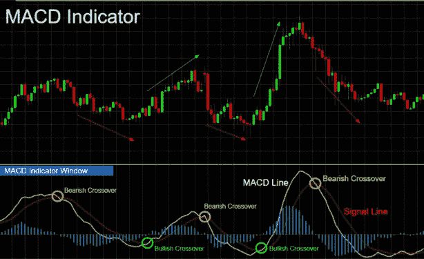
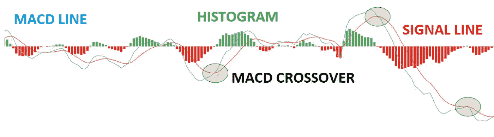
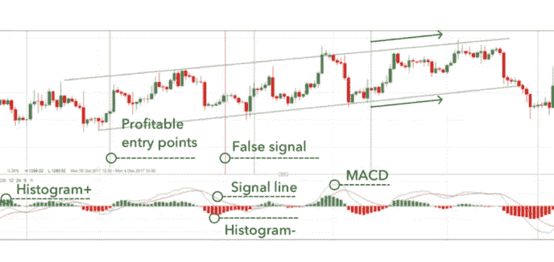
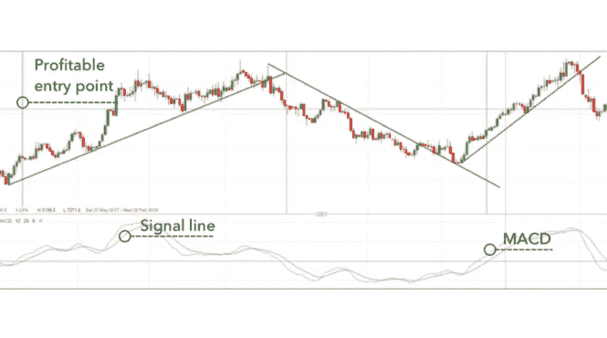

# 最佳 MACD 交易策略

> 原文：<https://medium.com/coinmonks/best-macd-trading-strategies-5f9f15859067?source=collection_archive---------33----------------------->

移动平均收敛发散(MACD)指标可以识别整个金融市场的机会。学习如何使用这个工具对交易者的成功至关重要，所以我们看了三个常见的 MACD 策略。

# 什么是 MACD？

移动平均线收敛发散(MACD)是最常用的技术分析指标之一。它是一个趋势跟踪动量指标，这意味着它查看资产的动量以确定趋势是上升还是下降，因此可用于提供交易信号和识别交易机会。

# MACD 是如何工作的？

MACD 指标由三部分组成:两条移动平均线和一根柱状图。

指标中的两条线看起来像简单移动平均线(SMAs)，但实际上它们是分层指数移动平均线(EMAs)。较慢的主线路是 MACD 线，而较快的线路是信号线。

如果两条移动平均线合在一起，我们称之为“收敛”，如果两条移动平均线背离，我们称之为“发散”。这两条线之间的差异显示在直方图上。如果 MACD 在零线以上交易，它将确认上升趋势，低于零线，该指标将用于确认下降趋势。

如果发现市场价格呈上升趋势——达到更高的高点和更高的低点，以及突破阻力的关键水平——交易者可能会进入多头头寸。而如果资产处于下降趋势，以较低的高点和较低的低点或支撑位的突破为特征，交易者可能会选择进入空头头寸。

# 三种常见的 MACD 交易策略

有一系列的 MACD 策略可以用来在市场中寻找机会。三种最受欢迎的策略包括:

1.  转型
2.  直方图反转
3.  零交叉

# 转型

MACD 线和信号线可以像随机振荡器一样使用，两条线交叉提供买入和卖出信号。和大多数交叉策略一样，当短期的、反应性更强的线——在这里是 MACD 线——越过慢速线——信号线时，买入信号就出现了。相反，当 MACD 线穿过信号线下方时，它提供了一个看跌的卖出信号。

由于交叉策略本质上是滞后的，它是基于在开仓前等待一个运动的发生。MACD 在较弱的市场趋势中面临的主要问题是，当信号产生时，价格可能会到达反转点。这将被认为是“错误信号”。值得注意的是，利用价格行为来确认信号的策略通常被认为更可靠。

下图强调了这种标准的交叉策略。有利可图的进场点用绿色竖线标出，而错误信号用红线标出。

# 直方图反转

直方图可以说是 MACD 最有用的部分，条形代表 MACD 和信号线的区别。当市场价格在一个方向上强劲移动时，柱状图的高度会增加，当柱状图收缩时，这是市场移动变慢的信号。

这意味着，当柱状图上的柱远离零时，两条移动平均线也越来越远。一旦最初的扩张阶段结束，驼峰形状可能会出现——这是移动平均线再次收紧的信号，这可能是交叉即将发生的早期迹象。

与上面提到的滞后交叉策略相比，这是一种领先策略。直方图反转是基于使用已知趋势作为放置头寸的基础，这意味着该策略可以在市场运动实际发生之前执行。

下面的图表突出了利用 MACD 直方图作为交易工具的潜力。通过等待柱状图中的两次逆势移动，它减少了这种移动是一次性的而不是反转的机会。通过使用趋势方向的工具，下面的图表突出了三个盈利的交易和一个亏损的交易。交易者也可以使用该工具退出交易，一旦 MACD 开始向相反的方向反转，就退出头寸。

# 零交叉

零交叉策略是基于 EMA 穿过零线。如果 MACD 从下方穿过零线，新的上升趋势可能正在形成，而 MACD 从上方穿过是新的下降趋势可能开始的信号。

这通常被视为三个信号中最慢的，所以你通常会看到更少的信号，但也更少的错误反转。策略是当 MACD 穿过零线以上时买入——或平仓，当 MACD 穿过零线以下时卖出——或平仓。

这种方法应该小心使用，因为延迟性意味着快速波动的市场通常会发现信号发出得太晚。然而，作为一个提供长时间清扫的反转信号的工具，这是非常有用的。

下图突出了澳元/美元过去的三个信号，该指标即将发布第四个信号。如果交易者在正确的地点进场和出场，这些都是有利可图的。并且通过遵循零交叉方法而不是交叉方法，可以避免许多错误信号。

当使用零交叉策略时，了解在哪里退出市场或设置止损是至关重要的。下面例子中的市场提供了几个趋势线突破，这是退出交易的好时机。或者，交易者可以使用低于前一个波动低点(上升趋势)或高于前一个波动高点(下降趋势)的破位来退出交易。

# 什么时候使用 MACD 最好？

没有使用 MACD 指标的“最佳”时机，这完全取决于你，你的个人偏好和交易计划。对一些人来说，可能没有正确的时间使用 MACD 指标，因为他们不采取技术方法进行分析，或选择使用各种其他指标来确定价格行为。

然而，如果你选择使用 MACD，使用该指标的最佳时间将取决于你打算使用上述哪种策略。如果你选择滞后策略，你必须密切关注 MACD 指标，以尽快接收信号。但是如果你选择了一个领先的策略，比如柱状图，你就可以花更少的时间来监控你的 MACD，因为信号会提前出现。

# MACD 战略的关键要点

*   MACD 是最常用的技术分析指标之一
*   它使用三个组件工作:两个移动平均线和一个直方图
*   如果两条移动平均线合在一起，我们称之为“收敛”，如果两条移动平均线背离，我们称之为“发散”
*   线条之间的差异显示在直方图上
*   有三种常见的 MACD 策略:交叉，直方图反转和零交叉
*   使用 MACD 没有最佳时机，因为这完全取决于个人偏好和每个人的交易计划

> 交易新手？试试[加密交易机器人](/coinmonks/crypto-trading-bot-c2ffce8acb2a)或者[复制交易](/coinmonks/top-10-crypto-copy-trading-platforms-for-beginners-d0c37c7d698c)