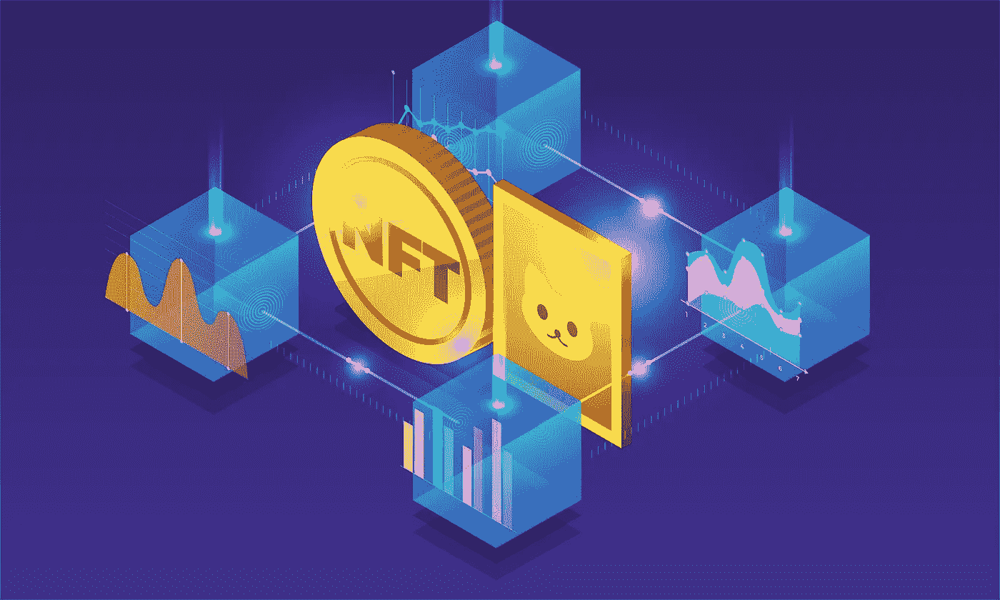
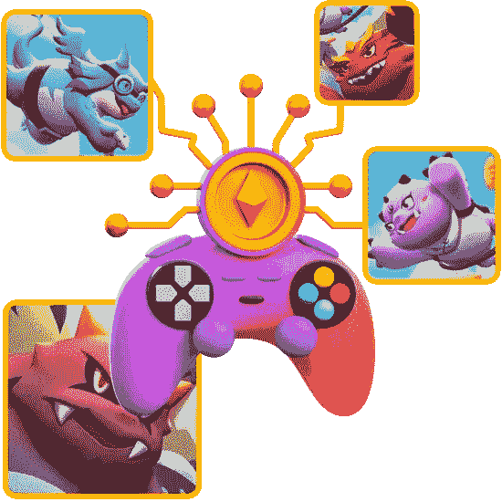

# 为企业家赢得 NFT 游戏的最佳游戏

> 原文：<https://medium.com/coinmonks/best-play-to-earn-nft-games-for-entrepreneurs-afdabe7eb0ab?source=collection_archive---------25----------------------->

NFT image from [Adobestock](https://stock.adobe.com/)

最佳 NFT 游戏在这里停留，并且每个月都有更多新的不可替代的代币视频游戏推出。就像线性游戏一样，这些游戏是风格和流派的折中组合，包括怪物繁殖模拟人生、卡牌战斗游戏和史诗角色扮演冒险。这些游戏并不都是为了赚钱而玩，但是它们都可以让玩家拥有游戏的一部分。

这种类型的广泛传播，加上加密货币和区块链技术的复杂性，使得 NFT 游戏有点难以理解。你可以阅读更多我的 NFT 游戏指南或阅读我们的功能什么是 NFT？以获得这项新技术的广泛指南。

NFT 游戏不同于主流体验，因为购买或赚取的物品可以在游戏内或游戏间出售或交易，以换取真钱。NFT 本身可以在游戏中作为部分所有权使用。大多数 NFT 游戏都有一个在区块链上买卖物品的内部市场，但这意味着它们也可以在游戏之外的最好的 NFT 市场上交易。

# NFT 在游戏中是什么？

NFT 将被视为游戏中的资产，这可能是游戏中的物品，衣服，皮肤等。任何以前你必须购买的物品都可以成为 NFT。

# 我可以免费玩 NFT 游戏吗？

是的，一些 NFT 游戏，如 Axie Infinity，和**一样是免费的。一般入门级的英雄和物品都会有发展的极限。**

## **1. [Axie Infinity](https://www.appdupe.com/axie-infinity-clone)**

**Axie Infinity(在新标签中打开)将 NFT 游戏放在地图上，它很容易成为 NFT 顶级游戏之一。这个培养怪物的 RPG 游戏向人们展示了 NFT 游戏是可行的，有益的，最重要的是有趣的。这个想法很简单:养一只宠物 Axie 并繁殖它来创造一代又一代的生物，每一个都从它的亲戚那里继承特征。你可以在 NFT 市场或游戏中收集和交易斧头，稀有品种会让你赚很多钱。**

**该游戏具有标准模式，如任务、玩家对玩家(PVP)战斗和冒险——每个模式都可以获得光滑的爱情药水(SLP)，这是游戏的实用令牌，用于支付繁殖 Axies。在许多方面，Axie Infinity 是一款类似于神奇宝贝或数码宝贝的“普通”游戏。**

**但是，由于你的车轴是注册在区块链名下的，它们的稀有性和价值可以让你赚到真金白银。这种先玩后赚的模式正是 NFT 游戏所闻名的，当价值上升时，这种模式很好，但当价值下降时，这种模式就不好了。为了抵消施加在游戏 Axie Infinity 上的市场力量，它现在有一个类似于《上古卷轴 Online》等游戏的免费模式，因此玩家可以不需要付费就可以加入，但他们的 Axie 发展有限。**

**今年 Axie Infinity 有了很多更新，使得游戏更加平易近人，并扩展了 Axie 的使用方式；例如，新的构建程序使玩家能够在 Axie Infinity 引擎上创建和提交游戏，最好的是扩展 Axie Infinity 元宇宙。**

## **[2。沙盒](https://www.sandbox.game/en/)**

**沙盒(在新标签中打开)是最成功的 NFT 游戏之一，因为在许多方面它不是一个“游戏”,而更像是一个创作者平台。把沙盒想象成 NFT 驱动的《我的世界》或 Roblox，你可以玩，也可以构建游戏和资产。只有在这里，在沙盒中，你拥有自己的创作，并可以使用 SAND token 在平台的市场上销售和交易你的数字物品、完整游戏等。**

**沙盒的另一面是游戏模式，在这里你可以开发一个自己的世界，添加游戏和体验，并在沙盒内建立一个元宇宙。你可以探索其他玩家的世界，玩游戏和输出内容到你的世界。这是由土地令牌管理的，也使玩家能够对新功能、工具和沙盒的方向进行投票。**

**体素视觉看起来平易近人，类似于《我的世界》，但你可以在沙盒中做更多的事情——你拥有它。看着玩家的土地进化，与其他用户的土地融合，创造出广阔的块状、色彩缤纷的王国，令人着迷。就像堡垒之夜一样，AMC 的《行尸走肉》和 Bushidos 等 NFT 项目等主要品牌正在合作，并在沙盒中展示。**

## **[3。被解放的神](https://www.appdupe.com/gods-unchained-clone)**

**像 MtG 竞技场一样，这里的想法是使用卡片和卡片组合与其他玩家战斗，每个人都有独特的统计数据，优势和劣势需要了解和利用。这是一个精心设计的战略游戏，优秀的玩家可以获胜，而你手中牌的价值并不总是重要的。**

**《被解放的神》之所以成功，是因为它是免费的，奖励技能，并使用 NFTs 来增强其传统思想。卡是通过玩游戏和赚取经验值而获得的，这些可以买卖，在不可改变的 X 密码市场上为你赚取真钱，在游戏中作为神的代币。神令牌也被用来融合和增强卡，以创造罕见的新版本或购买卡包。这是最好的纸牌游戏玩家的 NFT 游戏。**

## **[4。夹板地](https://splinterlands.com/)**

**Splinterlands(在新标签中打开)的目标是提供实体卡牌游戏的收集和交易机制，如魔术:但以数字方式收集。这是 NFTs 的一个优势，他们可以创造可验证的稀有性，并使玩家能够交易和收集数字卡片。《分裂之地》中的每一个动作都被记录在《蜂巢区块链》上，确保一切都是可证明的。**

**游戏玩法类似于《被解放的神》和其他战略卡牌游戏，如非 NFT 游戏炉石。卡有价值和统计，有些很稀有，价值更高。复制的卡片可以被融合以提高他们的能力。**

****

**Play to earn nft games**

**不像《被解放的神》,你必须付费才能玩《碎片之地》,在你开始之前必须买一个新的卡牌包。你得到的牌是随机的，所以有游戏的战利品箱机械师的幽灵悬在碎片地上。然而，一旦进入游戏，你**

**最佳 NFT 游戏将继续存在，并且每个月都会推出更多新的不可替代的代币电子游戏。就像线性游戏一样，这些游戏是风格和流派的折中组合，包括怪物繁殖模拟人生、卡牌战斗游戏和史诗角色扮演冒险。这些游戏并不都是为了赚钱而玩，但是它们都可以让玩家拥有游戏的一部分。**

**这种类型的广泛传播，加上加密货币和区块链技术的复杂性，使得 NFT 游戏有点难以理解。你可以阅读更多我的我们的指南 [**NFT 博彩**](https://www.insideexpress.co/nft-gaming-development-launch-your-nft-game-by-the-leading-game-developers/) 或者阅读我们的专题什么是 NFT？以获得这项新技术的广泛指南。**

**NFT 游戏不同于主流体验，因为购买或赚取的物品可以在游戏内或游戏间出售或交易，以换取真钱。NFT 本身可以在游戏中作为部分所有权使用。大多数 NFT 游戏都有一个在区块链上买卖物品的内部市场，但这意味着它们也可以在游戏之外的最好的 NFT 市场上交易。可以从战斗和任务中获得更多的卡片。**

> **交易新手？试试[密码交易机器人](/coinmonks/crypto-trading-bot-c2ffce8acb2a)或[复制交易](/coinmonks/top-10-crypto-copy-trading-platforms-for-beginners-d0c37c7d698c)**