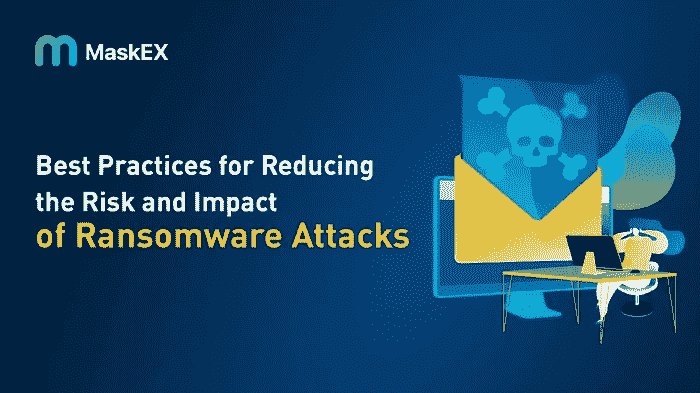

# 降低勒索软件攻击风险和影响的最佳实践

> 原文：<https://medium.com/coinmonks/best-practices-for-reducing-the-risk-and-impact-of-ransomware-attacks-37894307b0bc?source=collection_archive---------68----------------------->

随着数字经济的扩张和网络攻击变得越来越频繁，联邦政府对网络犯罪的调查呈指数级增长。为了降低风险和限制责任，企业现在必须针对网络攻击和安全漏洞制定灾难准备策略。

在本文中，我们将探讨降低勒索软件攻击的风险和影响的最佳实践。

## 什么是勒索软件？

勒索软件是一种恶意软件，它对用户文件和相关资源进行加密，然后要求以加密货币支付，以换取解密的数据。由于勒索软件可以通过互联网传播，因此它可以攻击的对象没有限制。与所有恶意软件一样，勒索软件使用常见的攻击方法渗透网络，例如:

*   社会工程、恶意链接、网络钓鱼电子邮件和有害网站
*   软件和远程桌面协议(RDP)中的漏洞

发送带有恶意链接或附件的电子邮件，员工会在不知不觉中点击这些链接或附件来发起攻击，这是黑客渗透组织的典型方式之一。攻击者会通知受害者他们的数据被加密了。受害者经常被要求以加密货币进行快速支付，因为它隐藏了攻击者的身份以获得解密密钥。攻击者经常威胁说，如果他们在特定的时间内没有得到报酬，就要删除数据。

## 预防措施

*   创建防火墙

针对勒索软件的第一道基于软件的防线是防火墙。防火墙帮助安全团队留意任何可疑或有害的迹象。防火墙可以检查入站和出站流量中的潜在危险。

为了调查网络上任何内容的数据内容，理想情况下，您的防火墙应该能够进行深度数据包检测(DPI)。此功能会自动检测包含受污染软件的软件包。

*   进行离线备份

尽管云备份非常好，但是如果不离线存储数据备份，您仍然有丢失数据的风险。这要求频繁备份、保存副本并进行监控，以确保备份是原始文件的准确副本。您的最佳做法是在攻击后经常恢复数据，使离线数据备份成为一种重要的勒索软件防御手段。

有了这个策略，你就不需要和攻击者谈判了；你恢复你的数据。除非攻击者能够访问您的离线数据库，否则攻击您的离线数据是不可能的。

*   确保你的网络是分段的

一旦勒索软件获得了对您系统的访问权限，它必须通过网络横向迁移到所需的数据。网络分割阻止黑客在不同的系统和设备之间自由传输数据。确保每个网络子系统拥有个性化的安全措施、特定的访问规则以及独立的网关和防火墙。

如果黑客闯入您网络的一部分，分段可以防止他们访问目标数据。此外，由于每个部分都需要时间来攻破，因此安全团队有更多的时间来识别和遏制威胁。

*   利用垃圾邮件过滤器

网络犯罪分子每天向随机的企业和个人发送数百万封有害电子邮件，但是一个不断学习的强大垃圾邮件过滤器和一个基于云的威胁情报中心可以阻止 99%以上的电子邮件到达员工的桌面。

*   确保所有软件都是最新的

不言而喻，所有软件都应该更新最新的安全更新。拥有过时的软件可能会让您面临安全漏洞。

*   培训公司员工意识到

勒索软件攻击的接触点是员工。因此，至关重要的是建立常规的安全意识培训，明确员工在打击勒索软件中的作用，并确保员工了解如何:

1.  发现网络钓鱼攻击。
2.  安全地安装和下载程序。
3.  识别可疑的网址和可执行文件。
4.  保护他们的凭证。
5.  选择安全密码。
6.  定期更新他们的系统。
7.  检查软件和网站的有效性。
8.  参与网络安全最佳实践。

## 降低勒索软件攻击的影响

如果您成为网络攻击的受害者，以下是如何降低勒索软件攻击的影响。

*   在攻击之前，创建一个事件响应计划并准备好。
*   选择一家跟踪支付给黑客的加密货币的事件响应公司。
*   确保你有网络安全保险。
*   在支付赎金之前，尽可能多地了解黑客和攻击。
*   确定支付赎金是否被视为违反惩罚。被赎回的一方可能会因违反制裁而面临高额民事罚款，甚至可能入狱。
*   用比特币支付赎金；避免使用增加你的匿名级别或隐私货币的工具。
*   向国家执法部门通报所有勒索软件事件。

## 结论

保护您公司的最佳方法是采取预防性措施来阻止勒索软件。实施上述步骤，并设计一个灾难恢复计划，以领先于黑客，并防止不必要的经济损失。

> 交易新手？试试[加密交易机器人](/coinmonks/crypto-trading-bot-c2ffce8acb2a)或者[复制交易](/coinmonks/top-10-crypto-copy-trading-platforms-for-beginners-d0c37c7d698c)