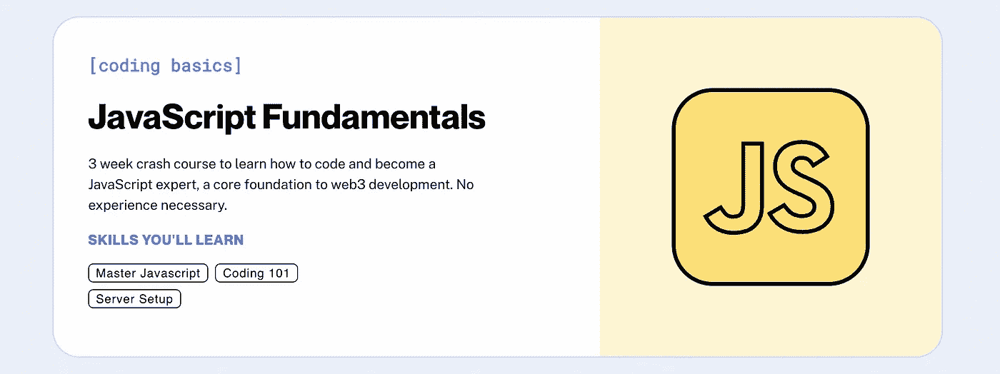

# 2023 年学习区块链开发的最佳资源

> 原文：<https://medium.com/coinmonks/best-resources-to-learn-blockchain-development-in-2023-cdd03bab58db?source=collection_archive---------1----------------------->

## 从零开始，成为一个高技能的区块链开发人员。

区块链技术是一种去中心化的账本，以可验证和永久的方式高效记录各方之间的交易。

这不仅仅是一些未来科技的流行词:它正在发生，并且正在改变世界。

我整理了一份资源清单，帮助你了解 2023 年的区块链科技！

# 1.秘密僵尸

Crypto Zombies

CryptoZombies 是区块链开发的最大的教育平台，它已经存在了 4 年多，拥有超过 40 万注册用户，已经完成了多门课程。

CryptoZombies 是互联网上第一个针对 NFTs 的教程，对于今天希望进入该行业的新一批 web3 开发者来说，它仍然非常重要。目前，CryptoZombies 课程主要集中在以太坊和 Solidity 开发上，但也有很多针对其他连锁店(如币安、创，甚至 Chainlink 等项目)的内容需求。

浏览器内的一步一步的课程将带你从最基础的坚固到创建你自己的全功能的基于区块链的游戏。甚至在第 1 课(可以一次完成)结束时，您就可以正式称自己为区块链开发者了！

如果你对可靠性、令牌标准和区块链一无所知，那么你可以从加密僵尸课程开始你的区块链开发之旅。首先，我会建议你只上 5 堂**稳健:初级到中级智能合约**课程，然后继续学习我提到的下一个资源，以便在更短的时间内获得最大收益。

 [## #1 Solidity 教程&以太坊区块链编程课程| CryptoZombies

### CryptoZombies 是最受欢迎的交互式 Solidity 教程，它将帮助您通过以下方式学习区块链编程

cryptozombies.io](https://cryptozombies.io/) 

# 2.通过 JavaScript 学习区块链、可靠性和全栈 Web3 开发— 32 小时课程

Learn Blockchain, Solidity, and Full Stack Web3 Development with JavaScript — 32-Hour Course

在从加密僵尸那里学习了坚实的基础之后，你继续这个课程。本课程将从智能合约的基础开始，以及为什么未来需要智能合约。除此之外，它将涵盖交易，天然气，帐户等基础知识。

本课程将向您全面介绍与区块链、智能合约、可靠性、ERC20s、全栈 Web3 dapps、去中心化金融(DeFi)、JavaScript、TypeScript、Chainlink、以太坊、可升级智能合约、DAOs、the graph、moralis、Aave、IPFS 等相关的所有核心概念。

学完本课程后，你将成为一名区块链向导，并准备好创建任何你想要的去中心化应用。

# 3.炼金术大学

Alchemy University

炼金术大学是学习如何构建 web3 并与之互动的终极生态系统。他们的目标是教你在 web3 中开始构建所需要知道的一切，从实践、全面的训练营到加速你的工作流程的启动代码。

他们提供了 3 条不同的道路，你可以根据你的经验水平继续与任何人合作；

## 1.JavaScript 基础知识

JavaScript Fundamentals

为了理解事物和成为区块链开发者，JavaScript 基础是非常必要的，所以如果你不知道它或对一些概念滞后，那么你可以首先开始这门课程，建立你的编程基础，然后继续区块链。

这个 JavaScript 速成课程通过异步请求和承诺等高级主题涵盖了编程的基础。以太坊最常用的开发工具和库是基于 JavaScript 的，这使得它成为 web3 开发的关键基础。

## 2.[以太坊开发者训练营](https://university.alchemy.com/#eth-bootcamp)

[Ethereum Developer Bootcamp](https://university.alchemy.com/#eth-bootcamp)

这个训练营将带你从头开始学习强大的基础知识，为你提供适应这个快速发展的生态系统的能力。这个训练营非常强调边做边学。您将构建一个完整的工作证明区块链、许多智能合同和几个分散的应用程序。

你在概念上学到的任何东西，都会通过编码练习向自己证明。他们精心制作了一个 IDE 和协作课堂工具，为您提供终极训练营体验。

我个人建议不管你的经验水平如何，开始 3 课，这些基础都超级牛逼。

## 3.网络之路 3

Road to Web3

Web3 之路是一个为期 10 周的免费项目，用于学习 Web3 开发。你将会在 DeFi，NFTs，Staking 和更多方面建立 dApps！

这是一门很棒的课程，可以为你未来的工作学习和建立作品集 DApps。

 [## 获得 web3 学位

### 通过课程、项目和代码快速跟踪你的 web3 职业生涯。完全免费。

university.alchemy.com](https://university.alchemy.com/) 

# 4.极速以太坊

SPEEDRUN ETHEREUM

Speedrun 以太坊是一个具有挑战性的平台，它让你可以通过在以太坊上构建快速项目来学习。一些项目是**简单的 NFT 例子，分散赌注应用程序，令牌供应商等。**

他们在 youtube 上有一个惊人的播放列表，可以让你从**的 Web2 过渡到 Web3。**

Web2 to Web3 — learn how to build on Ethereum

 [## 极速奔跑以太坊

### 了解如何在以太坊上构建；超能力和陷阱。

speedrunethereum.com](https://speedrunethereum.com/) 

# 5.建筑空间

Buildspace

Buildspace 是另一个很棒的平台，它提供基于以太坊和其他不同链(如 Solana)的项目学习。

它提供了不同的课程，如**坚固性介绍:运送以太坊 dApp，建立自己的以太坊 NFT 收藏，建立一把刀等。**

这是另一个很棒的平台，在这里你可以为你的投资组合建立惊人的项目，帮助你进入区块链空间。

 [## 建筑空间

### 探索有前途的领域，发布有意义的产品。背后是 a16z + YC。

buildspace.so](https://buildspace.so/) 

# 6.LearnWeb3

LearnWeb3

LearnWeb3 是另一个 Web3 平台，它为不同层次的开发人员提供不同的课程。每个专题讲座包含许多文章，涵盖了 web3 所需的大量主题。如果你是全新的，你可以从他们的**新生**轨道开始，这可以为你的 web3 之旅提供坚实的基础。

他们还有另外三个轨道，**大二，大三，大四**可以帮助你随着流程学习高级话题。

 [## 免费学习 Web3 DAO |成为 Web3 开发者

### 实践学习是每个职业不可或缺的一部分，而且要在一个不断鼓励你的环境中进行…

learnweb3.io](https://learnweb3.io/) 

# 7.无银行学院

BANKLESS ACADEMY

无银行学院的使命是确保每一个 web3 探索者为他们的加密宇宙之旅做好准备。

使用学院平台，您将迈出自信的第一步，进入新的前沿，然后开始自己独特的学习道路，并准备在区块链空间开辟新的道路。

 [## 无银行学院

### 提升你对 Web3 和 DeFi 的知识

app.banklessacademy.com](https://app.banklessacademy.com/) 

# 8.开发者道书院

Developer DAO Academy

**D_D 学堂**是由开发者道打造的开源教育平台。

他们寻求为学习者提供可应用于现实世界项目的知识和工具，同时促进健康的学习环境。

除此之外，Developer DAO 是最好的社区之一，它可以帮助你和其他有链接意识的人一起发展你的 web3 载体。

 [## 开发者道书院

### 学堂是由开发者道打造的开源教育平台。

代码学校](https://school-of-code.vercel.app/) 

# 9.以太坊开发者资源

Ethereum Developer Resources

**ethereum.org**是以太坊的官方网站，通过基础概念文档和开发栈来帮助你构建以太坊。此外，还有一些教程可以帮助您入门和运行。

受 Mozilla 开发者网络的启发，他们在那里放置了大量的开发者内容和资源。这里的一切都是开源的，随时可供您扩展和改进。

 [## 以太坊开发者资源| ethereum.org

### ethereum.org 在这里帮助你建立以太坊的基础概念和文档…

ethereum.org](https://ethereum.org/en/developers/) 

# 结论

好了，这些都是我所知道的可以产生巨大影响并推动您开始区块链发展之旅的惊人资源。

当然，你不需要放弃我提到的每一个资源，只需要探索和继续你感兴趣的资源。每个人都是不同的，有些人喜欢看视频，有些人喜欢阅读，因为我已经提到了所有这些供您选择。

知识通过与他人分享而增长！我花时间用我所拥有的知识和资源去帮助其他人。确保做同样的事情，并与那些在区块链空间开始他们的载体的人分享。

感谢
[阿里·穆尔塔扎·梅蒙](https://medium.com/u/e03fa75e10fd?source=post_page-----cdd03bab58db--------------------------------)

> *交易新手？试试* [*加密交易机器人*](/coinmonks/crypto-trading-bot-c2ffce8acb2a) *或* [*复制交易*](/coinmonks/top-10-crypto-copy-trading-platforms-for-beginners-d0c37c7d698c) *上* [*最好的加密交易*](/coinmonks/crypto-exchange-dd2f9d6f3769)

> 加入 Coinmonks [电报频道](https://t.me/coincodecap)和 [Youtube 频道](https://www.youtube.com/c/coinmonks/videos)获取每日[加密新闻](http://coincodecap.com/)

# 另外，阅读

*   [复制交易](/coinmonks/top-10-crypto-copy-trading-platforms-for-beginners-d0c37c7d698c) | [加密税务软件](/coinmonks/crypto-tax-software-ed4b4810e338)
*   [网格交易](https://coincodecap.com/grid-trading) | [加密硬件钱包](/coinmonks/the-best-cryptocurrency-hardware-wallets-of-2020-e28b1c124069)
*   [免费加密信号](/coinmonks/free-crypto-signals-48b25e61a8da) | [加密交易机器人](/coinmonks/crypto-trading-bot-c2ffce8acb2a)
*   [杠杆代币](/coinmonks/leveraged-token-3f5257808b22)终极指南
*   [16 款最佳折叠电动自行车](/coinmonks/top-17-folding-electric-bikes-5e296f0918cb)
*   [28 款最佳电动自行车点评](/coinmonks/the-28-best-electric-bikes-review-and-buying-guide-in-2023-7bb3146cb403)
*   前三名[币安期货交易机器人](/coinmonks/top-3-binance-futures-trading-bots-e6031f84b3f9)