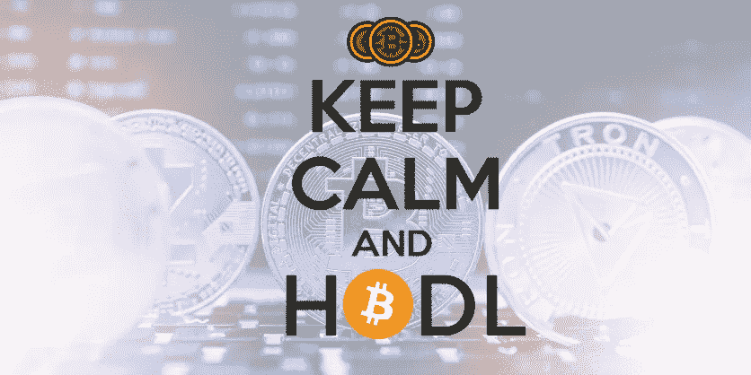

# 如何安全地使用加密技术并从中获利？

> 原文：<https://medium.com/coinmonks/best-way-to-hodl-crypto-safely-and-make-profit-adf4617684ba?source=collection_archive---------9----------------------->

Hodling 已经成为密码社区中的流行词，因为它需要在不稳定的密码市场中使用。即使那些不是加密货币投资者的人也在社交媒体平台或互联网论坛上遇到过“Hodl”这个术语。

hodl 的意思是“坚持亲爱的生活，如果这听起来像一个语法错误，你几乎是正确的。”2013 年 12 月 18 日，在 Bitcointalk 论坛上出现该术语的背后有一个著名的故事，当时用户 GameKyuubi 在比特币价格在年内出现了意想不到的价格运动后，错误地发布了短语“我在闲逛”。

**相关文章:** [***【币安】利用低风险产品赚取利息***](/coinmonks/binance-earn-earn-interest-using-less-risk-products-408f6736cea)

# Holding 的策略是什么？

霍德林的原则在密码市场上已经不再新鲜。正如我们已经知道的，这是一种购买加密资产而长期不出售的方式，不考虑市场波动。在加密货币中，处理项目代币的人通常被称为钻石手。如果不是一无所获，霍德林防止了人们对过早出售加密资产的恐慌。

在加密领域，有许多人称之为“上市时间”的概念。这主要由加密货币交易商和喜欢短期买卖加密货币的投资者使用。

对于那些寻求了解“什么是存储策略”的人来说，“上市时间”的概念与之不同。它不是一种短期有效的策略，而是评估加密货币的长期收益价值。

要坚持这一策略，你需要防止加密货币市场的情绪动摇你。有时，当加密货币市场出现回调时，遵循这一策略可能会具有挑战性，因为您可能会面临是抛售还是持有的决定。为了避免这种情况，使用这种策略的加密货币投资者通常不会利用第三方服务来存储他们的密码。他们用冷钱包而不是热钱包来减少在市场低迷时考虑出售的倾向。

# 🌟[在 USDT 创建一个币安帐户并获得 100 美元奖金](https://www.binance.com/en/activity/referral/offers/claim?ref=CPA_00M6XWFUN3)🌟

[**Click Her To Access**](https://accounts.binance.com/en/register?ref=26723737)

一旦您在[**www.Binance.com**](https://www.binance.com/en/activity/referral/offers/claim?ref=CPA_00M6XWFUN3)**创建了帐户，就可以存入 50 多 USDT，然后在 100 USDT 优惠券到期前赎回。(只需按照他们的简单指南激活奖金)**

# **从长远来看，处理加密货币以获取利润时要做的事情**

**加密货币并不像看起来那么容易，尽管这个过程不像短期交易那样有压力。要盈利，有需要注意的地方；其中包括:**

# **明智地选择加密货币:**

**霍德林并不意味着你应该找到加密货币，然后在没有适当研究的情况下投资它。大多数时候，从长远来看，强大的社区和合理的项目会提高加密货币的价格。因此，在投资的同时，做彻底的研究，找到一种尽管未来价格波动和升值，但仍将保持强劲的加密货币。**

*****相关文章:*** [***熊市买比特币以外的 5 大加密货币***](/coinmonks/5-great-cryptocurrencies-other-than-bitcoin-to-buy-in-a-bear-market-be3e9945d621)**

# **使用冷钱包:**

**您可以使用冷钱包来积累加密货币，而不是使用标准钱包(也称为热钱包)来存储加密货币。然而，这样做降低了出售加密货币的便利性和想法，假设下跌。如果用的是热钱包，很可能会时不时的查看一下，如果有明显的下降，就很难抑制抛售的想法。**

# **价格高时不买，价格低时不卖:**

**这就很能说明问题了。如果你打算长期持有加密货币，你需要在价格高的时候停止买入，在价格低的时候不要卖出。成本平均和相信熊市是确保你折价购买加密货币的更好方法。**

**尽管你会避免在下跌时恐慌抛售，但这条规则也有例外。当你知道存在地毯式搜索或加密货币背后的项目已经死亡时，卖出并继续前进。**

# **去还是不去霍德尔？**

**在有利可图的加密投资中，没有放之四海而皆准的策略。对于那些像日内交易这样短期买卖的人来说，他们获得了很多，失去了积累的钱。你的投资或交易目标和经验将决定交易是否是一个好的策略。**

**然而，对于大多数人来说，hodl 策略是一个行之有效的策略，因为把握市场时机是相对困难或不可能的。所以对于加密货币交易新手来说通常是比较好的投资策略。**

# **霍德林是一个安全的策略吗？**

**与传统的金融机构不同，没有一个中央机构来监管密码行业的所有运作和活动。此外，加密货币非常不稳定，前一分钟，硬币的价格可能是 110 美元，下一分钟，它可能会跌至 25 美元。因此，人们会问这样的问题:“你在建立一个安全的策略吗？”**

**除了极少数例外，hodling 通常是一种在 crypto 中获利的好方法。首先，找到具有稳固潜力的加密货币和支持它的社区。下一步是投资加密货币。你可以通过购买和支持她的想法来做到这一点。在那之后，你必须等待加密货币的价值上涨很长时间，然后才能决定要么拿走你的利润并保留你的资本，要么卖掉所有的加密货币。当然，这并不意味着这种策略没有风险，但它通常是安全的，尤其是如果你是编码新手的话。**

*****相关文章:*** [***7 款最佳跑马币***](/@s.hanz/7-best-staking-coins-in-2022-70dbc31adcae)**

# **结论**

**从长远来看，Hodling crypto 是加密货币投资者赚钱的方式之一。2013 年，当比特币经历跌宕起伏时，这个术语成为加密领域最流行的术语。时间背后的概念已经被采用，加密货币交易商现在正从中获利。然而，这并不像看起来那么容易；如果你不想失去你的钱，你仍然需要坚持一些规则。这些规则中的一些，比如选择正确的加密项目，使用冷钱包，以及知道何时买卖，都是必不可少的。**

****

**[**Click Here To Generate Your Passive Income**](https://www.binance.com/en/activity/referral/offers/claim?ref=CPA_00M6XWFUN3)**

**请 [**关注并订阅**](/@s.hanz) ，务必分享我的作品作为激励姿态。点击这里查看我所有的文章:[**https://medium.com/@s.hanz**](/@s.hanz)**

# **更多文章:**

**[**埃里克·芬曼，十几岁的百万富翁|比特币成功故事**](/coinmonks/erik-finman-the-teenage-millionaire-bitcoin-success-stories-fe569fa5a477)**

**[**买 Shitcoin 有什么好处吗？**](/coinmonks/is-there-any-benefit-from-buying-shitcoin-412bf88006aa)**

**[**2022 年元宇宙最佳 5 个好项目加密币—清单 1**](/@s.hanz/best-5-metaverse-crypto-coins-with-good-projects-in-2022-list-1-687fedbe668e)**

**[***2022 年元宇宙最佳 5 个加密币好项目—榜单 2***](/@s.hanz/best-5-metaverse-crypto-coins-with-good-projects-in-2022-list-2-15af2f8f01d9)**

**[**2022 年最值得投资的 7 种元宇宙加密币—榜单 3**](/coinmonks/7-best-metaverse-crypto-coins-to-invest-in-2022-list-3-9e077f5c87ab)**

**[**最后的机会—2022 年投资的 6 个最佳元宇宙加密硬币—榜单 4**](/coinmonks/last-chance-6-best-metaverse-crypto-coins-to-invest-in-2022-list-4-2ce3d6c1c922)**

**[**需要钱的时候要做的事情快——新招**](/@s.hanz/things-to-do-when-i-need-money-fast-new-tricks-2b68ad24406b)**

**[**2022 年推广 NFT 项目的 7 种免费方式**](/coinmonks/7-free-ways-to-promote-nft-projects-in-2022-ccefc7f249e7)**

**[**2022 年 7 款最佳赌注硬币**](/@s.hanz/7-best-staking-coins-in-2022-70dbc31adcae)**

> **交易新手？试试[加密交易机器人](/coinmonks/crypto-trading-bot-c2ffce8acb2a)或者[复制交易](/coinmonks/top-10-crypto-copy-trading-platforms-for-beginners-d0c37c7d698c)**