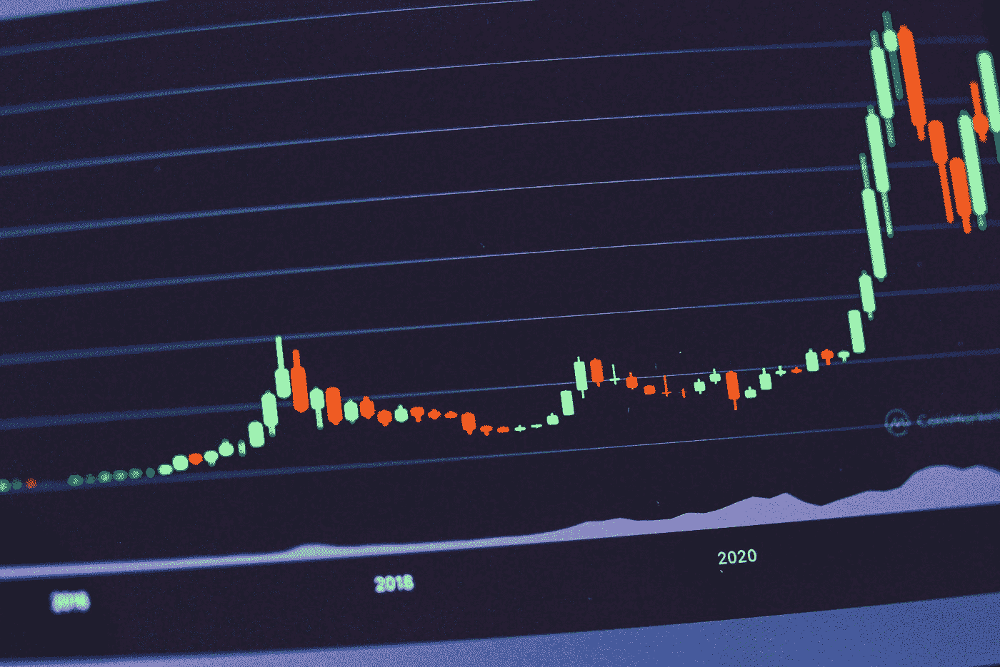

# 跟上所有加密更新的最佳方法

> 原文：<https://medium.com/coinmonks/best-ways-to-keep-up-with-all-the-crypto-updates-b5cf982ccf59?source=collection_archive---------9----------------------->

加密世界在不断变化，几乎每天都有新的事情发生。加密会议和活动是跟上不断发展的加密行业的最佳方式之一。

如果你投资了加密货币或比特币，走在市场变化的前面是必不可少的。然而，有时很容易错过重要的秘密日期。

我们制作了这个方便的指南，以避免任何错过重要加密日期的 FOMO。请继续阅读，了解哪里可以获得最新的加密信息，这样您就可以随时了解最新信息并做好准备。

## **1。**

**说到实时加密对话，Twitter 是最佳选择。您可以关注您最喜欢的项目及其背后的团队、加密领域的影响者以及像您一样的其他加密爱好者，以了解有关加密世界的最新讨论、新闻和想法。**

**当你在 Twitter 上关注正确的人和标签时，你可以放心，你将是第一个知道重要加密主题的人，如关键公告和区块链内的任何变化。**

**然而，“加密推特”不仅仅是关于新闻。在 Twitter 上保持活跃，你还会发现其他有趣的东西，比如很酷的加密迷因。**

## ****2。****

****如果你是一个加密投资者，这是一个你不能错过的网站。从当前的市场价格到市场资本总额和交易量，CoinGecko 拥有您想知道的一切(甚至更多！)关于加密货币。****

****不仅如此，该网站还有许多其他吸引人的功能，让您可以轻松跟踪、交易、购买和出售您的加密货币。在这里，你可以把你想要跟踪的硬币添加到你的投资组合中。这使得以后访问您希望跟踪的硬币的信息变得更加容易。****

****CoinGecko 是获取加密货币所有更新和信息的一站式网站。****

## ******3。电报与不和******

****与 Twitter 类似，Telegram 和 Discord 是你可以找到大多数加密社区的地方。这里的小组将帮助你跟上密码世界的新项目。****

****CoinGecko 通常在网站的项目顶部有官方的 Telegram group 和 Discord server。这是因为在这两个地方，您可以从项目背后的团队获得最准确和最新的信息。还可以和早期采用者和爱好者群体互动。****

****这还不是全部；电报组和 Discord 服务器也可用于判断对新项目的整体兴趣或特定令牌的整体效用。****

## ******4。加密博客******

****这可能并不令人惊讶，但加密博客是一个保持更新加密世界的好方法。如今，网上有几个关于各种加密主题的博客，所以有时很难区分哪些博客有真实信息，哪些没有。****

****关注真实博客的一个有用的提示是留意业内受尊敬的思想领袖的博客。这些博客通常会有关于最新加密趋势的准确信息。****

****如果有你关注的加密网站，比如 CoinGecko 或币安，也许值得看看他们是否有一个博客，里面有更多关于媒体或子媒体的深入信息和观点。这两个网站也是偶然发现其他加密博客的好地方。****

## ******5。项目网站******

****还有什么地方比官方网站更能获得你感兴趣的加密项目的最新信息呢？****

****加密项目网站通常拥有关于特定项目的最准确和最新的信息，以及该项目的路线图和发展方向。****

****如果您不确定某个特定项目的官方网站，请使用可靠的来源，如 CoinGecko 来获取链接。这是为了避免潜在的诈骗网站。****

****你可以通过网站上的信息来判断网站和项目的真实性。如果它与社交媒体、博客和其他信息的链接很有趣，这很可能是一项值得的投资。****

## ******6。链上指标&分析工具******

****有几个网站，如 Into the Block、Glassnode、Lunar Crush、Etherscan 和 Blockchain.com，在那里可以获得区块链的最新数据和分析。****

****这些网站都有自己的 USPs。例如，Glassnode 为您提供流行的区块链的链上数据和指标。你可以比较新加密地址的数据，活跃地址的数量，加密货币的流量，以及比特币在利润中的比例。****

****另一方面， [LunarCrush](https://lunarcrush.com/) 是更新秘密社交媒体趋势的最佳地点。如果你想了解区块链发生了什么，以太扫描和 Blockchain.com 是你可以去的地方。****

## ******7。加密会议&事件******

****最后但并非最不重要的一点是，最具互动性(可能也是最有趣的)的了解加密世界最新动态的方式是参加加密会议和活动。****

****这些活动不仅为您提供了密码世界中正在发生的最新信息，也是与其他密码爱好者会面和交流的好方法。****

****如果你所在的城市近期没有任何秘密会议，为什么不自己举办一个小型的秘密会外活动呢？****

****这将是一个与你所在城市的秘密社区互动的好方法。你甚至可能会遇到能资助你下一个项目或帮助你提升事业的人。****

****查看 [Spacehuntr](https://spacehuntr.com/) ,寻找您附近的酷炫活动地点，举办您的加密活动。这还不是全部。Spacehuntr 也有一个专家团队，他们将为您提供您需要的所有信息，使您的活动取得成功！****

********

****Photo by [regularguy.eth](https://unsplash.com/@moneyphotos?utm_source=medium&utm_medium=referral) on [Unsplash](https://unsplash.com?utm_source=medium&utm_medium=referral)****