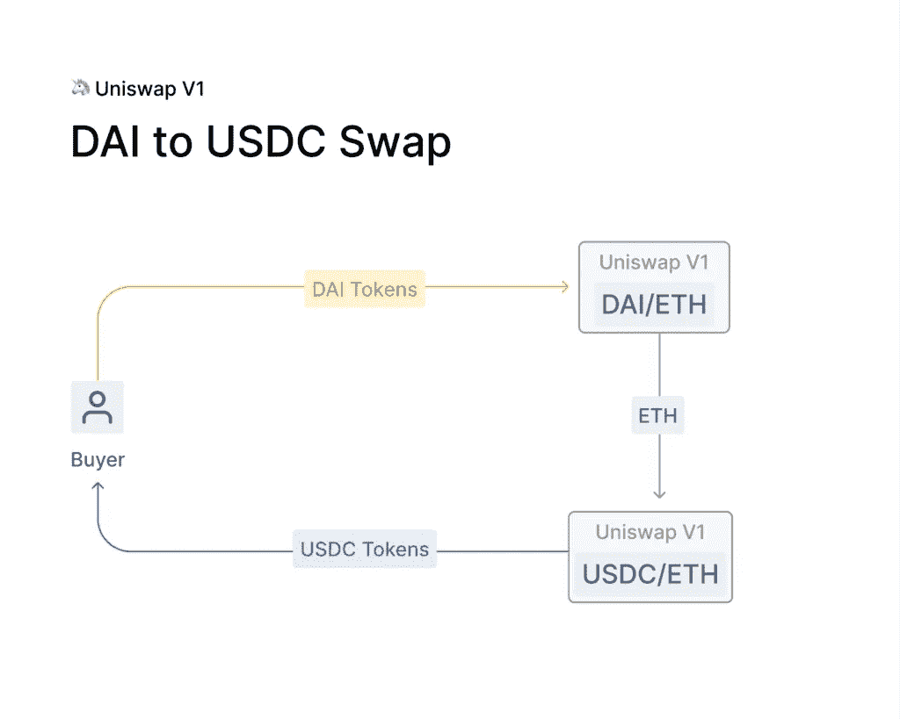
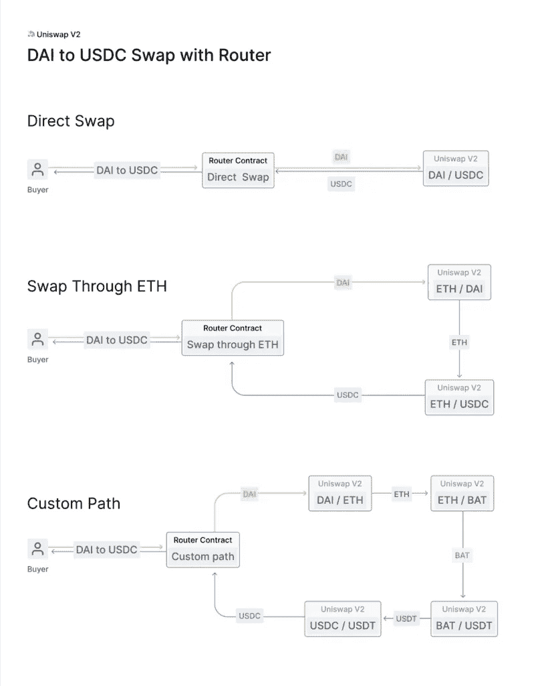
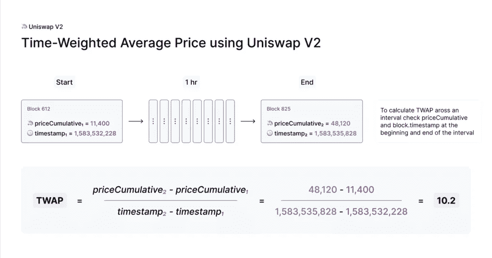
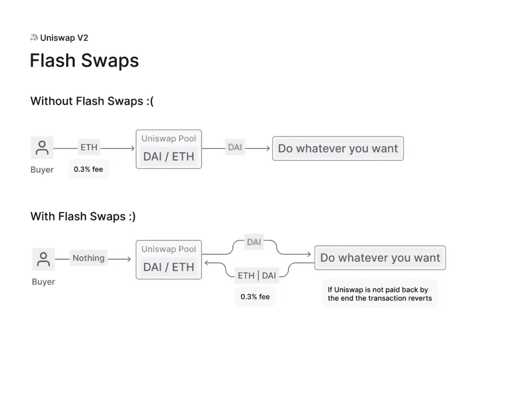
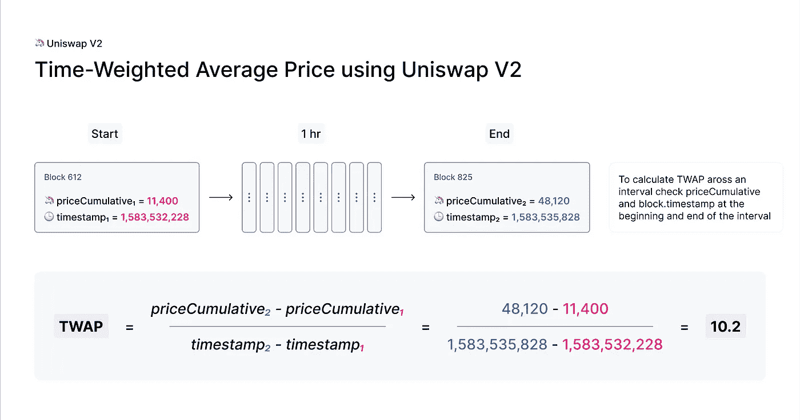

# Uniswap v2 提供更优惠的价格

> 原文：<https://medium.com/coinmonks/better-price-feeds-with-uniswap-v2-dc0dc133347a?source=collection_archive---------1----------------------->

## 了解 Uniswap v2 价格源


大家好，今天我们将讨论 **Uniswap v2 价格反馈**以及 Uniswap v2 如何为您提供**更好的价格反馈**。

快速增长的分散金融(DeFi)生态系统旨在使用分散、非托管的金融产品来取代贷款、保险和衍生品等金融应用中的集中式中间人。

**Uniswap** 是 **DeFi** 生态系统中核心产品之一的一个例子，即分散加密交易所，或 **DEX** 。首先，我们来讨论一下 Uniswap 是什么。

# 什么是 Uniswap？

**Uniswap** 是**以太坊**上的一个协议，用于交换 **ERC20** 令牌，不需要买卖双方创造需求。换句话说，Uniswap 是一个基于以太坊的**去中心化交换(DEX)** ，允许任何人**交换** ERC20 令牌。2020 年 9 月，Uniswap 推出了其 **UNI governance token** ，向 9 月前使用该协议的任何人空投。 **Uniswap V3** 于 2021 年 5 月推出，增加了新功能，包括集中流动性和多层费用。

与大多数旨在收取费用的交易所不同，Uniswap 的功能是一种公共产品——社区交易代币的工具，没有平台费或中间人。此外，与大多数撮合买家和卖家以确定价格并执行交易的交易所不同，Uniswap 使用一个简单的数学等式、代币池和 ETH 池来做同样的工作。

# Uniswap v1 与 v2

让我们提醒自己它的进化路径和 **v1** 与 **v2** 的区别。这将有助于我们理解为什么 Uniswap 成为这个领域的领导者是理所当然的事情。

# uni swap v1—AMMs 简介

**Uniswap v1** 于 2018 年 11 月 2 日在**以太坊主网**首发。尽管它不是第一个 DEX，但它肯定是第一个吸引密码爱好者眼球的。在 Uniswap 之前， [EtherDelta](https://etherdelta.com/) 几乎是唯一一个获得一些关注的 DEX。尽管如此，它还是基于**订单簿**模式，这并不被认为是分散交易所的最佳解决方案，因为它带来了成本、用户体验差和缺乏流动性等问题。

与 EtherDelta 不同，Uniswap 基于**自动做市商(AMM)** 模式。这个模型依靠一个**数学公式**来给资产定价。AMMs 依赖于流动性提供者(LP)而不是下单，流动性提供者投资于流动性池中的交易对。

Uniswap 是一家**恒定功能做市商**，或者更具体地说，是一家恒定产品做市商。这意味着每个流动性池中交易对的比率必须遵循常数乘积公式:

***x*y=k***

其中 *k* 为常数， *x* 为第一项资产的储备， *y* 为第二项资产的储备。

这意味着所有有限合伙人都要以不改变 k 的方式提供额外的流动性。此外，每个交易者都必须知道锁定的资金总量，以避免高滑点。

Uniswap v1 仅支持 **ETH-ERC20** 交易对，因此您只能用 ETH 交换一个 ERC20 令牌。所以，如果你想把换成戴，你必须把换成 ETH，然后去 ETH-DAI 池得到戴。



Uniswap v1 Example — DAI to USDC Swap

Uniswap v1 引入的另一个特性是 **LP 令牌**。每个流动性提供者将获得与他们增加的总流动性的百分比成比例的 LP 令牌的数量。这些 LP 代币代表 LP 对池的贡献，并且可以被出售/交易或燃烧以赎回存放的代币。此外，Uniswap 上的每笔交易都会产生 0.30%的交易费。这些费用作为对提供流动性的有限合伙人的奖励被自动发送到流动性准备金。

# uni WAP v2—优化、分散化和安全性

Uniswap v1 是一种新型分散市场的概念验证。它的初步成功是团队立即重申一个更好的解决方案的信号。Uniswap v2 于 2020 年 5 月推出。

简而言之， **Uniswap v2** 是 Uniswap v1 的一个更好、更用户友好的版本。这个新版本中解决的 v1 的主要问题是缺少 ERC20-ERC20 令牌池。对于那些想用一个 **ERC20** 令牌换另一个令牌的用户来说，这导致了更高的成本和延误。

## ERC20-ERC20 池

Uniswap v2 引入了 ERC20-ERC20 流动性池来解决这个" **ETH 桥接**"问题。他们甚至在核心合同中使用包装 ETH 而不是本地 ETH。然而，最终用户仍然可以通过帮助者合同使用 ETH。



Uniswap V2 — ETH Bridging

## 神谕

Uniswap 的第二个版本还实现了新功能，支持高度分散和抗操纵的链上**价格馈送**。

基本思想是通过将累积价格(整个合同历史中每秒的 Uniswap 价格之和)除以时间戳持续时间(持续时间结束时间戳减去持续时间开始时间戳)来计算一段时间内的平均价格(时间加权平均价格— **TWAP** )。



Uniswap v2 — Time Weighted Average Price — **TWAP**

## 闪存互换

v2 推出的另一个突破性特性是**闪存交换**。这些 Flash Swaps 允许用户在 Uniswap 上提取任意数量的 ERC20 令牌，无需任何前期费用，并且可以对其进行任何操作(执行任意代码)，前提是在交易执行结束时，他们可以:

*   支付所有提取的 ERC20 代币
*   支付一定比例的 ERC20 代币，并返还剩余部分
*   退回所有提取的 ERC20 代币



Uniswap v2 Flash Swaps

Uniswap 还引入了**协议费**(可以通过分散的社区投票来开启/关闭，将每 0.30%的交易费中的 0.05%交给 Uniswap 基金，以资助未来的发展。

即使在 v2 推出后 Uniswap v1 依然存在，但没过多久，LPs 就将大部分流动性从一个版本转移到了另一个版本。Uniswap v2 取得了巨大的成功，日交易量甚至超过了一些最著名的中央交易所。这一成功使 Uniswap v2 成为最分叉的项目之一，SushiSwap 是其最大的竞争对手，被创建为分叉项目。SushiSwap 的这一吸血鬼攻击耗尽了 Uniswap 的很大一部分流动性，导致了 2020 年 9 月著名的 **UNI token 空投**。

# Uniswap V2 提供更好的价格馈送

**Uniswap v2** 发布了该平台的第二个主要版本，它具有**更好的价格反馈** oracle 的特性，同时引入了一个**闪贷**的变体。

# Uniswap 价格是如何确定的？

正如我们在 Uniswap 概述中了解到的，Uniswap 上的每一对实际上都是由流动性池支撑的。**流动性池**是智能合约，持有两种独特代币的余额，并执行有关存款和取款的规则。首要规则是**不变乘积公式**。当代币被提取(购买)时，必须存入(出售)一定比例的金额以保持不变。池中代币的比率，结合常数乘积公式，最终决定了互换执行的价格。

# Uniswap 如何处理价格

在 Uniswap V1，交易总是以执行时计算的“最佳可能”价格执行。有点令人困惑的是，这种计算实际上是用两种不同公式中的一种来完成的，这取决于交易是否指定了确切的 ***投入*或*产出*** 金额。从功能上来说，这两个功能之间的差异很小，但是差异的存在增加了概念的复杂性。最初在 V2 支持这两种功能的尝试被证明是不合适的，于是决定不在核心中提供任何定价功能。相反，pairs 在每次交易后直接检查不变量是否满足(考虑费用)。这意味着， **V2** 对简单而透明地确保他们自己的安全，很好地分离了关注点，而不是依赖于定价函数来*也*实施不变量。一个下游好处是 **V2** 对更自然地支持出现的其他风格的交易(例如，在执行时交易到特定价格)。

从高层次来说，在 Uniswap V2 公司，*交易必须在外围进行定价*。好消息是，该库提供了各种旨在使这变得非常简单的函数，路由器中的所有交换函数在设计时都考虑到了这一点。

# 定价交易

当**在 Uniswap 上交换代币**时，通常希望以 ***的确切输入金额*** 获得尽可能多的输出代币，或者以 ***的确切输出金额*** 支付尽可能少的输入代币。为了计算这些金额，合同必须查找一对货币的 ***当前储备*** ，以便了解**当前价格**是多少。然而， ***不安全*** *执行该查找并依赖结果而不访问外部价格*。

假设，一份智能合约天真地希望向 DAI/WETH 对发送 10 个 DAI，并在给定当前准备金率的情况下接收尽可能多的 WETH。如果在调用时，简单的智能合约只是查看当前价格并执行交易，那么它很容易受到抢先交易的影响，并可能遭受经济损失。要了解为什么要考虑一个在交易被确认之前就看到交易的恶意行为者。他们可以在简单互换进行之前立即执行大幅改变 DAI/WETH 价格的互换，等待简单互换以糟糕的价格执行，然后互换以将价格改变回简单互换之前的价格。这种攻击相当便宜且风险低，通常可以获利。

为了防止这种类型的攻击，提交**互换** *是至关重要的，它们有权了解其互换应在*执行的“ ***公平*** *”价格。换句话说，掉期交易需要访问一个 ***oracle*** ，以确保他们可以从 Uniswap 获得的最佳执行足够接近 oracle 认为的“真实价格。虽然这听起来可能很复杂，但是**预言**可以简单到*对一双*鞋当前市场价格的离线观察。由于套利，通常情况下，一对货币的内部储备比率接近“真实”市场价格。因此，如果用户在提交交易时考虑到这一点，他们可以确保由于抢先交易造成的损失被严格控制。例如，Uniswap 前端就是这样确保交易安全的。它计算给定观察到的块内价格的最佳输入/输出量，并使用路由器执行交换，这保证交换将以比观察到的块内速率差不小于`x` %的速率执行，其中`x`是用户指定的滑动容差(默认为 0.5%)。*

# 准确输入[和](https://docs.uniswap.org/protocol/V2/concepts/advanced-topics/pricing#exact-input)

如果您想要发送精确数量的输入令牌，以换取尽可能多的输出令牌，您将需要使用 [getAmountsOut](https://docs.uniswap.org/protocol/V2/reference/smart-contracts/router-02#getamountout) 。等效的 SDK 函数是用于滑移计算的 [getOutputAmount](https://docs.uniswap.org/sdk/2.0.0/reference/pair#getoutputamount) 或 [minimumAmountOut](https://docs.uniswap.org/sdk/2.0.0/reference/trade#minimumamountout-since-204) 。

# 精确输出[](https://docs.uniswap.org/protocol/V2/concepts/advanced-topics/pricing#exact-output)

如果您想用尽可能少的输入令牌接收精确数量的输出令牌，您将需要使用 [getAmountsIn](https://docs.uniswap.org/protocol/V2/reference/smart-contracts/router-02#getamountsin) 。等效的 SDK 函数是用于滑移计算的 [getInputAmount](https://docs.uniswap.org/sdk/2.0.0/reference/pair#getinputamount) ，或[maximum amount](https://docs.uniswap.org/sdk/2.0.0/reference/trade#maximumamountin-since-204)。

# 价格先知

**Uniswap V2** 实施了新功能，实现了高度分散和抗操纵的**链上价格反馈**。这是通过在操纵价格昂贵时衡量价格，并巧妙地积累历史数据来实现的。这使得外部智能合约可以在任何时间间隔内创建节能的时间加权平均 Uniswap 价格。

**链上价格反馈**是许多分散式金融应用的重要组成部分，包括类似于衍生品、贷款、保证金交易、预测市场等。尽管大多数时间密切跟踪真实世界的价格，但 Uniswap V1 不能安全地用作价格预测工具，因为价格可能在短时间内大幅波动。

Uniswap V2 对构建于其上的 price feed 进行了大量改进。首先，在任何交易发生之前，每一对都测量(但不存储)每一个块开始时的市场价格。操纵这个价格的成本很高，因为它是由前一个区块中的最后一笔交易设定的。

为了将测量的价格设置为与全球市场价格不同步的价格，攻击者必须在前一个交易块结束时进行一次糟糕的交易，通常无法保证他们能够在下一个交易块套利回来。攻击者会把钱输给套利者，除非他们能“自私地”连续开采两个区块。这种类型的攻击提出了许多挑战，迄今为止还没有观察到。

仅此还不够。如果基于该机制产生的价格结算了大量价值，那么攻击的利润可能会超过损失。

取而代之的是，Uniswap V2 公司将这一交易结束价格加入到核心合约中的一个单一的**累计价格变量**中，该变量根据该价格存在的时间进行加权。此变量表示整个合同历史中每一秒的 Uniswap 价格总和。


Uniswap v2 Onchain Price Feeds

外部合同可以使用该变量来跟踪任何时间间隔内的准确时间加权平均价格(TWAPs)。

这是通过在间隔开始和结束时从 ERC20 令牌对中读取累积价格来实现的。这个累计价格的差额可以除以时间间隔的长度，就可以得到这个时间段的 TWAP。



TWAPs using Uniswap V2

**TWAPs** 可以直接使用，也可以根据需要作为移动平均线(EMAs 和 SMAs)的基础。

一些注意事项:

*   对于 10 分钟 TWAP，每 10 分钟取样一次。对于为期一周的 TWAP，每周取样一次。
*   对于简单的 TWAP，操作成本增加(大约。线性)与 Uniswap 上的流动性，以及(大约。线性)与你平均的时间长度。
*   估计一次攻击的成本相对简单。在 1 小时的 TWAP 上移动价格 5%大约等于套利损失的金额和 1 小时内移动价格 5%的费用。

当使用 Uniswap V2 作为 oracle 时，有一些细微差别需要注意，特别是在涉及到操作阻力时。

# Uniswap V2 定价

我们来谈谈定价。本指南将关注两个最重要的 Uniswap 价格:中间价和执行价。

# 中等价格

在 Uniswap 的上下文中，中间价格是反映一个或多个对 中的 ***储备比率的价格。我们有三种方式来考虑这个价格。***

*   它定义了一个令牌相对于另一个令牌的相对值。
*   它代表了理论上你可以用一种极少量的代币换另一种代币的价格。
*   它可以解释为资产的当前*市场出清价格或公允价值价格*。

让我们考虑 DAI-WETH 的中间价格(即每 1 WETH 的 DAI 数量)。

## 直接[](https://docs.uniswap.org/sdk/2.0.0/guides/pricing#direct)

**获得戴韦中间价的最简单方法**是直接观察这对**:**

```
*import* { ChainId, Token, WETH, Fetcher, Route } *from* '@uniswap/sdk'*const* DAI = *new* Token(ChainId.MAINNET, '0x6B175474E89094C44Da98b954EedeAC495271d0F', 18)*// note that you may want/need to handle this async code differently,*
*// for example if top-level await is not an option*
*const* pair = *await* Fetcher.fetchPairData(DAI, WETH[DAI.chainId])*const* route = *new* Route([pair], WETH[DAI.chainId])console.log(route.midPrice.toSignificant(6)) *// 201.306*
console.log(route.midPrice.invert().toSignificant(6)) *// 0.00496756*
```

**您可能想知道为什么我们必须构建一个*路径*来获得中间价格，而不是简单地从对中获得它(毕竟，它包括所有必要的数据)。原因很简单:一条路线迫使我们坚持交易的方向。路线由一对或多对以及一个输入令牌(它完全定义了一条交易路径)组成。在本例中，我们传递 WETH 作为输入令牌，这意味着我们对 WETH - > DAI 交易感兴趣。**

**现在我们明白了，中间价将根据 DAI/WETH 来定义。不过不要担心，如果我们需要 WETH/DAI 价格，我们可以很容易地将其反转。**

**最后，您可能已经注意到，我们将价格格式化为 6 位有效数字。这是因为在内部，价格存储为精确的分数，可以根据需要转换为其他表示形式。**

## **间接[](https://docs.uniswap.org/sdk/2.0.0/guides/pricing#indirect)**

**为了举例，让我们设想在戴和 WETH *之间不存在直接配对*。为了得到阿呆-韦瑟的中等价格，我们需要选择一个有效的路线。想象一下，戴和我们都与第三个令牌配对。在这种情况下，我们可以通过 USDC 对计算间接中间价:**

```
*import* { ChainId, Token, WETH, Fetcher, Route } *from* '@uniswap/sdk'*const* USDC = *new* Token(ChainId.MAINNET, '0xA0b86991c6218b36c1d19D4a2e9Eb0cE3606eB48', 6)
*const* DAI = *new* Token(ChainId.MAINNET, '0x6B175474E89094C44Da98b954EedeAC495271d0F', 18)*// note that you may want/need to handle this async code differently,*
*// for example if top-level await is not an option*
*const* USDCWETHPair = *await* Fetcher.fetchPairData(USDC, WETH[ChainId.MAINNET])
*const* DAIUSDCPair = *await* Fetcher.fetchPairData(DAI, USDC)*const* route = *new* Route([USDCWETHPair, DAIUSDCPair], WETH[ChainId.MAINNET])console.log(route.midPrice.toSignificant(6)) *// 202.081*
console.log(route.midPrice.invert().toSignificant(6)) *// 0.00494851*
```

# **执行价格**

**中间价是一条路线的 ***当前状态*状态**的绝佳代表，但是交易呢？事实证明，定义另一个价格，即交易的 ***执行*** 价格，作为发送/接收资产的**比率是有意义的。****

**假设，我们想用 1 WETH 换戴:**

```
*import* { ChainId, Token, WETH, Fetcher, Trade, Route, TokenAmount, TradeType } *from* '@uniswap/sdk'*const* DAI = *new* Token(ChainId.MAINNET, '0x6B175474E89094C44Da98b954EedeAC495271d0F', 18)*// note that you may want/need to handle this async code differently,*
*// for example if top-level await is not an option*
*const* pair = *await* Fetcher.fetchPairData(DAI, WETH[DAI.chainId])*const* route = *new* Route([pair], WETH[DAI.chainId])*const* trade = *new* Trade(route, *new* TokenAmount(WETH[DAI.chainId], '1000000000000000000'), TradeType.EXACT_INPUT)console.log(trade.executionPrice.toSignificant(6))
console.log(trade.nextMidPrice.toSignificant(6))
```

**请注意，我们正在为尽可能多的 DAI 构建一个 1 WETH 的交易，*给定直接配对的当前储备*。执行价格代表该交易的平均 DAI/WETH 价格。当然，任何一对的储备可以改变每个区块，这将影响执行价格。**

**还要注意，如果交易在储备改变之前成功完成，我们可以访问下一个*中间价。***

# **包裹**

**本文阐述了对 **Uniswap v2 价格源**的深刻理解。另外，请阅读我之前关于 Uniswap v3 概述的文章🔽**

**[](/coinmonks/uniswap-v3-explained-57e0cdf86719) [## Uniswap V3 解释

### 关于 Uniswap V3，您需要了解的所有信息

medium.com](/coinmonks/uniswap-v3-explained-57e0cdf86719)** 

# **与我保持联系！👋**

**默罕默德·沙赫扎德
——*[*瑞思科技*](https://medium.com/u/8721a6090e85?source=post_page-----dc0dc133347a--------------------------------) 的技术副总裁***

*****领英**https://www.linkedin.com/in/ishanshahzad/[▶️](https://www.linkedin.com/in/ishanshahzad/)***

> ***交易新手？尝试[加密交易机器人](/coinmonks/crypto-trading-bot-c2ffce8acb2a)或[复制交易](/coinmonks/top-10-crypto-copy-trading-platforms-for-beginners-d0c37c7d698c)***