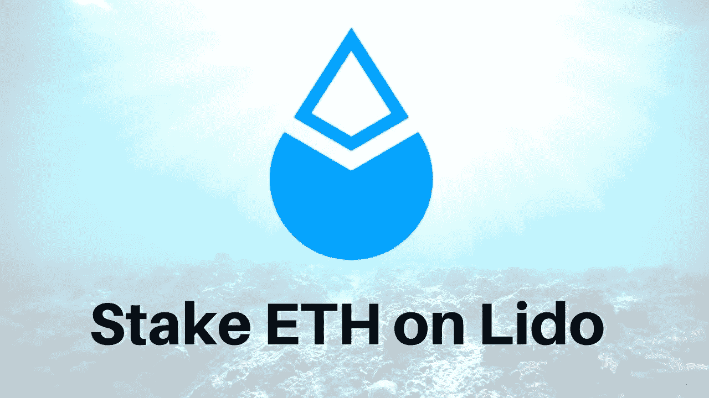

# 押注合并——押下以太坊套利机会

> 原文：<https://medium.com/coinmonks/betting-on-the-merge-the-staked-ethereum-arbitrage-opportunity-b07410258f1c?source=collection_archive---------2----------------------->

传说中的以太坊合并已经被讨论和猜测了几个月了。许多人看好以太坊的潜力，当链条从工作证明过渡到利益证明时。当以太坊 2.0 被部署和“合并”最终发生时，一些 Defi Degens 甚至对潜在的套利游戏进行了精心的押注，这可能会产生严重的回报。

**下面是你需要知道的:**

目前，您可以在丽都金融上存款以太坊 ETH，以换取赌注以太坊 stETH。利多的赌注服务向有效锁定交易所平台上的 ETH 的用户奖励一定比例的收益。Staked Ethereum 是以太坊的衍生令牌，代表 1:1 等效的 ETH，已被长期用于支持和保护在信标链上运行的以太坊区块链网络。信标链是以太坊区块链的平行幽灵版本，使用利害关系证明而不是工作证明。

“最初，信标链将独立于我们今天使用的以太坊主网而存在。但最终，它们会被连接起来。该计划是将 Mainnet“合并”到由信标链控制和协调的风险证明系统中。—Ethereum.org

在所谓的“合并”过程中，当以太坊区块链最终从工作证明转变为股权证明时，stETH 实际上起到了借据的作用，可以兑换成等量的 ETH。许多用户倾向于通过将他们的 ETH 押在 Lido 上来赚取收益，并希望在合并后采用新的以太坊网络标准以太坊 2.0 时将他们的 ETH 转换回 ETH。押注合并一直被认为是一件肯定的事情，因为感觉以太坊 2.0 即将到来已经有几个月了。不幸的是，由于多次延迟，以太坊 2.0 的推出实际上已经成为一个迷因，促使许多人思考一个大问题“文合并？”

**套利机会:**

虽然 stETH 和 ETH 应该以 1:1 的平价交易，但过去几个月的市场动荡已导致人们担心潜在的加密流动性危机。许多持有以太币的人有理由对市场状况感到恐慌，并开始抛售他们的 stETH 代币，因为他们担心一旦发生银行挤兑，可能没有足够的 ETH 从利多赎回。这导致了 stETH 的价值(目前丽都为 1315 美元)与 ETH 的价值(1344 美元)脱钩。许多德根人押注的套利机会就在这里。随着以太坊折价交易，那些正在购买 stETH 代币的人实际上是在押注合并，并准备在以太坊 2.0 最终部署时获得巨大收益。stETH 持有者不仅会赚取赌注收益，而且他们还会自动套利 stETH 和 ETH 之间的差价，因为这两种代币在合并后将再次以 1:1 的比例交易。

什么处于危险之中？

押注于“合并”存在一些严重的风险。

1.  由于已经出现了多次延迟，许多人有理由担心合并是否以及何时会真正发生。合并已经被推迟了 6 次，最近一次发生在 6 月，当时“难度炸弹”被推迟到 2022 年 8 月。
2.  随着过去几个月如此多的加密公司如 Luna、3AC、Celsius、Voyager 和 Vauld 宣布破产，人们开始担心利多金融的生存能力。Lido 已经成为加密领域的市场领导者，为用户提供将 ETH 换成 stETH 的能力。丽都目前占 Beacon Chain 存款的 31.5%，超过 410 万 ETH 锁定在丽都的智能合约中，按今天的价格计算约为 44 亿美元。然而，随着过去几个月的市场波动，许多上述破产的加密公司不得不清算他们的 stETH 头寸，导致许多人试图从 ETH 套利。密码公司的互联性在许多情况下导致了连锁反应。当像 3AC 这样的大公司倒闭时，有可能蔓延到其他公司。有些人把这种连锁反应称为 Web 3 多米诺效应。目前还不清楚 Lido 是否能够承受 Web 3 多米诺效应，并存活到以太坊 2.0 部署为止。
3.  最后，值得考虑的是宏观经济条件和对加密市场的潜在影响。那些买入 stETH 股票的人认为市场会上涨，或者至少会保持稳定。到合并发生时，ETH 有可能进一步下跌，并可能抵消套利机会的任何潜在收益。这不太可能，但我们今年又看到了三位数的 ETH，所以一切皆有可能。

以太坊 2.0 为大胆和雄心勃勃的人提供了一个巨大的机会。当合并最终发生时，那些在 stETH 上投资的人有一个潜在的巨大的上升空间。高端图形和采矿卡市场已经出现大幅折扣，因为预计以太坊将从工作证明转变为股份证明，需求正在枯竭。尽管有许多延误，但许多人对我们今年能看到合并的想法持乐观态度。如果事实证明是这样，并且市场状况到那时已经有所改善，那么押注于合并的人将从 stETH 套利机会中获得可观的回报。在那之前，我们需要有信心，继续发微博“文合并？”——就像整个 Web 3 行业的文字祈祷。阿门。

> 交易新手？试试[加密交易机器人](/coinmonks/crypto-trading-bot-c2ffce8acb2a)或者[复制交易](/coinmonks/top-10-crypto-copy-trading-platforms-for-beginners-d0c37c7d698c)

感谢您的阅读。

看看我在推特上未经过滤的想法:

【https://twitter.com/wasifmrahman 

在 LinkedIn 上关注我的职业生涯:

 [## Wasif Rahman -美国纽约布鲁克林|职业简介| LinkedIn

### Wasif 觉得用第三人称谈论自己很奇怪。我在影响者营销行业工作了五年…

www.linkedin.com](https://www.linkedin.com/in/wasifmrahman/) 

我对媒体的另一个想法是:

 [## 瓦西夫·拉赫曼-中号

### 阅读瓦西夫·拉赫曼在媒介上的作品。Web 3 德根 Ex Populus 营销伙伴关系总监。每天…

medium.com](/@wasifmrahman) 

来源:

[https://decrypt . co/105258/how-ether eum-stakers-on-lido-finance-is-trading-the-merge](https://decrypt.co/105258/how-ethereum-stakers-on-lido-finance-are-trading-the-merge)

[https://www . investopedia . com/Staked-ether-5496378 #:~:text = Staked % 20 ether % 2C % 20 or % 20 steth % 2C % 20 is，以及% 20 secure % 20a % 20 block chain % 20 network](https://www.investopedia.com/staked-ether-5496378#:~:text=Staked%20ether%2C%20or%20stETH%2C%20is,and%20secure%20a%20blockchain%20network)。

[https://ethereum.org/en/upgrades/beacon-chain/](https://ethereum.org/en/upgrades/beacon-chain/)

[https://news . coincu . com/98140-以太坊-breaks-promise-the-merge-delayed/](https://news.coincu.com/98140-ethereum-breaks-promise-the-merge-delayed/)