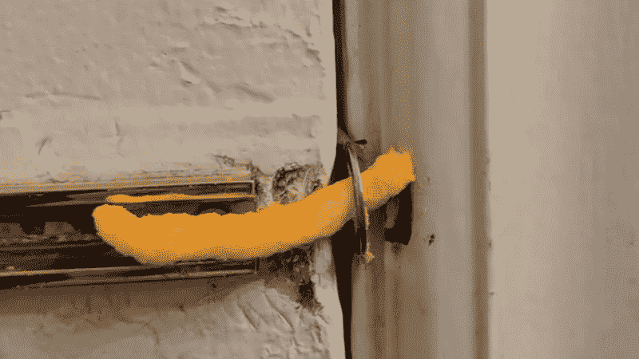

# 小心加密炼金术士

> 原文：<https://medium.com/coinmonks/beware-the-crypto-alchemists-4c60cc4102de?source=collection_archive---------13----------------------->

Photo by [Joshua Newton](https://unsplash.com/@joshuanewton?utm_source=unsplash&utm_medium=referral&utm_content=creditCopyText) on [Unsplash](https://unsplash.com/s/photos/magic?utm_source=unsplash&utm_medium=referral&utm_content=creditCopyText)

我记得在大学的第一年，我们在牛津大学的热力学教授告诉我们，工程系总是收到人们的来信，声称已经解决了一些无法证明的证据或长期存在的物理学难题，或编造了一些惊人的发明。

他笑着讲述他们是如何收到这么多邮件的(我知道，我老了)，但他总是知道谁是疯子，只要他们在某个地方写道，他们需要*弯曲*物理学的核心原则之一，以便让解决方案发挥作用——就像无视能量守恒定律的永动机一样——而不是在基本定律的范围内工作。

有些规矩不能破；对于一些事情，没有神奇的解决方法。相反，你必须微妙地平衡一系列的权衡，以提出一个增量更好的替代方案，艺术就在这种妥协中。真正的天才(像千层面一样在沉默中前进)在于在这些硬约束下进行优化，做出艰难但必要的权衡决策，以实现局部而非全局的优化。

在密码学中，[区块链三难困境](https://www.ledger.com/academy/what-is-the-blockchain-trilemma)就是其中之一。

不要听信那些假先知，那些蛇油销售人员，宣称他们已经解决了区块链三难问题，并且一举实现了可伸缩性、安全性和去中心化的三位一体。因为这是不可能的。

这就像你在游戏中创造一个角色，你有一定数量的点数分布在不同的属性中。你不能把所有的都用完！

(或者就像星际争霸一样——你不能让巨人拉什*和*去做早期的医疗兵/陆战队员，对吗？！这只是简单的资源管理——你没有足够的矿产或天然气。您必须选择一条车道。)

挥手并不能改变这一点；数学博士证书不会改变这一点；在密码部门工作的年数不会改变这一点。

一旦你增加了这些三难属性中的一个，其他的必然会减少。只要从逻辑上考虑一下:

区块链由节点网络维护。

**如果您优先考虑分散化:**

*   去中心化意味着更多的节点。更多的节点必然意味着节点需要更长的时间来达成一致——因为信息自然必须在更多的参与者之间传播，即达成共识更困难，这与交易速度更慢直接相关。如果事务较慢，那么伸缩性会受到影响。

TL；DR —向上分散，向下扩展。

**如果您优先考虑安全性:**

*   高安全性意味着很难接管网络，这意味着需要存在更多独立的节点。因此，我们得到了与之前去中心化相同的逻辑流程。

TL；灾难恢复—安全性提高，规模缩小。

**如果您对缩放进行优先级排序:**

获得扩展意味着吞吐量的增加，即每秒更多的事务。这相当于更快的阻塞时间，不可避免地意味着您可以:

1.  更容易达成共识，降低安全标准，因为攻击者也更容易达成共识。
2.  或者使信息传播更快，解决方案之一是减少信息必须传播到的节点的数量。这与权力下放相冲突。

TL；DR:向上扩展—安全性降低/分散性降低。

现在告诉我，你如何在不牺牲某些东西的情况下获得所有这些折衷？这是根本不可能的，它们是不相容的。你应该问的问题不是哪个链解决了三难问题，而是*在哪里*任何声称这样做的链都做出了权衡。

因为他们肯定会在某个地方妥协。

即使是 L2·洛普解决方案也必须做出妥协。从本质上说，它们通过将交易捆绑在一起来增加可伸缩性，这样 L1 可以简单地验证交易而不是做所有的计算。但是，这些效率的提高仍然是牺牲的结果——有时是分散化的，比如乐观主义的[单序列器](https://community.optimism.io/docs/how-optimism-works/#block-production)；有时有时间退出，本质上是将你的时间惩罚从单个交易中“捆绑”成一个大批量退出，如 [Arbitrum 对欺诈证据的 7 天宽限期](https://help.uniswap.org/en/articles/5538762-how-to-withdraw-tokens-from-arbitrum)；或者额外的链外计算努力和依赖，[像 ZK 汇总](https://vitalik.ca/general/2021/01/05/rollup.html)。

一次又一次，我们被提醒——没有免费的午餐。基本面还是基本面。无论我们是在 web1、web2 还是 web3，情况都是如此。

然而，随着新技术的大肆宣传和狂热，感觉就像在一个新的范式下，每个规则都被重写，甚至是基本规则；但事实并非如此。

在 web2 软件工程和架构中，有一个类似的范例 CAP 定理——它适用于分布式系统。它以同样的方式存在于一致性、可用性和分区容忍度之间不可能的三重困境中，完美地反映了可伸缩性、分散性和安全性之间的权衡。

它也不能被“解决”，简单地优化，因为基本面持续存在，即使他们有时似乎不适用于加密。

然而，一次又一次，他们做到了。

## 其他基础知识

**“价值”不是凭空产生的。制造一个区块链代币仅仅是创造一个没有数字许可的某物的 T2 表现。但是一个象征性的代币本身并不比股票更有价值。它完全取决于令牌所代表的基础资产。有些是有价值的，因为它们保护网络或代表真正的链外有形价值——如以太坊、比特币或 USDC，但其他的纯粹是狗屎硬币。**

就像好公司的股票值钱，差公司的股票不值钱一样。就像飞行常客里程或公司忠诚度积分因公司而异。

这就是为什么你有时看到的短语令人愤怒——它们简单地说“通过做来赚取加密货币……”，这就像在 web1 中说你可以用未知的货币 TBD 赚取法币。嗯……这部分很重要。然而，那里的傻瓜仍然得到了。

**分散投资是更安全、风险更低、底价更高的选择，但全押可以获得高回报。**喜欢，不是屎吧？然而，当谈到加密时，jpg 猴子们似乎是盲目的。我有一个博士朋友，他用 100%的积蓄投资了 Luna/Anchor，在这个过程中损失了大约 99%。

所有这一切——一生的财富，完全依赖于奇多锁定，这是一个明显不可持续的 20%锚定收益率……他会在任何其他非加密投资中这样做吗？

基本面依旧。

My homie’s life savings in Anchor vs the liquidation SWAT team

不过话说回来，我的牛津教授们也反复告诉我，永远不要把维基百科作为任何事情的资源，并认为好的“教学”包括对懒惰的狗屎幻灯片进行令人麻木的无聊讲座，所以他们可能并不总是知道什么是最好的。

> 交易新手？尝试[加密交易机器人](/coinmonks/crypto-trading-bot-c2ffce8acb2a)或[复制交易](/coinmonks/top-10-crypto-copy-trading-platforms-for-beginners-d0c37c7d698c)