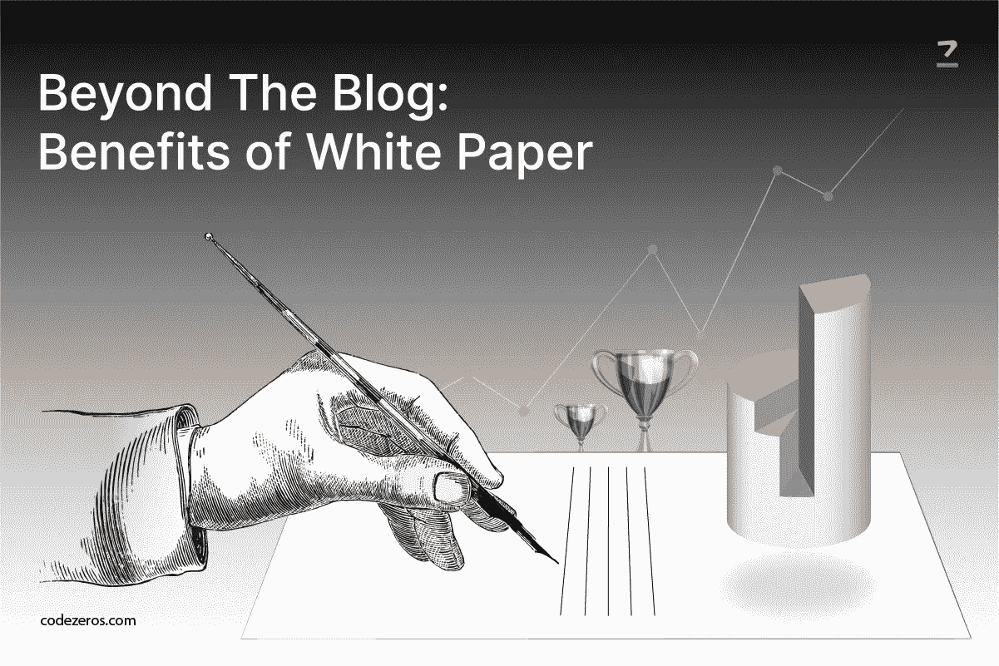

# 超越博客:白皮书的优势

> 原文：<https://medium.com/coinmonks/beyond-the-blog-benefits-of-whitepaper-285fda00bb15?source=collection_archive---------26----------------------->

博客的力量无法解释。它是最不可或缺和最有价值的交流工具之一。这是我们出于各种原因向客户推荐的工具。

事实是，现在大多数人都有自己的博客，因此标准有时会变得宽松。然而，各种其他内容格式可能具有额外的价值，并获得更高的期望水平，如白皮书。

Beyond the Blog: Benefits of Whitepaper

**从哪里开始？**

首先，任何一家 [**现代白皮书解决方案公司**](https://www.codezeros.com/services/modern-whitepaper-solutions) 都会建议你做一份有创意的简报。这一行动将有助于您从一开始就勾勒出需要建立的每个必要细节。

此外，它还是一个很好的资源，您可以与内部利益相关者共享，将他们都聚集在同一页面上。它还确保它符合公司的整体定位。

创意简报中需要包含的一些重要事项如下:

1.  对该计划进行全面的描述
2.  概述作品的主旨或它所关注的内容
3.  支持的东西需要突出
4.  必须事先确定主要受众
5.  想想读者将如何从中受益
6.  专注于你想要实现的目标
7.  确定你希望你的读者采取什么行动
8.  最后，创建一个时间表

**内容创建技巧:**

创建内容时需要遵循的一些必要的 [**白皮书解决方案**](https://www.codezeros.com/services/) 和提示如下:

*   **建立可信度:**

如果你考虑与其他行业的专家合作写作，那是最好的。或者，你可以从一个有影响力的人那里得到相关的引用，并将其包含在你的内容中，以提供更好的支持。

*   **提请注意:**

在这方面，写博客和写白皮书没有太大的区别，因为你需要为两者创造一个醒目的标题来吸引读者的注意力。

试着让你的演讲尽可能地吸引人和有力，让他们事先对你的话题有一点了解。使用能说服他们采取行动的主动动词。

*   **告知他们不知道的事情:**

与您的读者分享一些独家见解或未知事实，他们可能不知道，除非他们阅读白皮书。尽可能给它一个发人深省的触动。

*   **关注视觉:**

仅仅一堆文字就可能让读者草率。因此，利用颜色、字体和引人注目的照片来突出你写作中的关键点。

*   **研究:**

你需要对各种主题进行适当的研究，如 [**以太坊白皮书开发**](https://www.codezeros.com/) ，以提供支持性的信息和统计数据。或者，你也可以与主题专家交谈，以获得对该主题的清晰看法。

*   **保持正确的长度:**

你的文章应该足够长，以传达你希望你的读者得到的全部信息。不要做得太短，也不要添加绒毛来增加不必要的长度。

**做促销策划:**

不要只是把它放在网站上，等待人们发现它。如果你从一开始就准备好了促销计划，这将会有所帮助。

1.  提前就你选择的话题写几篇博文来定位可信度。
2.  在正式公开你的作品之前，给你的少数客户独家访问权。
3.  选择付费和有机推广，并利用社交媒体渠道进行 [**区块链白皮书解决方案**](https://www.codezeros.com/services/modern-whitepaper-solutions) 。
4.  将 CTA(号召行动)放在网站的其他逻辑位置，这样访问者可能会注意到它。
5.  与可能对你的作品感兴趣的出版物和在线资源分享你的想法。

**白皮书的优势:**

撰写区块链白皮书的一些重要优势如下:

1.**销售线索生成:**

白皮书具有很高的转化率，因为它们由教育内容和直接营销材料组成。说服和学习的完美结合使他们成为最好的营销工具之一。

2.**传播专业知识:**

白皮书可以用来传播专业知识和建立更好的品牌形象。通过添加一个简短的描述你的公司和它做什么将展示你在该领域的专业知识和证书。

3.**增加参与度:**

通过让读者下载您的白皮书，您可以提高参与度。在庞大的市场营销世界中，用户的刻意行为会促使他们投资你的公司。

4.**帮助建立邮件列表:**

你可以给你的用户一份礼物，让他们提前注册订阅你的时事通讯。免费白皮书是一份有吸引力的礼物。确保你的内容是最高质量的，有可操作的信息，与你和你的观众相关。这将激励他们订阅。

**结论:**

白皮书是一份深入而权威的文件，用于教育读者你独特的观点。然而，许多人更喜欢它作为一种老派的方法，现在不再有光泽。

但事实是，如果制作正确，ROI(投资回报)将是有价值的，并将有助于潜在客户的产生、品牌意识的创造和声誉的建立。

> 交易新手？试试[加密交易机器人](/coinmonks/crypto-trading-bot-c2ffce8acb2a)或者[复制交易](/coinmonks/top-10-crypto-copy-trading-platforms-for-beginners-d0c37c7d698c)