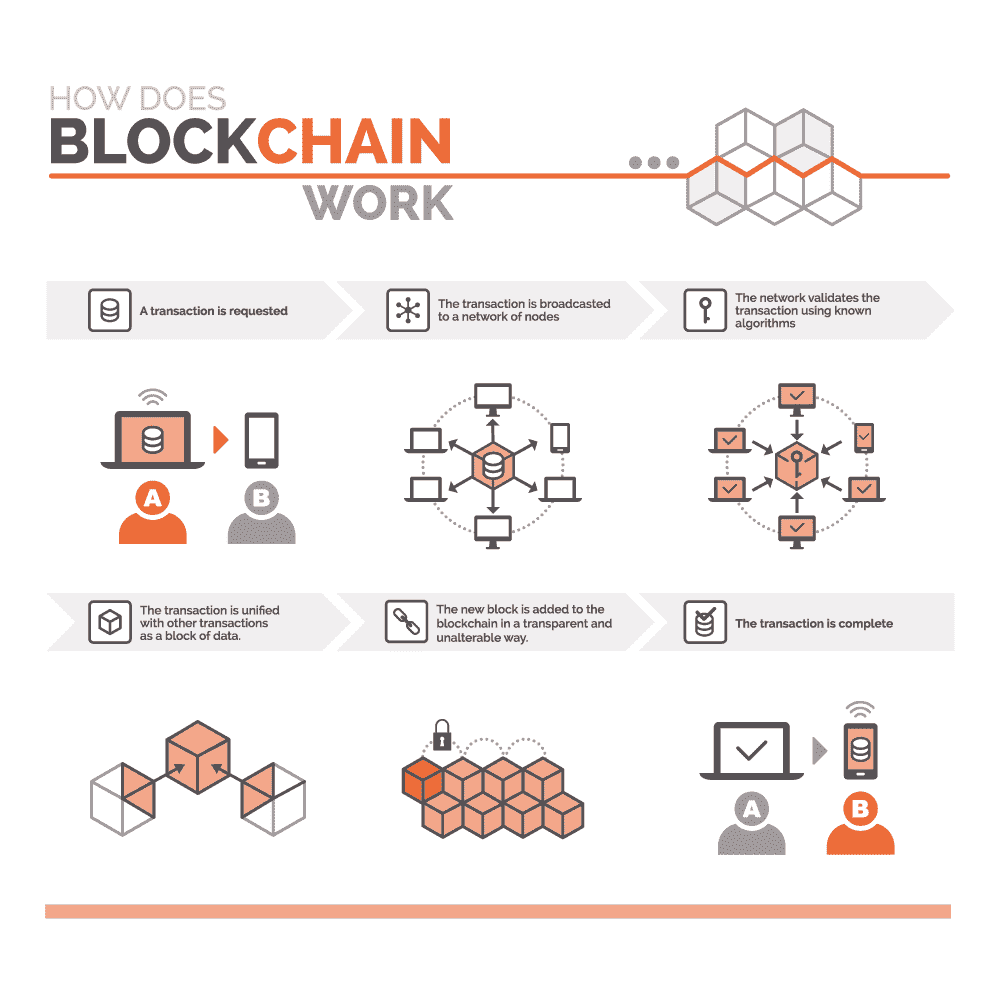
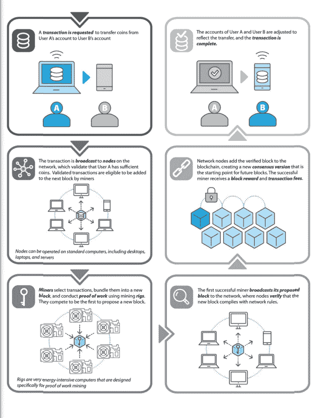
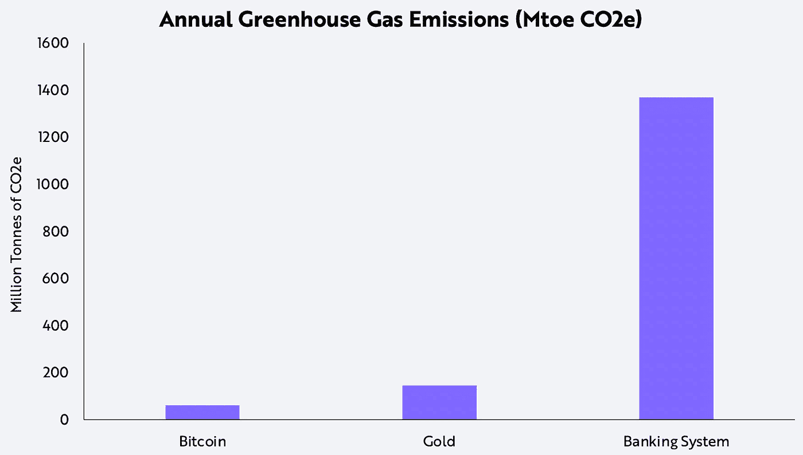

# 超越效用:区块链对我们星球的影响

> 原文：<https://medium.com/coinmonks/beyond-utility-blockchains-impact-on-our-planet-6f56fb373cfc?source=collection_archive---------21----------------------->

区块链怀疑论者认为，区块链技术正在摧毁这个星球。这是一场真正的危机，还是只是让我们想起了那个喊狼来了的男孩？

随着地球母亲经历气候变化，区块链用例(尤其是加密货币)的能源消耗和碳足迹可能是反对完全采用区块链技术的最有力的论据。

本文从中立的立场出发，对这一困境进行了更深入的研究；这些主张实际上站得住脚吗，或者它们完全是有偏见的？让我们看看。

为此，让我们回到一切开始的地方。

# **区块链技术历史**

区块链技术的起源可以追溯到 1991 年，当时研究科学家 [Stuart Haber](https://www.worldcryptoindex.com/creators/stuart-haber/) 和 [W. Scott Stornetta](https://www.worldcryptoindex.com/creators/w-scott-stornetta/) 提出并最终推出了一种实用的解决方案，来解决数字文档被回溯、向前或以任何形式篡改的问题。该解决方案涉及一种自动机制，将带有时间戳的文档以加密方式存储在一系列块中。

大约一年后， [Merkle Trees](https://101blockchains.com/merkle-trees/) 融入了这个概念。它们通过存储数字记录来保护区块链。每个数字记录都与前一个记录相连，形成一个链条。这些创建的链中的最新记录包含整个链的历史；因此，不断验证链中的所有交易。

迈向数字货币的第一步是在 2004 年。计算机科学家和密码学家 Hal Finney 介绍了可重复使用的工作证明机制。这是第一个被认可的加密货币原型。

然而，最重要的一步是中本聪在 2008 年将分布式区块链理论概念化。中本聪是比特币和区块链技术背后的大脑的笔名。这个人或团队引入了数字分类账，数据存储在一系列块中。这种基础设施将在没有第三方或监管机构干预的情况下实现安全的点对点交易。

2009 年 1 月 3 日，纳科莫托通过挖掘第一个比特币区块验证了区块链技术的概念。这个“[创世纪区块](https://books.google.com.ng/books/about/The_Genesis_Block.html?id=RjJvxQEACAAJ&source=kp_book_description&redir_esc=y)”或者更普遍的叫法是“0 号区块”，包含 50 个比特币。9 天后，中本聪给哈尔·芬尼送去了 10 个比特币，这标志着第一笔比特币交易。当年 10 月，比特币市场(第一家比特币交易所)成立。

区块链历史上的一个重要里程碑是 2014 年[以太坊基金会](https://ethereum.org/en/foundation/)的成立。由[维塔利克·布特林](https://podcasts.apple.com/us/podcast/35-designing-ethereum-vitalik-buterin/id1499409058?i=1000495243493)首创的以太坊被打造为一个分散的应用平台，除了加密货币之外，它对其他用例也很有用。

以太坊前沿网络(Ethereum Frontier network)于 2015 年推出，允许开发者编写智能合约，并构建可在以太坊网络上部署的 dApps(去中心化应用程序)。从那时起，区块链已经成为主流，并继续朝着大规模采用的方向发展。

*How Does A Blockchain Work? (adapted from* [*Kilroy Blockchain*](https://kilroyblockchain.com/what-is-blockchain)*)*

# **区块链技术的未来**

利益相关者继续在区块链进行研究和投资，这对这项技术的采用是个好消息。然而，就像每一项新技术一样，在实现大规模普及之前，它必须应对一些挑战；最紧迫的挑战是区块链网络的可扩展性、安全性和去中心化问题所描述的“ [**区块链三难困境**](https://newsletter.banklesshq.com/p/the-triple-point-blockchain) ”。

然而，这项技术面临的一个相对削弱但同样重要的挑战是围绕区块链网络的环境考虑。关于区块链用例(尤其是加密货币)、它们的能源消耗以及它们相应的碳足迹，已经有了无数的争论。

那么区块链和加密货币对环境有什么影响呢？

# **达成共识**

区块链网络上的节点通过共识机制验证每个新数据块。最常用的机制是工作证明(PoW ),矿工通过完成某种形式的计算工作(如解决数学难题)获得验证交易和创建新块的权利。

随着这些网络的增长，为了同时提高它们的安全性，需要更多的节点来执行计算工作。

*Understanding Proof of Work Blockchain in Crypto-Asset Mining (adapted from* [*Kilroy Blockchain*](https://kilroyblockchain.com/what-is-blockchain)*)*

PoW 共识机制需要巨大的能量输入来为计算提供动力。这是因为新数据块只能以定义的一致时间间隔进行验证并添加到链中。这个时间间隔不受挖掘该块的节点数量的直接影响。然而，随着更多的矿工加入网络，数学难题变得更加困难，导致更多的能量被用于在定义的时间间隔内同步完成计算。

值得注意的是，具有 PoW 共识机制的区块链的高能耗率主要不是低效算法的直接结果，因为正是这种高能耗率保护了这些区块链网络免受 [Sybil 攻击](https://academy.binance.com/en/articles/sybil-attacks-explained)。这些攻击是由控制大部分网络计算能力的攻击者实施的。这样，他们就可以随心所欲地操纵区块链网络。这意味着随着区块链网络的增长，它变得越安全，因为潜在的攻击者必须承担挖掘新块所需的总计算能力的 50%。

然而，考虑到 PoW 为区块链带来的可扩展安全级别，并不能消除这样一个事实，即这些区块链估计消耗了全球能源消耗的 0.9%，对于相对较新的技术来说，这个数字太高了。

> “从 2018 年到 2022 年，全球加密资产的年化电力增长迅速，估计用电量翻了两番。截至 2022 年 8 月，全球加密资产的总用电量估计在每年 1200 亿至 2400 亿千瓦时之间，这一范围超过了许多国家(如阿根廷或澳大利亚)的年度总用电量。这相当于全球年用电量的 0.4%至 0.9%。”——**美国白宫在其 2022 年 9 月气候报告中:“** [**气候和能源对美国加密资产的影响**](https://www.whitehouse.gov/wp-content/uploads/2022/09/09-2022-Crypto-Assets-and-Climate-Report.pdf)

**你应该注意到，无许可区块链的能源消耗不仅仅受到所采用的共识机制的影响。三个主要的能源出口是:**

*   **分布式虚拟机存储，**
*   **共识机制，以及**
*   **节点间的通信。**

**然而，与达成共识所消耗的能量相比，协调通信和存储所消耗的能量相对来说可以忽略不计。例如，比特币的存储和通信机制分别消耗 0.00315Twh 和 0.000006Twh 的上限估计值，而其 PoW 共识机制每年消耗 263Twh(根据瑞士联邦能源办公室的估计)。**

**显而易见，区块链技术的运行使用了大量的电力，但这种相对新颖的技术对地球有什么直接影响呢？**

# ****碳足迹****

**像采矿加密货币这样的区块链操作使用电网电力或主要由化石燃料供电的发电厂，导致温室气体排放。这直接影响了地球，因为它加剧了气候变化。**

> **“全球最大市值的加密资产发电每年产生 140 30 万公吨二氧化碳(Mt CO2/y)。”——**美国白宫在其 2022 年 9 月气候报告中:“** [**气候和能源对美国加密资产的影响**](https://www.whitehouse.gov/wp-content/uploads/2022/09/09-2022-Crypto-Assets-and-Climate-Report.pdf)**

****剑桥大学比特币电力消耗指数(T12)显示，比特币采矿设备的全球电力消耗为 159.02 Twh，占全球电力消耗的 0.6%，占全球 CHG 排放量的 0.3%。在中国彻底禁止加密货币之前，仅比特币使用的平均能源就有约 30%来自水电、太阳能和其他可再生能源，这些能源大多产自中国。在 2018 年至 2021 年期间，这项禁令导致比特币采矿作业所用电力的估计碳强度从每千瓦时 480 克二氧化碳跃升至 570 克。****

# ******这意味着什么？******

****可以说，区块链技术及其使用案例所消耗的能源总量与其环境影响不成正比。相反，重要的是考虑能量是如何产生的。目前，比特币采矿作业使用约 60%的可再生能源，这对于一个相对较新的行业来说相当不错。方舟投资管理公司(ARK Investment Management)进行的一项研究得出了一个有趣的指标，表明比特币生态系统消耗的能源不到传统银行系统运行所需能源的 10%。****

********

*****Annual Greenhouse Gas Emissions From Major Financial Systems (adapted from* [*ARK Investment Management*](https://ark-invest.com/articles/analyst-research/bitcoin-myths/)*)*****

****尽管传统银行系统比 DeFi(去中心化金融)服务更多的人是有争议的，但 Nick Szabo 等专家认为，计算能力形式的区块链技术的资源消耗是达到区块链技术能够达到的安全和自主水平所需的必要权衡。****

> ****"大量的资源消耗和较差的计算可扩展性解锁了独立、无缝全局和自动化完整性所必需的安全性."——[**尼克·萨博**](https://unenumerated.blogspot.com/2017/02/money-blockchains-and-social-scalability.html) **，比特黄金创始人、比特币先驱******

# ******未来:区块链技术能否走向绿色？******

****区块链专家承认，区块链技术的能源消耗和由此产生的影响可以被认为是有问题的。在这方面，已经计划并正在采取步骤解决这些问题。****

****较新的区块链网络已经开始建立和采用更有效的共识机制，如 [PoS](https://shows.banklesshq.com/p/why-proof-of-stake-vitalik-buterin-7f4) (利益相关证明)共识机制。像世界第二大区块链以太坊这样的老机构已经开始从高能耗的 PoW 共识机制迁移到 PoS。[合并](https://ethereum.org/en/upgrades/merge/)是今年最大的黑天鹅事件之一，标志着以太坊网络向 PoS 的迁移。此次合并只是区块链网络向更可扩展、更高效的网络迈进的重要一步。****

****随着区块链努力实现碳中和，像碳抵消、碳信用和对环境友好事业的捐赠等其他努力也值得一提。****

# ****总的来说，****

****区块链技术的支持者指出，这是一项新兴的创新技术，其潜力才刚刚开始被发掘。不言而喻，区块链技术仍处于其早期基础设施阶段，这是众所周知的特别密集。区块链的支持者认为，随着它的成熟，区块链将不断推动能源效率的最大化，甚至可以成为一个改善环境的机制。****