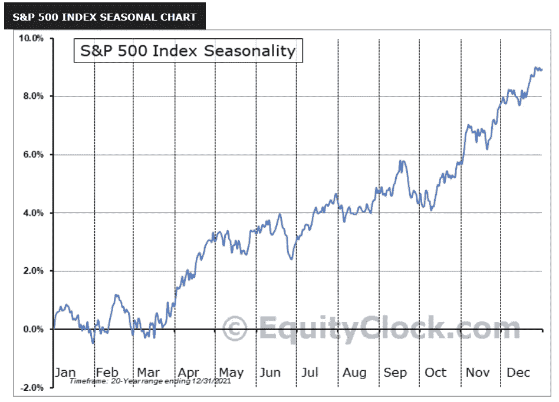
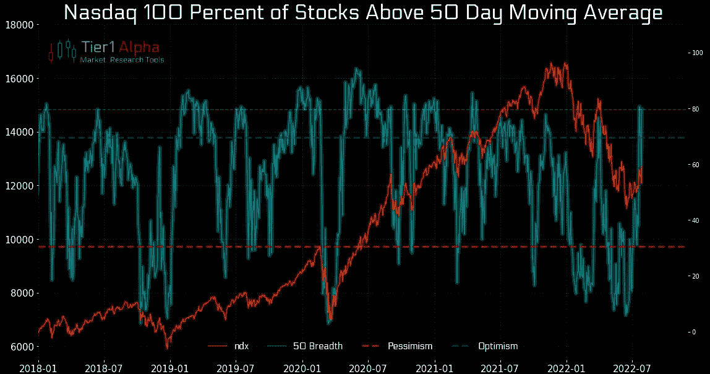
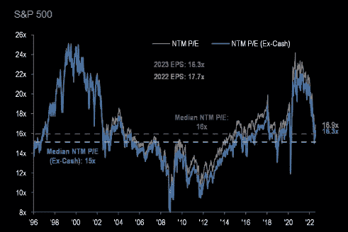
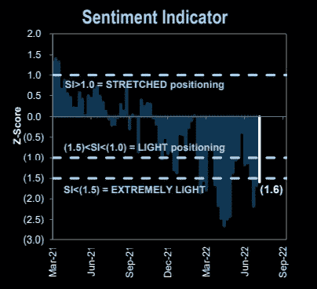
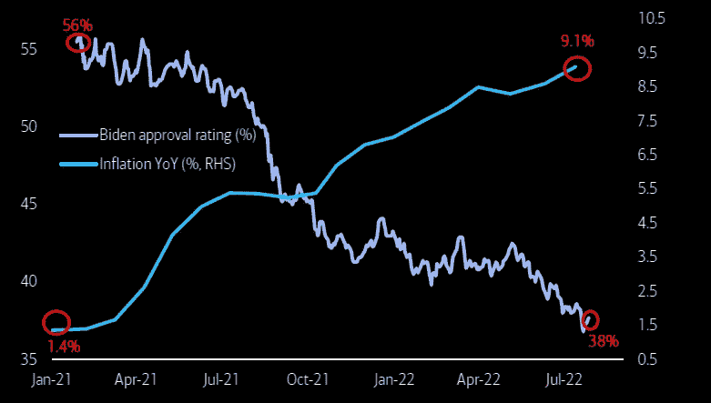
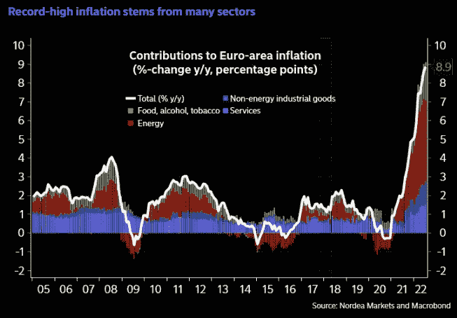
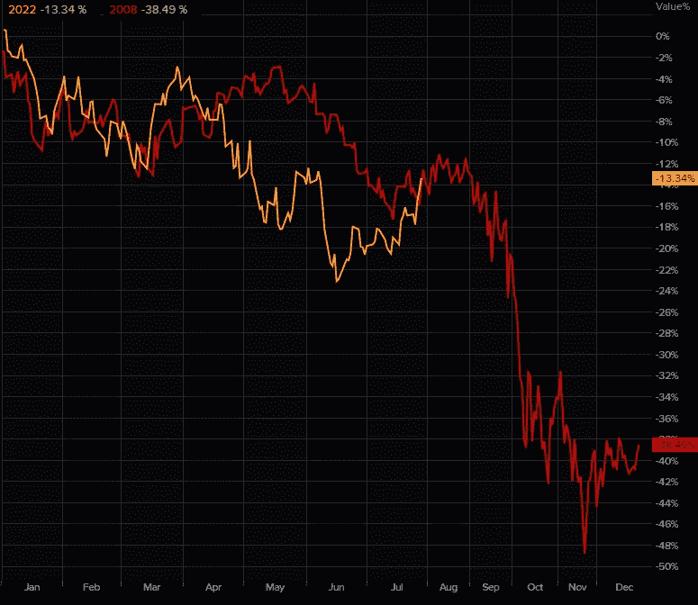

# 拜登的支持率与通货膨胀，8 月市场季节性，股票不再昂贵

> 原文：<https://medium.com/coinmonks/bidens-approval-rating-vs-inflation-august-market-seasonality-stocks-no-longer-expensive-51f6b42bab08?source=collection_archive---------12----------------------->

嘿，我是基兰！市场又将迎来新的一周，以下是需要注意的关键事件，以及来自投资银行的最有趣的宏观研究。我希望能在本周的[贸易节目](http://www.traderseed.io/)中与你交谈，一如既往，如果你有任何问题，请在下面给我留言。

# 每周观察列表

继上周四美国 GDP 数据显示美国经济处于衰退边缘后，本周五的月度“非农就业报告”将比往常更受期待。该报告预计将显示劳动力市场仍然强劲，尽管有报道称一些公司正在裁员和冻结招聘。低于预期的数字可能会支持这样的观点，即美联储在加息时可能不会像预期的那样积极。

上周，一些好于预期的收益报告帮助提振了股市，未来一周，众多公司将继续发布大量收益报告。苹果和亚马逊周五发布的积极预测显示，这些巨头公司在经济低迷时期表现出了韧性。第二季度美国企业业绩大多强于预期。在 279 家已经公布收益的标准普尔 500 公司中，77.8%超过了预期。根据路透社的数据。

> *交易新手？试试* [*密码交易机器人*](/coinmonks/crypto-trading-bot-c2ffce8acb2a) *或* [*复制交易*](/coinmonks/top-10-crypto-copy-trading-platforms-for-beginners-d0c37c7d698c)

# 宏观视角

S & P 500 八月季节性。7 月份的表现完全符合季节性，整个月份都有强劲的上涨。从历史上来看，八月是一个平淡的月份，前期会有一个调整，然后在月末会有一个上升。

纳斯达克股票上涨得非常快..现在，80%的股票都在 50 天移动平均线之上，显示出对这些市场领先技术公司的短期乐观。

股票不再贵了。在今年的抛售之后，股票估值回到了长期平均水平，尽管 7 月份的反弹在一定程度上抵消了低价的影响。

**人气仍在尖叫买入。尽管 7 月份股市反弹走高，但基于高盛(Goldman Sach)零售和机构客户的头寸，市场人气仍然很低。**

**拜登支持率 vs 美国 CPI 通胀。非常负相关，如果这种情况持续下去，对现任美国政府来说不是好消息。**

欧洲的通货膨胀问题并不那么短暂。什么都比较贵。能源、食品、酒店、餐馆、家具……价格普遍上涨。

**S & P500 2008 v 2022。**追踪这些类比总是很有趣，而且往往惊人地准确。今天的标准普尔 500 指数与 2008 年的全球金融危机相比。两者的交易都缓慢下降到夏季，整个 7 月份都出现反弹。八月是平坦的，然后最后的疼痛腿下部在九月开始。一个留在你脑海深处的问题。

我希望你觉得这很有趣，很有用。请务必每周关注我，了解市场动态。如果您有任何问题、意见或反馈，请在下面的评论中告诉我。

祝你一周愉快！
基兰
www.traderseed.io