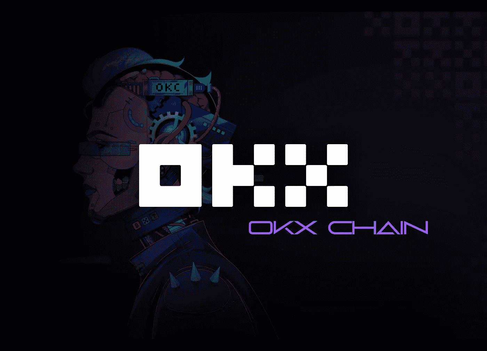
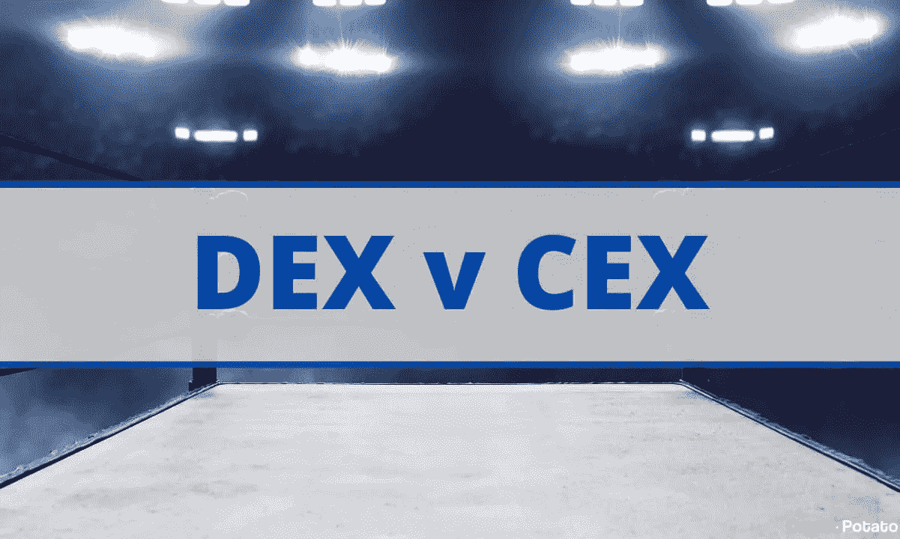
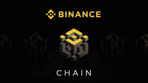
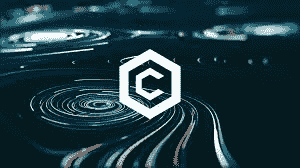
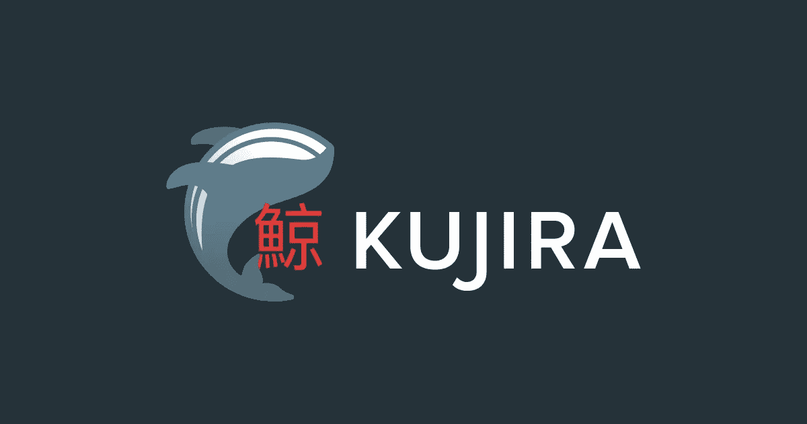
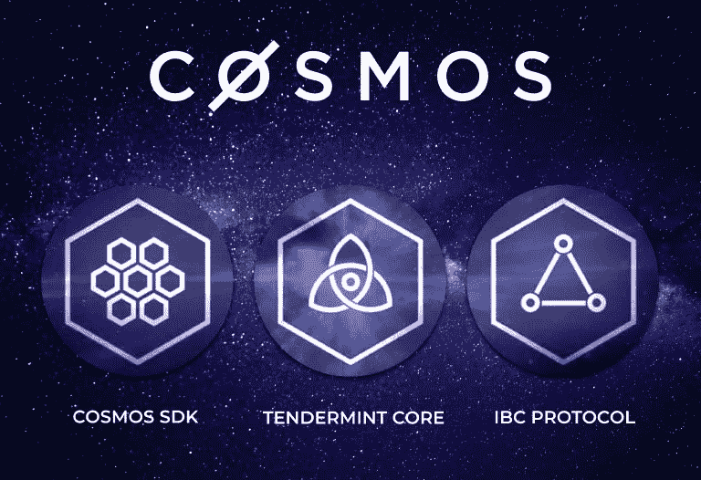
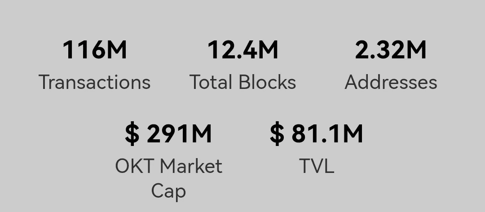

# 大交换，大机会？:OKX 链条

> 原文：<https://medium.com/coinmonks/big-exchange-big-opportunity-okx-chain-19fca6483842?source=collection_archive---------11----------------------->

## 介绍

如果 DeFi 得到了我们今天看到的采用，这也要归功于大型交易所(CEX)，它们在分散金融生态系统上进行试验，并将其引入到它们的服务中。

此外，改进交换令牌的效用及其自身的令牌组学(例如:购买和燃烧系统，用交换令牌支付燃气费)。

> Cz(币安首席执行官)多次表示“10 年内分散交易所将大于集中交易所”，这就是为什么许多交易所都在大力投资 DeFi。

试图通过这种方式获得与等待他们的未来相关的有利位置，并因此成为 DeFi 空间内的“地标”。

另请参见:

[**DEXs 上链量超越集中式同行:**](https://cryptopotato.com/on-chain-volume-on-dexs-surpasses-its-centralized-counterparts-chainalysis/)

[https://cryptopotato . com/on-chain-volume-on-dexs-超越-其-centralized-counters-chain analysis/](https://cryptopotato.com/on-chain-volume-on-dexs-surpasses-its-centralized-counterparts-chainalysis/)

## 两个成功的 CEX 建造的区块链

现在，CEXs 做的前两个大项目涉及区块链创造的 BNB 链和克罗诺斯链。这两个表现非常好，事实上 BNB 链是第二个最常用的链，仅次于以太坊链。

Cronos chain 比 BNB chain 相对较新，但尽管它很年轻，生态系统增长非常快，越来越多的项目建立在此基础上。

这两个区块链有共同的特点，这也是好的，因为选择实现和选择一个项目，使它们互操作，便宜和相当可伸缩；Cosmos
但是让我们看看这些特性:

**这些链是通过所谓的 Cosmos SDK 构建的，它允许以一种快速而安全的方式启动区块链，并具有基于 Cosmos 构建的所有好处。**

他们使用一种被称为 Tendermint 的共识算法。

**为了实现互操作性，他们集成了 IBC(区块链间通信协议)(如果你想更深入地了解互操作性，我已经写了其他文章讨论这一点)。**

**它们与 EVM 兼容。以太坊是一个定义，所以在链和生态系统之间建立一个能够允许“合作”的连接是很重要的。**

**他们的目标是便宜(DeFi 大规模采用因此受到激励)**

因此，当一个大型交易所正在建立其 DeFi 生态系统和自己的区块链时，宇宙空间通常会参与其中，事实上，最近许多项目都在向它靠拢。在卢娜-UST 号惨败后，鲸声优已经在宇宙号上建立了它的链条:

[https://medium . com/team-kuji ra/the-future-of-kuji ra-485 d43c 4729 c](/team-kujira/the-future-of-kujira-485d43c4729c)

Dydx 和其他人也在 Cosmos 上发布，看看互操作性将如何发展“环境”会很有趣，此外，许多社区和 Dao 也将加入。
OKC

现在，OKC 或 OKX 连锁店了解了 Cosmos 的潜力，并决定在其连锁店中实施 IBC，使其能够与其他连锁店沟通，并因此对新的机会开放，如合作伙伴关系以及资本和基金。

该链与 EVM 兼容，并使用 Band 协议作为 oracle。

此外，我们的使命是构建一个广泛的 Web3 开发和创新领域，涵盖 DeFi、Web3 工具、游戏、NFTs 等……这是一个面向下一代 Web3 应用的可编程智能合约平台。

> 交易新手？试试[密码交易机器人](/coinmonks/crypto-trading-bot-c2ffce8acb2a)或者[复制交易](/coinmonks/top-10-crypto-copy-trading-platforms-for-beginners-d0c37c7d698c)

目前，OKC 上有超过 160 个 Dapps，但利用率非常低，供应链正在经历一个“干旱期”。

自从 Cosmos 社区欢迎 OKC 进入生态系统以来，这种流动性短缺现在可能会消失，OKX 正在努力取得它有远见的进展。
让我们来看看最近的一些数据:

我们可以说，OKC 仍在建设中，即使许多 Dapps 已经部署在它上面。
观察团队如何在这个领域创造价值将会非常有趣。这也将作为其他愿意推出连锁项目的案例研究。

最后，另一个有趣的地方是 OKT (OKX token)。它将如何集成到链中，使用什么工具？随着时间的推移，这些问题将会有答案。目前让我们继续关注它(NFA)

**我希望你喜欢这个帖子，并学到一些新东西。随意留下一个跟屁虫和一个拍手的** ✔️