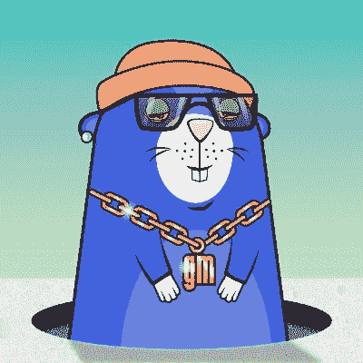

# 比利·穆雷因密码黑客损失了 20 万美元

> 原文：<https://medium.com/coinmonks/bill-murray-lost-200k-to-crypto-hackers-2391fd5ba65a?source=collection_archive---------24----------------------->

如果不问比尔"你会打电话给谁"那就是浪费机会了。当加密黑客攻击时。请放心，这不会是你在这篇文章中读到的唯一一个基于比利·穆雷的笑话。然而，当它是一个昂贵的 NFT 时，失去卡通朋克的 JPEG 图像可能是一个毁灭性的损失。令人欣慰的是，在他的个人收藏遭到网络攻击后，默里设法保住了他的国家森林公园。尽管如此，加密黑客还是成功窃取了数十万美元。可悲的是，比利·穆雷在他的 NFT 慈善拍卖中筹集了这笔钱。当然，关于此事有一份官方的警方报告，但它是“迷失在翻译中”(告诉你笑话不会停止)。

# 加密黑客

一群罪犯瞄准了比利·穆雷的 NFT 慈善拍卖，并设法偷走了 119.2 ETH。目前，这大约值 185，000 美元，是为慈善机构筹集的。这次袭击发生在拍卖期间，慈善机构几乎立即失去了资金。此外，加密黑客试图从默里的个人钱包中窃取不可替换的令牌。据 [Coindesk](https://www.coindesk.com/business/2022/09/02/hacker-steals-bill-murrays-crypto-after-185k-nft-charity-auction/) 报道，加菲猫的声音持有两个密码朋克 NFT。仅供参考，一些密码朋克 NFT 的价值超过一个在奥斯汀超过 2 英亩的 4 居室的房子！

谢天谢地，比利·穆雷知道他要给谁打电话，他的虚拟钱包安全团队文克曼来帮忙了。这家 NFT 咨询公司成功化解了对默里个人钱包的攻击。至于用于慈善事业的钱，该小组未能追回以太坊。加密黑客

一群罪犯瞄准了比利·穆雷的 NFT 慈善拍卖，并设法偷走了 119.2 ETH。目前，这大约值 185，000 美元，是为慈善机构筹集的。这次袭击发生在拍卖期间，慈善机构几乎立即失去了资金。此外，加密黑客试图从默里的个人钱包中窃取不可替换的令牌。据 [Coindesk](https://www.coindesk.com/business/2022/09/02/hacker-steals-bill-murrays-crypto-after-185k-nft-charity-auction/) 报道，加菲猫的声音持有两个密码朋克 NFT。仅供参考，一些密码朋克 NFT 的价值超过一个在奥斯汀超过 2 英亩的 4 居室的房子！

谢天谢地，比利·穆雷知道他要给谁打电话，他的虚拟钱包安全团队文克曼来帮忙了。这家 NFT 咨询公司成功化解了对默里个人钱包的攻击。至于用于慈善事业的钱，这个团队没能找回以太坊..

Because Murray Played Garfield and This is an NFT!

与此同时，默里的团队表示，他们已经向警方提交了一份报告，并正在跟进这一问题。据该团队称，他们已经与加密分析公司 Chainalysis 合作，以确定小偷的身份。

然而，就像默里的许多电影一样，这个故事有一个快乐的结局。尽管亏损，一名比特币基地用户还是向慈善机构捐赠了价值 187，000 美元的 ETH。比利·穆雷正在与 Chive 慈善机构合作，这是一个筹集资金的非营利组织。

# NFT 抢劫案

从根本上说，绝大多数的加密骗局都源于用户的错误。这并不是说数字钱包绝对安全。然而，大量的报价、建议和消息经常会使用户迷惑，从而做出错误的决定。给聪明人一句话，每个人都可能成为秘密骗局的目标，不仅仅是名人会失去他们的慈善资金。为此，我们建议您始终花时间彻底审查和评估您收到的电子邮件、消息和链接的合法性。

也就是说，加密黑客最容易被肯定持有贵重物品的高知名度个人所吸引。早在 5 月，赛斯·格林就因网络钓鱼诈骗失去了 4 只 Bore Ape NFTs。一般来说，当窃贼通过用受感染的链接欺骗用户来窃取用户数据时，就会发生网络钓鱼欺诈。正如我们之前提到的，保护您个人信息的最佳方式是不与任何人分享。如果你使用场外交易平台，确保它们不需要 KYC。为此，[HIE exchange](http://www.hi.exchange/)是你能找到的最好的交换机之一。

据 Solidus Labs 首席执行官陈阿拉德说，备受瞩目的名人并不是唯一受到攻击的人。阿拉德说:“骗子不会歧视和锁定任何他们认为可以从中赚钱的人，从名人到皇室到普通人。

归根结底，我们中的许多人没有能力拥有自己的网络安全团队。然而，多注意一些基本的细节并保持谨慎，对保护我们的资金大有帮助。也就是说，看看土拨鼠 NFT JPEG，因为它是本文中最后一个比利·穆雷笑话。

Groundhog day reference joke! Oh, and it’s also and NFT!

“[比利·穆雷因加密黑客](https://blog.hi.exchange/crypto-hackers-bill-murray/)损失 20 万美元”最初由同一作者[尼玛·阿斯加里](https://blog.hi.exchange/author/nimaasgari/)发表在 HiExchange 博客上。

> 交易新手？尝试[加密交易机器人](/coinmonks/crypto-trading-bot-c2ffce8acb2a)或[复制交易](/coinmonks/top-10-crypto-copy-trading-platforms-for-beginners-d0c37c7d698c)