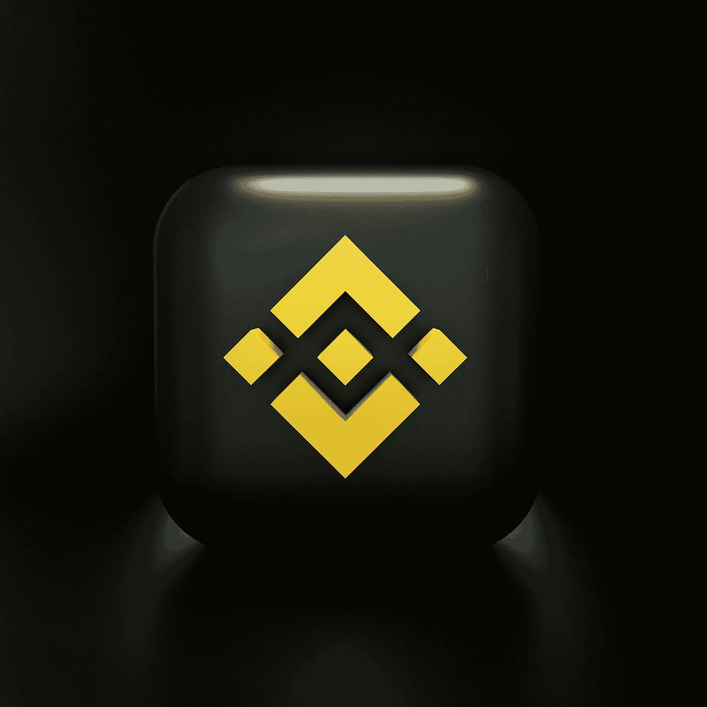

# 币安(BNB)价格预测

> 原文：<https://medium.com/coinmonks/binance-bnb-price-prediction-c1259391ac52?source=collection_archive---------16----------------------->

Source photo Unsplash.com

# 什么是币安硬币(BNB)？

币安交易所铸造的硬币被称为币安代币。它是一种本国货币，对其使用者来说是有用的象征。币安平台包括币安智能链、币安链、币安学院、信托钱包和几个研究项目。