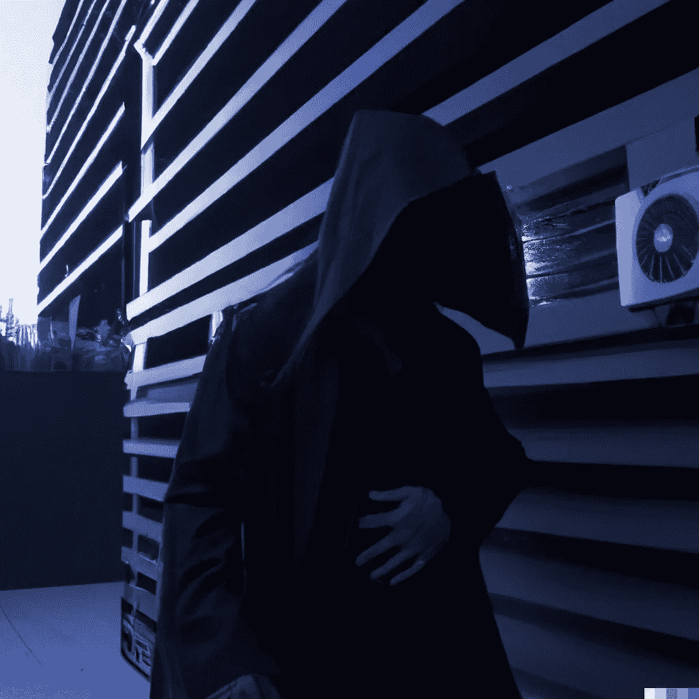
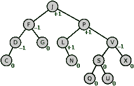
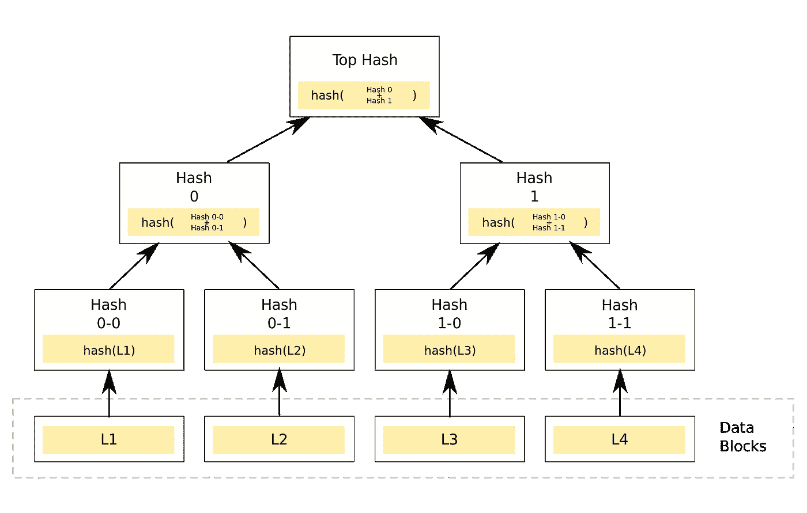

# 币安大桥黑客事件——发生了什么？

> 原文：<https://medium.com/coinmonks/binance-bridge-hack-what-happened-db9a03dc871f?source=collection_archive---------1----------------------->

昨天，一座通往 BSC 的桥梁被黑了，价值约 5 亿美元。这并不意味着黑客可以将所有这些资金存入银行，但这确实指出了一个有趣的漏洞。

**在这里我们将探索:**

*   到底是什么被黑了？(币安大桥)
*   是怎么被黑的？
*   接下来会发生什么？

# 介绍

___________________________

“你起来了吗？”在加密/网络 3 行业中，没有人愿意在私人信息中看到*这三个字。*

Samczsun(如果你还不知道的话)是一个专家级别的白帽黑客，无论何时出现问题，他通常都站在维护行业安全的最前沿。这些话是他对任何协议或应用程序开发人员的标志性问候，这些开发人员可能会收到一些关于他们产品的漏洞或黑客攻击的坏消息。

昨天，Samczsun 在揭露几个小时前发生的事情时，实时发布了一系列推文。涉及 200 万 BNB 元(5.66 亿美元)的事件。

# 到底是什么被黑了？

___________________________

币安是世界领先的加密货币交易所。不是被黑的。

主流媒体(甚至一些加密的本地新闻出版物)有时会弄错。请不要再看快餐新闻了。

BSC 是币安智能链——它最初是以太坊(Ethereum)的一个分支。这是一个协议，区块链，有点分散，等等。眼下重要的是另一个 L1。有一种硬币存在于 BSC 上，类似于以太坊上的 ETH，那就是 BNB。

你如何让 BNB 使用这些应用程序？你通过币安大桥转移资金。所有协议都有网桥。有一些通用的桥允许你在不相关的链之间来回移动。

**桥梁**

“桥”有点用词不当。当你过桥时，你(和你的物品)通常从一边开始，然后完全迁移到另一边。

在加密中，“桥”让你在一边锁定你的资金，然后在另一边收到等量的其他商品。
这就像把你的讴歌停在停车场，把钥匙交给某个人替你保管(这个人通常是一个聪明的合同或钱包，而且通常是多重签名的),然后开着一辆同等价值的丰田出去兜风。当你准备好了，把丰田开回来，开回你的讴歌(假设它还在)。

这里的“桥”更像是自动化的、有保证的、可逆的协议级交换，但不管怎样，你会明白的。

正如你所看到的，人们把车停在桥的一边，把钥匙留给别人，这种钥匙的权力开始变得很有价值。一段时间后，所有这些车的价值开始真正增加，特别是如果一些人开始把他们的'兰博'带来。

桥梁被黑并不是什么新鲜事。这里不同的是桥被黑的方式。

# 是怎么被黑的？

___________________________

计算机科学喜欢树。接招吧，环保主义者。

不相信我？这里有一些使用树木的东西。

*   搜索算法
*   比赛
*   人工智能
*   区块链
*   拼写检查器

数据的树形表示非常有效。这种结构可以使存储和检索信息变得更加容易。从一个节点开始，确定一些比较，沿着所需的分支到另一个更小的树，等等。每次你这样做的时候，你就省去了关心或浏览大量其他数据，这将是低效的。树有助于确定要看什么，并更快地缩小相关选项。

**AVL 树**

AVL tree

智能合同区块链中的数据存储在树中。币安桥使用了来自宇宙生态系统的 AVL 树实现[。AVL 树非常有趣，它在节点中存储和检索数据时保持平衡。](https://github.com/cosmos/iavl/commits/807f8c542e48369d35622d582f56da5187d128b3/proof.go)

想象一棵树从顶部。它有树枝和树叶。每片叶子上都有一些毛虫在慢动作咀嚼(有一次在泰国，我被那些嘎吱嘎吱的声音吵醒，很奇怪)。

假设为了保持生态平衡，树左侧的每片叶子应该有少于 5 条毛虫，而右侧的每片叶子应该有 5 条或更多的毛虫(不确定为什么这样会平衡树，但作为例子可以接受)。进来了一只疯狂的猿，从右边撞倒了一些毛毛虫。现在其中一些叶子上有不到 5 条毛虫。妈的，不再平衡了。AVL 会自动重新平衡，所以那些少于 5 条毛虫的叶子会留在左边。

毛毛虫和区块链没有任何关系(或者他们有吗？—好吧，不，他们没有)。但是区块链使用 AVL 树，这很重要。这种数据表示称为 Merkle 树。

**默克尔树**

Merkle tree

我们还能谈谈毛毛虫吗？不，我们要继续前进。但你知道什么很像毛毛虫吗？加密散列。

好吧，不是真的，但是，请仍然共鸣。区块链 Merkle trees 不在乎一片叶子上毛毛虫的数量(对不起大自然爱好者)。每个节点代表的信息是一个散列函数，它告诉您一些关于子树分支上叶子的数据，一直到叶子(树的最后一个节点)。这允许数据从其所在的数据库冒泡到树上的表示，以便更容易存储、查找和验证数据。

回到黑客时代。这些树用散列函数来验证。从叶节点开始，散列被证明是树的根。如果有人可以修改叶节点中的信息，但产生的散列被上级节点证明是真实的，那么他们就可以改变谁拥有什么。

这里的简短故事是有人能够伪造那些证据。

关于技术细节，最好参考 Samczsun 的推文。他提到了他找到的方法。显然黑客并不是这么做的。但是同样的原则也适用于所发生的事情。

这耗尽了我对技术细节的理解。希望没有出错。如果我有，请让我知道。

# 接下来会发生什么？

___________________________

CZ 宣布验证器已经停止了这个链。这些验证器理论上是自治的匿名操作符，它们可以相互通信来共同执行操作。

尘埃落定后，黑客只带走了大约 8000 万美元。

[这是显示被盗金额的黑客简介](https://debank.com/profile/0x489a8756c18c0b8b24ec2a2b9ff3d4d447f79bec)。

在他的账户被冻结之前，他至少可以向其他地址发送一些电子邮件。一些地址已经被列入黑名单。

[这是其中一个含有 ETH 的地址。](https://debank.com/profile/0x489a8756c18c0b8b24ec2a2b9ff3d4d447f79bec)

像往常一样，Crypto/Web3 的一天不会无聊。

如果你觉得这篇文章很有帮助，一定要关注我的 Medium，了解更多来自这个空间的内容。

**附注:我们正在为 Crypto Climax 制作网站，以使其成为在线出版物。敬请期待！**

# 时事通讯

___________________________

我在我们的生态系统中制作与市场和开发者相关的内容。

这篇文章是我的免费每周时事通讯的一篇专题文章的例子。在那里你还可以找到独家内容，所以一定要注册！

你的邮件不会用于其他任何用途(我甚至都不看它们)。

 [## 每周简讯的加密高潮- Revue

### 通过 Crypto Climax 在 Crypto、Web3、NFT 和元宇宙市场尖端的可行见解和策展，帮助…

www.getrevue.co](https://www.getrevue.co/profile/thecryptoclimax?element=subscribe-through-revue) 

# 推特

__________________________________

此外，请务必在 Twitter 上关注我的帖子和其他重要内容。

[https://twitter.com/TheCryptoClimax](https://twitter.com/TheCryptoClimax)

直到下一次，从您的首要加密/Web3 出版物。

麦克斯——隐秘的高潮

> 交易新手？尝试[加密交易机器人](/coinmonks/crypto-trading-bot-c2ffce8acb2a)或[复制交易](/coinmonks/top-10-crypto-copy-trading-platforms-for-beginners-d0c37c7d698c)