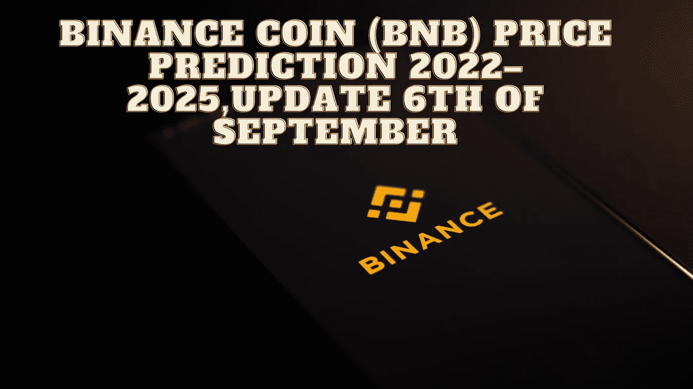

# 币安硬币(BNB)价格预测 2022–2025，9 月 6 日更新

> 原文：<https://medium.com/coinmonks/binance-coin-bnb-price-prediction-2022-2025-update-6th-of-september-94f8da654b62?source=collection_archive---------27----------------------->

Source photo Unsplash.com

# 什么是币安硬币(BNB)？

币安加密货币交易所创造了自己的数字代币，称为币安币。币安的本地货币，用符号“BNB”表示，作为支付和公用事业的代币。币安生态系统包括币安智能链、币安链、币安学院、信托…