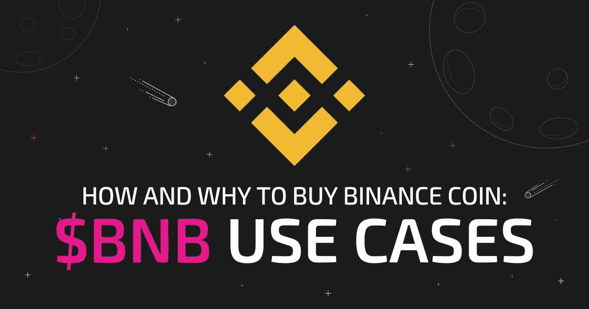

# 币安硬币——值得购买吗？$BNB 用例

> 原文：<https://medium.com/coinmonks/binance-coin-worth-buying-bnb-use-cases-c0488551d761?source=collection_archive---------28----------------------->



许多密码被创造出来作为货币。然而，其中一些也有独特的用例，使它们脱颖而出。随着加密货币格局的不断变化，代币不仅仅作为交换媒介发挥作用，这一点很重要。认识到这一需求的开发人员已经努力创建令牌来服务于用例的创建。

一个很好的例子是币安硬币(BNB)。币安币于 2017 年由名为币安的交易平台推出。该平台进行了一次 ICO，为发布筹集资金。在进行 ICO 时，BNB 的价值为 1 bnb 0.1 美元。随着时间的推移，BNB 已经发展成为加密货币领域的成功象征。它的许多用例吸引新用户并留住老用户。

牢记每个加密用户，交易者或投资者的不同需求，币安硬币的目标是执行尽可能多的功能。币安创造了一种可以有多种功能的代币，如下所述。


# 支付币安的交易费用

这可能是令牌最广为人知的用例。币安允许用户在平台上用币安币支付交易费用——这一用例将 BNB 推向了行业的前沿。此外，币安还为与 BNB 支付的所有费用提供 50%的折扣。这非常令人印象深刻，尤其是与大多数密码不断上涨的交易费用相比。

自那以后，币安将其折扣减少了一半，现在它向用户提供与 BNB 支付的所有费用的 25%的折扣。虽然这个折扣比最初的报价低了很多，但仍然是一笔令人难以置信的交易。25%的交易费对那些经常在一天内进行几笔交易的交易者来说是特别优惠的，币安平台允许这些交易者使用 BNB 来享受折扣和省钱。值得注意的是，币安的交易费用很低，这意味着这种折扣将进一步降低价格，帮助交易者和投资者节省更多的钱。


# 在商品和服务上花费 BNB

加密货币领域中只有少数加密货币成功地成为可接受的交易媒介。这是大多数加密货币的核心目标之一。使用货币购买商品和服务的能力显示了该货币的真实价值。

币安通过为用户提供多种支付 BNB 商品和服务的方式，成功提高了代币的价值。币安支持在其不断增长的供应商社区中使用 BNB。这个社区还包括一系列值得注意的机构，例如，币安最近[投资了 TravelbyBit](https://travelbybit.com/binance-invests-in-travelbybit/#:~:text=Brisbane%2C%20QLD%20(3%20October%2C,currency-friendly%20airport%20in%20Brisbane.) ，这是一家致力于通过允许人们用加密货币支付商品和服务来增加加密货币使用率的公司，这家澳大利亚初创公司迄今为止已在其投资组合中增加了 150 家机构。这意味着 TravelbyBit 的附属供应商将能够使用 BNB 支付商品和服务。

在 Pundi X、Crypto.com 等其他区块链平台上，也可以使用 BNB 进行支付。这些合作让 BNB 超越了币安交易所，成为不仅仅是一个本土的象征。


# 获得资金

为了让新的加密用户真正感到宾至如归，平台需要整合专注于用户及其需求的功能。这将确保每个新的采纳者在加密空间感到舒适。最好的方法是给他们一种熟悉感。

创建类似于更常见产品的加密产品会让大多数新用户感到更轻松。这可以通过增加密码的流动性来实现。例如，有时 BNB 持有者可能需要现金，他们应该能够得到。为了让所有用户感到安全和财务自由，需要消除与加密相关的几个限制。应该允许用户轻松地发送、接收或提取他们的钱。

币安通过在加密自动取款机上使用币安硬币成功实现了这一点。这使得 BNB 持有者可以使用他们认为合适的硬币。BNB 还可以用来在 Nexo 等加密贷款应用上获得贷款。


# 社交媒体服务和 BNB

另一种增加加密采用的方法是合并一个用例，以满足非加密交易者的需求。这鼓励新用户探索加密。币安硬币就有这样一个用例。币安允许用户使用 BNB 访问社交媒体服务。

多年来，社交媒体已经成为世界各地许多人生活中不可或缺的一部分。币安决定利用这一点，创造一个可以在各种社交媒体平台上使用的令牌。

一个直接的例子是使用 API exchange 集成在 Investfeed 上购买 BNB，invest feed 是一个专注于加密和类似创新的社交媒体网络。BNB 还可以用来赠送给 Uplive 和 agonist 等平台上的其他用户。这些功能让硬币获得了新的用户。


# 你为什么应该投资币安硬币？

BNB 为投资者提供了许多好处。它的各种使用案例吸引了新用户，这反过来有利于硬币的价格。随着越来越多的加密用户和非加密用户接受硬币，以前的投资者随着价值的增加而获利。你可以投资币安钱币公司(BNB)，因为它有很大的增长潜力。此外，硬币设法保持了远高于其最初硬币发行的价格，这是一些代币未能做到的。

** swap zone . io 网站上的这些或任何其他文章中的任何信息都不应被视为投资建议。永远做你自己的研究。*

```
Read Further: [Top 15 Crypto to Invest in 2022](https://swapzone.io/blog/top-15-crypto-to-buy-now)
```

# 如何以及在哪里购买 BNB

要购买 BNB，你必须首先找到一个允许你交易代币的交易所。在你投资之前，一定要选择一个可靠和值得信赖的交易所。你选择的交易所是整个过程中重要的一环。通常，要在交易所注册，你可能需要提供一些关于你自己的信息，如你的姓名、有效身份证、电子邮件地址、电话号码等。

**这就是我们在 Swapzone 与众不同的地方，我们重视用户的隐私，不会要求他们提供任何个人信息。**

首先，只需打开交易所的“[支持的货币](https://swapzone.io/currencies)”部分，找到 BNB。

*   选择适合您的货币组合，然后继续购买。
*   选择一家允许您通过直接转账或信用卡支付轻松存钱的交易所。
*   确保你仔细检查交易的细节，这样你就知道没有错误。
*   存钱以便你能购买 BNB 代币。
*   存款后，你可以按照 Swapzone 提供的用户友好界面购买代币。

永远记住选择一个快速可靠的加密交换，如 Swapzone，这样你的钱会在安全的手里。

# 流行成对转换币安硬币

[BNB 到 BTC](https://swapzone.io/exchange/bnbbsc/btc) [BNB 到 ETH](https://swapzone.io/exchange/bnbbsc/eth) [BNB 到 LTC](https://swapzone.io/exchange/bnbbsc/ltc) [BNB 到 BNB](https://swapzone.io/exchange/bnbbsc/bnb) [BNB 到 BCH](https://swapzone.io/exchange/bnbbsc/bch) [BNB 到 USDT](https://swapzone.io/exchange/bnbbsc/usdt) [BNB 到 THETA](https://swapzone.io/exchange/bnbbsc/theta)[BNB 到 XMR](https://swapzone.io/exchange/bnbbsc/xmr) [BNB 到 TRX](https://swapzone.io/exchange/bnbbsc/trx) [BNB 到 BSV](https://swapzone.io/exchange/bnbbsc/bsv) [BNB 到 DASH](https://swapzone.io/exchange/bnbbsc/dash) [BNB 到 ZEC](https://swapzone.io/exchange/bnbbsc/zec)

> 交易新手？尝试[加密交易机器人](/coinmonks/crypto-trading-bot-c2ffce8acb2a)或[复制交易](/coinmonks/top-10-crypto-copy-trading-platforms-for-beginners-d0c37c7d698c)