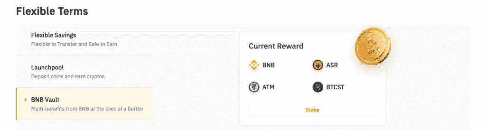
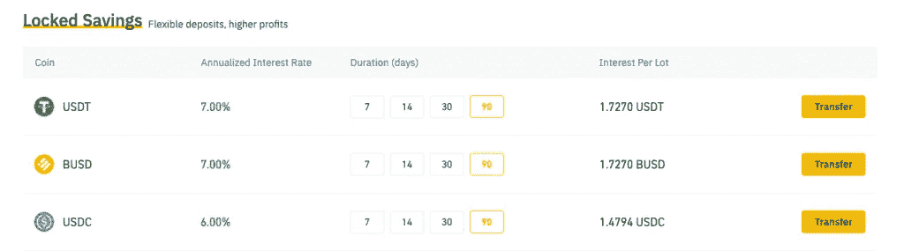

# 币安赚取:利用低风险产品赚取利息

> 原文：<https://medium.com/coinmonks/binance-earn-earn-interest-using-less-risk-products-408f6736cea?source=collection_archive---------9----------------------->

[**Binance Earn: Earn Interest Using Less-Risk Products**](https://www.binance.com/en/activity/referral/offers/claim?ref=CPA_00M6XWFUN3)

在市场波动加剧时，投资者和交易员自然应该重新评估自己的头寸。一个好的投资者应该考虑他的投资组合和风险承受水平，而不管市场表现如何。

由于最近的市场波动，许多人发现自己处于这种情况，目前正在考虑更多的选择。在做决定之前，考虑每项投资的风险水平是很重要的。无论你是下注还是持有加密货币，盘点都是基本的风险管理。

币安挣是一个适合其用户的完整的产品包。如果您尚未注册币安交易所，您可以 [**使用我们的推荐代码获得 100 美元的奖励**](https://www.binance.com/en/activity/referral/offers/claim?ref=CPA_00M6XWFUN3) 。

如果你已经在使用币安赚，我可以帮你。让我们来看看这项服务的风险、产品，以及它如何处理你的钱。

## 币安挣的是什么？

[**币安赚**](https://www.binance.com/en/activity/referral/offers/claim?ref=CPA_00M6XWFUN3) 是领先的加密货币被动收入网站。它对产品的偏好适合新用户。币安平台帮助那些想在不替换币安生态系统的情况下赚钱的用户。

你可以用你的加密硬币做赌注，借出一部分资本来获得利息，或者通过币安平台安全地存款。要开始使用任何币安赚取替代您需要首先存款 usdt 或其等值的加密到您的帐户，然后发送您的资金从您的外汇现货钱包到币安赚取。

# 低风险产品

## 灵活条款

在币安赚取灵活的可能性，让用户有机会赚取利息，而不必锁定他的资金一段时间。有了这些选择，利率会更低。然而，这将降低风险，并提供随时退出的灵活性。

## 灵活储蓄

币安的用户可以选择存入加密货币，并通过灵活的储蓄每天获得收入。对于加密货币来说，这是一个极好的解决方案，否则加密货币可能会在你的现货钱包中休眠。

目前有 56 种灵活储蓄产品可供选择。目前，用户可以从 BTC、瑞士法郎和 USDT 等流行货币中获得高达 10%的利息。此外，您还可以自动转账，自动购买灵活的储蓄使用您的可用现货钱包余额。

> 交易新手？尝试[加密交易机器人](/coinmonks/crypto-trading-bot-c2ffce8acb2a)或[复制交易](/coinmonks/top-10-crypto-copy-trading-platforms-for-beginners-d0c37c7d698c)

## BNB 金库

为了获得最好的 APY 回报，BNB 金库结合了灵活储蓄、BNB 定义赌注和 Launchpool。

如果你赌你的 BNB 硬币，你将得到 BNB 金库资产。这些奖励将传输到您的现货钱包。与 BNB 跳马你有灵活的条款，加上你可以 un-stake 你的收益，只要你需要。

## 发射池

您可以使用 Launchpool 来存放加密货币，如 BNB、BTC 和其他数字硬币，以便在币安市场推出的新代币中分得一杯羹。利率目前高达 68 %。您可以在每个活动开始前查看详细信息。

LaunchPool 是灵活的。这是因为尽管这些代币被锁定，但在活动期间仍可随时兑换。

# 🌟[创建一个币安帐户，在 USDT 赢取 100 美元奖金](https://www.binance.com/en/activity/referral/offers/claim?ref=CPA_00M6XWFUN3)🌟

**🌟** [**Create a Binance account and get 100$ Bonus in USDT**](https://www.binance.com/en/activity/referral/offers/claim?ref=CPA_00M6XWFUN3)**🌟**

# 🌟我有一个伟大的奖金给你:在币安注册后 100 美元🌟

**一旦您** [**通过我们的推荐代码**](https://www.binance.com/en/activity/referral/offers/claim?ref=CPA_00M6XWFUN3) 创建了您的币安，存款超过 50 美元，然后在到期前兑换您的 100 USDT 优惠券。

## 固定期限

有了固定期限，你基本上同意把你的钱存一段预定的时间。你会发现固定期限的利率比灵活期限的利率高。

## 固定储蓄

您将加密货币存入指定的期限，从 7 天到 90 天。你存放加密货币的时间越长，利率就越高。

目前，你可以存 USDT 和 BUSD 这样的货币。对于 90 天的期限，这些存款目前的利率高达 7%。您的加密货币在此期间被锁定。

## 锁定桩

用户可以通过锁定赌注在区块链上下注资产来赢取奖励。大约有 30 种赌注硬币可用，目前最高利率为+30%。这些产品包括赌注硬币。这些产品有不同的期限和最低锁定金额。

## ETH 2.0 铆接

另一个定期产品 ETH 2.0 staking 提供高达 20%的 APY，是一个安全可靠的 ETH staking 加密环境。

在第一阶段，这可能需要两年多的时间，当你的 ETH 股份，这是不能赎回的。然而，币安将始终按照 1:1 的比例向所有用户发放链上奖励，奖励基于用户的 BETH 持有量，这是作为您下注以太坊的证明的货币。

第一阶段完成后，您可以赎回您的 ETH。但是，您可以将您的 BETH 换成 ETH。在任何时候，你都可以将你的 BETH 转回 ETH，并在 ETH 获得同等报酬。

[**Click here for more info about Binance Staking — ETH 2.0**](https://www.binance.com/en/activity/referral/offers/claim?ref=CPA_00M6XWFUN3)

## 活动

活动是需求高而供应有限的独特场合。你可能需要尽快订阅，因为他们的供应通常是有限的。

大约有 155 项活动，最高比率超过 80%。活动可以带来比固定储蓄更高的收益。

## 结论:

这就是币安赚:利用低风险产品赚取利息。如果你喜欢这篇文章，如果你能在推特或脸书上分享，我会很感激。非常感谢！

[**Click Here To Get Your 100 USDT Bonus Once you Deposit 50 USDT or its Equivalent**](https://www.binance.com/en/activity/referral/offers/claim?ref=CPA_00M6XWFUN3)

请 [**关注并订阅**](/@s.hanz) ，务必分享我的作品作为激励姿态。点击这里查看我所有的文章:【https://medium.com/@s.hanz】T5

# 更多文章:

[**熊市买比特币以外的 5 大加密货币**](/coinmonks/5-great-cryptocurrencies-other-than-bitcoin-to-buy-in-a-bear-market-be3e9945d621)

[**2022 年元宇宙最佳 5 个好项目加密币—清单 1**](/@s.hanz/best-5-metaverse-crypto-coins-with-good-projects-in-2022-list-1-687fedbe668e)

[***2022 年元宇宙最佳 5 个加密币好项目—榜单二***](/@s.hanz/best-5-metaverse-crypto-coins-with-good-projects-in-2022-list-2-15af2f8f01d9)

[**2022 年最值得投资的 7 种元宇宙加密币—榜单 3**](/coinmonks/7-best-metaverse-crypto-coins-to-invest-in-2022-list-3-9e077f5c87ab)

[**最后的机会—2022 年投资的 6 个最佳元宇宙加密硬币—榜单 4**](/coinmonks/last-chance-6-best-metaverse-crypto-coins-to-invest-in-2022-list-4-2ce3d6c1c922)

[**需要钱的时候要做的事情快——新招**](/@s.hanz/things-to-do-when-i-need-money-fast-new-tricks-2b68ad24406b)

[**2022 年推广 NFT 项目的 7 种免费方式**](/coinmonks/7-free-ways-to-promote-nft-projects-in-2022-ccefc7f249e7)

[**2022 年 7 款最佳赌注硬币**](/@s.hanz/7-best-staking-coins-in-2022-70dbc31adcae)

[**五月六日聘请 NFT 顶级艺人**](/coinmonks/6-top-nft-artists-to-hire-on-fiverr-62ae1643eedc)