# 币安礼品卡，用卡下注和购买密码(非洲)

> 原文：<https://medium.com/coinmonks/binance-gift-card-staking-and-buying-crypto-with-card-africa-fd5c75c9bd4a?source=collection_archive---------10----------------------->

[币安](https://accounts.binance.com/en-IN/register?ref=431277160)作为世界上最大的加密货币交易所，拥有充足的资产，确保用户在平台上获得价值。

在 FTX 崩盘后，由于其流动性和证据或储备，币安似乎正站在“T2 最后一人”的位置上。

就在几天前，币安发布了 BTC 的准备金证明，在 101%的准备金率下，*的链上准备金*为 582，485.9302 BTC。

这只能告诉你你的加密资产在币安有多安全。

因此，不言而喻，币安是来统治和革新集中交易空间的。

如果你的总部在非洲，那么“*币安非洲*”应该是你的加密交易清单上的第一个。

但首先，你是否充分利用了币安的资源？让我们探索币安礼品卡，赌注和用卡购买密码。

## 币安购物卡概述

虽然你可能是一个大风扇的加密，在大多数情况下，你的朋友和亲戚几乎不了解，甚至没有任何加密帐户。

*尽管非洲的加密技术发展迅速，但仍有大量人口尚未采用加密技术。*

和一张币安礼品卡，可能是你在你的圈子里推广加密技术的终极工具。

我敢打赌，你曾多次希望你打算汇钱的那个人有一个加密钱包。

有了币安礼品卡，您可以让您的收件人轻松地打开一个币安帐户，以便访问里面的资金。

除此之外，你还可以添加你的推荐代码，并在他们发起交易时获得回扣。

您可以通过电子邮件、社交媒体和短信向您的朋友发送币安礼品卡。他们有各种各样的设计来吸引你的潜在客户。

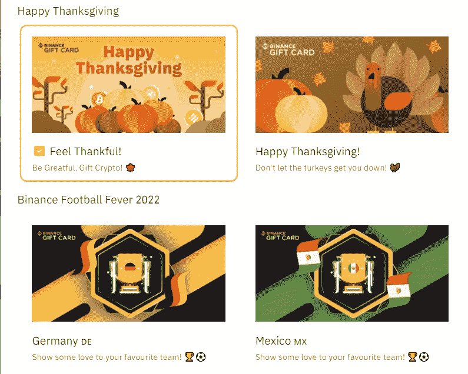

一旦你发送礼品卡，接收者可以兑换礼品卡并访问他们的币安钱包上的加密。

**送币安购物卡的步骤**

1.  点击> > 进入 [***币安购物卡页面***](https://www.binance.com/en-IN/gift-card?ref=431277160)
2.  进入页面后，我建议您使用页面顶部的“*发送礼品推荐*”菜单选项，以便您的收件人可以使用您的推荐代码开立账户。

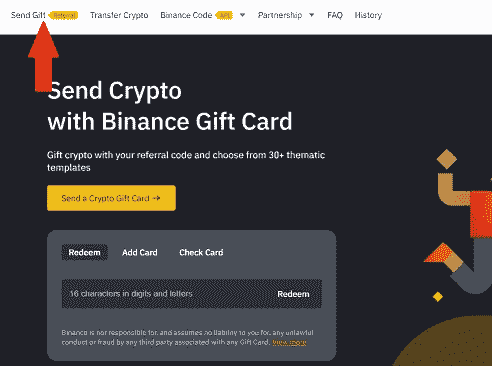

Binance gift card

3.一旦进入“*送礼品推荐*页面，第一步创建卡片。

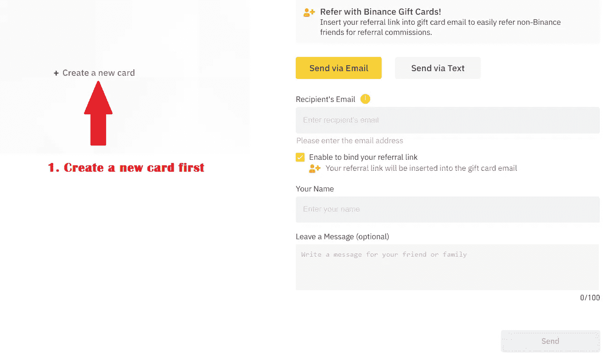

4.您将被重定向到创建卡片的页面。确保你的资金钱包里有资金。你可以自由购买任何加密资产。从左侧，你可以选择一个吸引你的设计。

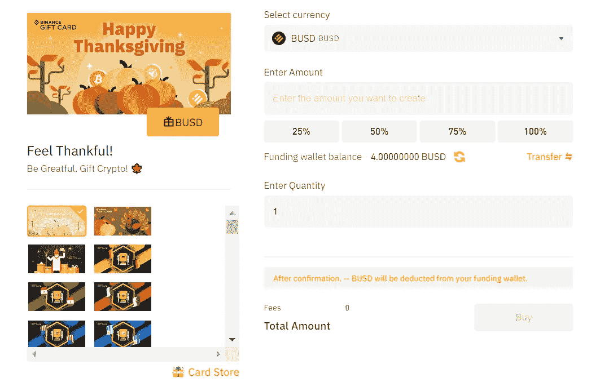

5.一旦你设计了你的币安礼品卡，你可以继续输入你的信息，如姓名，电子邮件和信息。记得启用推荐选项。

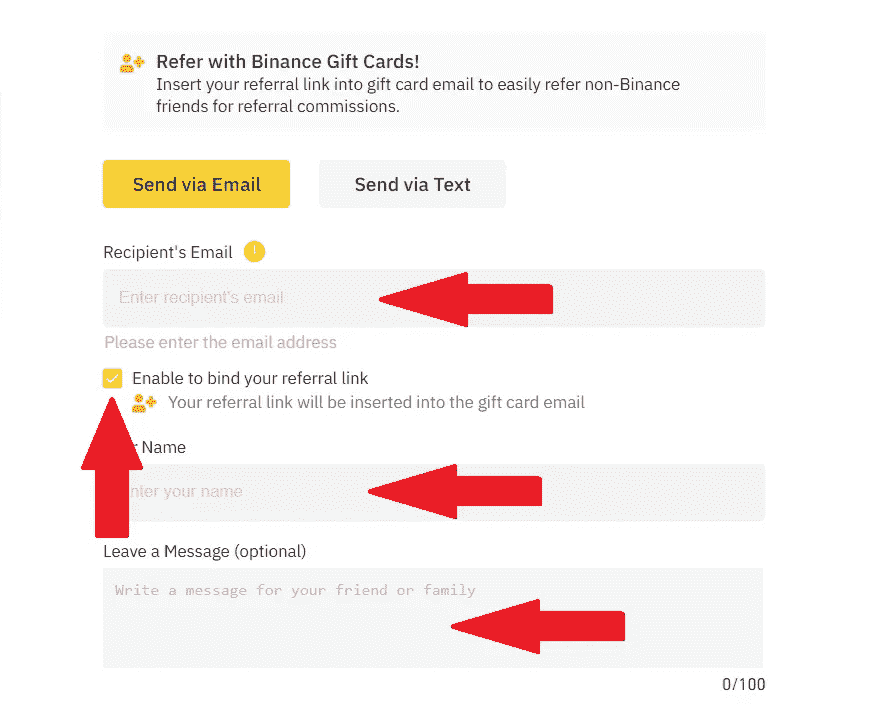

**兑换币安礼品卡的步骤**

如果您刚刚收到您的币安礼品卡，以下简单的步骤将帮助您准备兑换您的币安礼品卡。

1.  访问 [***【币安】礼券页面点击> >***](https://www.binance.com/en-IN/gift-card?ref=431277160)
2.  输入如下所示的 16 个字符的代码并兑换。

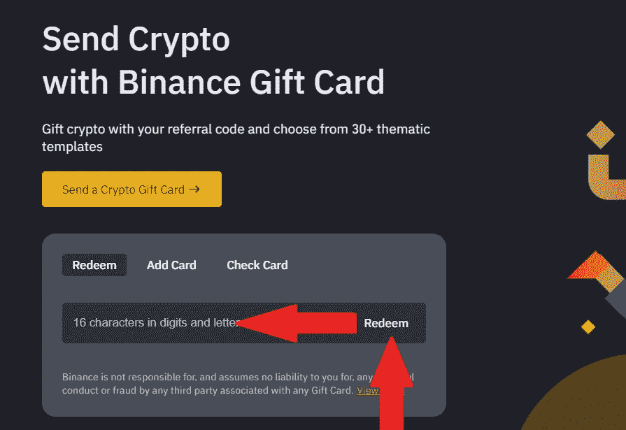

这就是你所需要的。

*如果你正在使用币安应用程序，你仍然可以重复上述步骤。但是，请确保您使用最新版本的应用程序来成功创建、发送和兑换币安礼品卡。*

## 如何押注币安

赌注绝对是一个双赢的策略，以确保您在币安 hoDLing crypto 时充分利用您的加密资产。

*那么，跑马圈地到底是什么？*

赌注为密码持有者提供了一个将他们的数字资产投入使用的机会，作为回报，他们可以从他们持有的资产中获得被动收入(利息)。这是为了支持区块链的运作。

在币安，您可以通过币安赢取产品轻松参与赌博活动。

1.  只需导航至 [***币安赚取页面> >***](https://www.binance.com/en-IN/earn?ref=431277160) 即可访问币安灵活储蓄，将鼠标悬停在简单赚取上，并点击箭头选项。

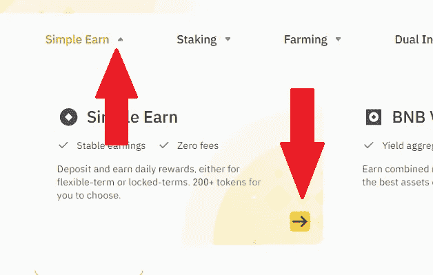

您将被重定向到币安灵活储蓄页面。通过灵活储蓄，您可以订阅产品并在任何需要的时间赎回。

为了订阅产品，您只需选择“*订阅*”按钮。

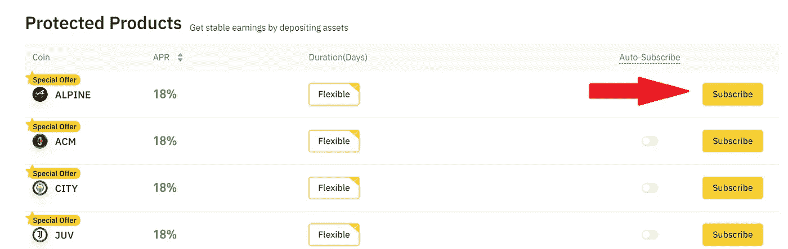

例如，如果你想订阅 Alpine，如上所示，你需要在你的 spot 钱包里有 Alpine present。

如果你的现货钱包里有一枚稳定的硬币或任何其他加密资产，你可以很容易地将其转换成你想要订阅的加密资产。

2.要访问 BNB 金库，只需将鼠标悬停在币安赚取主页上的“*简单赚取*”选项上，然后选择第二个选项。

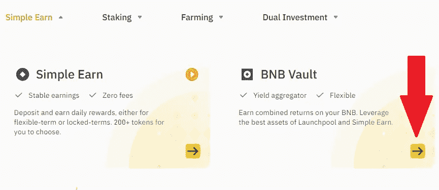

通过 BNB 金库，用户可以在未使用的 BNB 上获得奖励。一旦进入 BNB 金库页面，如果你的现货钱包里有一些 BNB，你只需点击赌注。

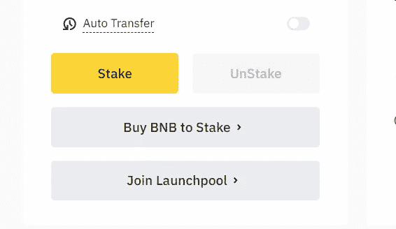

3.要访问 Eth 2.0 定位，在币安挣主页上，选择“*定位*”，点击第一个选项，“ETH 2.0”定位。

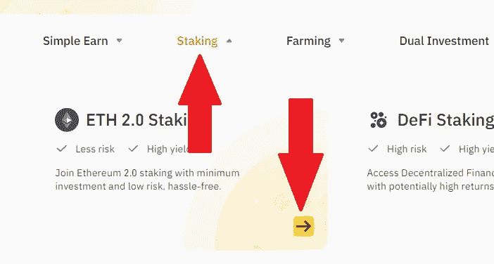

通过 Eth 2.0 staking，用户可以在以太坊上下注，并因支持 Eth 2.0 网络升级而获得奖励。一旦您点击“ *stake now* ”，您将简单地启动 Eth 2.0 的锁定过程。

你的现货钱包里至少要有 0.0001 ETH。

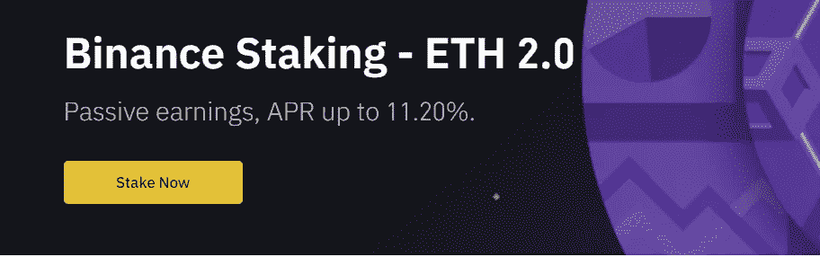

4.在币安主页上，选择“*定位*，选择“*定位*，即可进入定位。

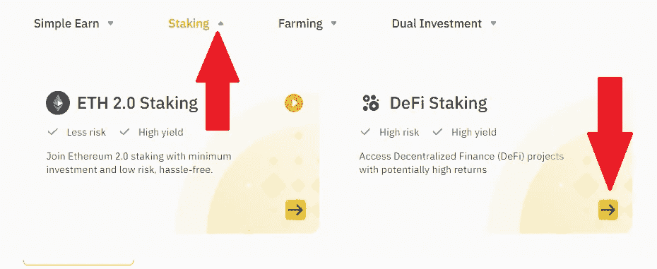

与 Defi 赌注用户可以赚取被动收入的赌注各种加密资产和开始产量农业。然而，请注意，这是一个高风险高回报的赌注。奖励可能高达 60%的 APY。

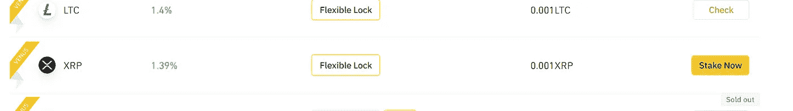

5.要访问流动性农业，请将鼠标悬停在币安赚主页上的“*农业*，然后选择“*流动性农业*”。

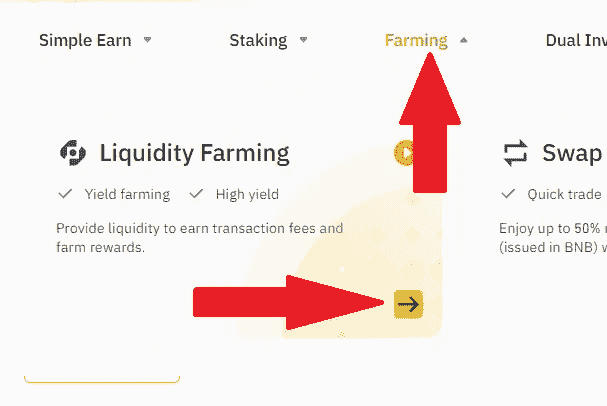

利用流动性农场，用户可以通过向流动性池添加稳定的硬币和法定货币来成为流动性提供者。然而，这样做的风险很高。

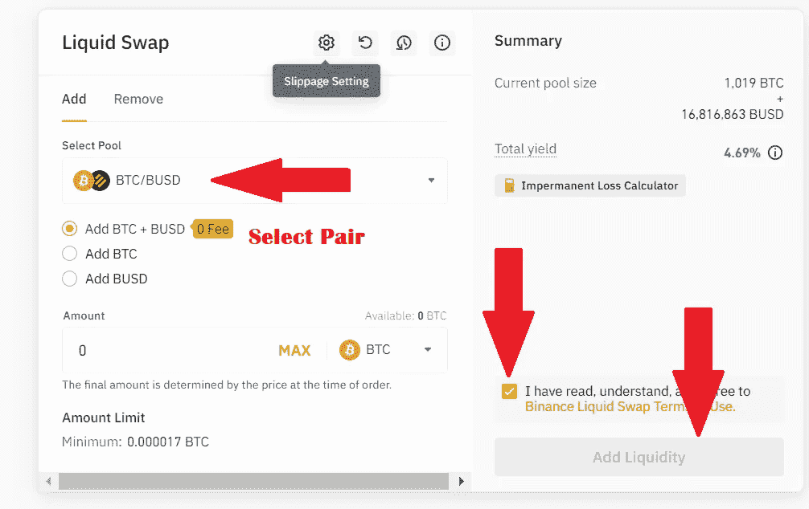

6.要访问发射池，请在币安收入主页上选择“*农业*”，然后选择第三个选项“*发射池*”。

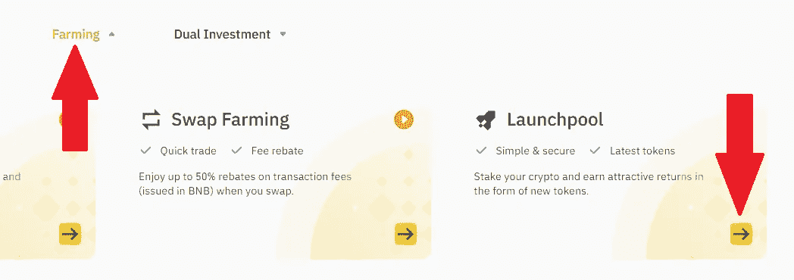

当用户在 Launch pool 上下注时，他们可以在最新的代币发布时拿到它们。它具有零风险水平和动态 APY。

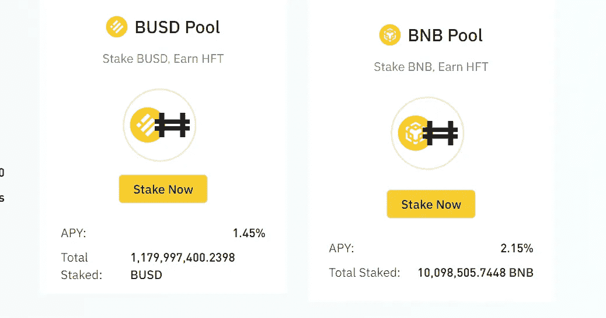

*您也可以在币安应用程序的币安赚取产品下使用这些功能。*

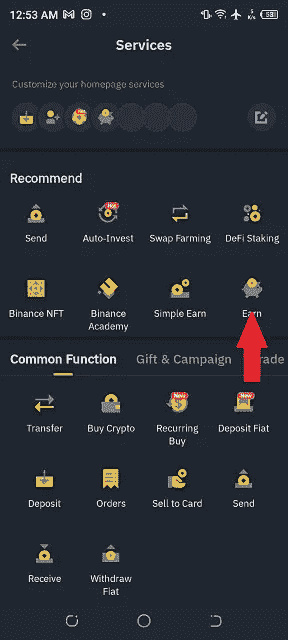

## 购买加密卡(币安)|如何在非洲购买加密卡

如果你是一个常驻非洲的人，习惯用币安 P2P 嗯，你也可以用你的信用卡在币安上购买一些密码。

你猜怎么着，只需要几秒钟。

1.  登录您的币安账户，导航至“*购买加密软件*”，点击“用卡购买”

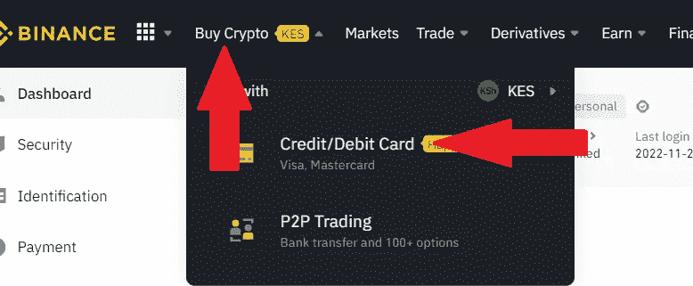

2.输入您打算花费的金额，并选择您想要购买的特定加密资产。

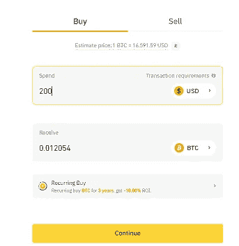

在下一页，您需要输入您的卡的详细信息，然后，您就可以完成交易了。

*你也可以在币安上用卡购买 crypto，而在币安 App 上。*

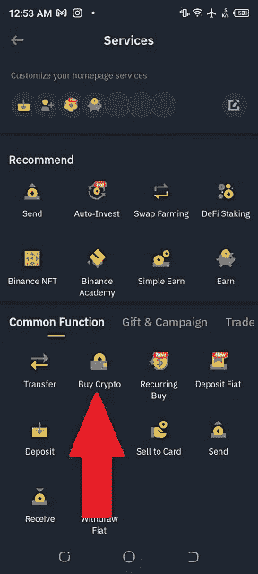

[***在这里开一个币安账户> >***](https://accounts.binance.com/en-IN/register?ref=431277160)

[***如果常驻东非，在这里加入币安东非电报组> >***](https://web.telegram.org/k/#@BinanceEastAfrica)

**免责声明**:本文仅用于教育目的，不应理解为投资建议。

***关联披露:*** *本帖可能包含关联链接* s。

> 交易新手？尝试[加密交易机器人](/coinmonks/crypto-trading-bot-c2ffce8acb2a)或[复制交易](/coinmonks/top-10-crypto-copy-trading-platforms-for-beginners-d0c37c7d698c)