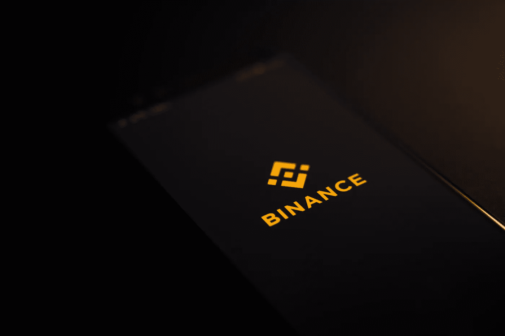

# 币安已经同意支付 10 亿美元收购破产的加密货币交易所 Voyager Digital 的资产

> 原文：<https://medium.com/coinmonks/binance-has-agreed-to-pay-1-billion-to-acquire-the-assets-of-bankrupt-cryptocurrency-exchange-847548c4eee?source=collection_archive---------16----------------------->

Source photo [black and white lenovo laptop photo — Free Crypto Image on Unsplash](https://unsplash.com/photos/_92BitC3QEU)

币安周一发布的一份新闻声明显示，其美国子公司已达成协议，以 10 亿美元收购已倒闭的加密货币初创公司 Voyager Digital。

航海家数码宣布，在考虑了一些战略选择后，它决定…