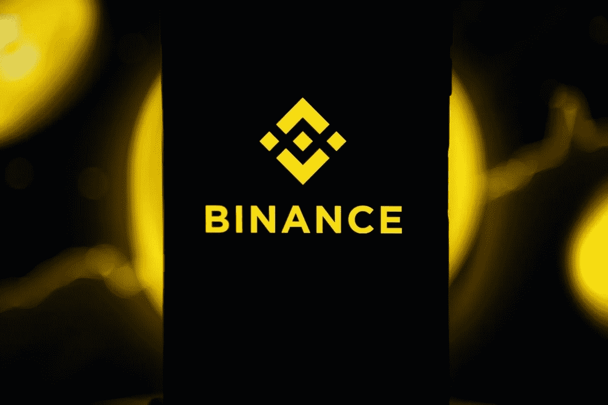

# 赵昌鹏表示，币安可能会在年底前花费 10 亿美元进行收购

> 原文：<https://medium.com/coinmonks/binance-may-spend-1-billion-on-acquisitions-by-the-end-of-the-year-says-changpeng-zhao-61b41f5f32e?source=collection_archive---------17----------------------->

币安杰出的首席执行官赵昌鹏表示，到今年年底，该交易所可能会支付超过 10 亿美元的各种投资和收购。他还希望将公司的光环扩大到分散金融(DeFi)、不可替代代币(NFT)、游戏和在线交易。

# 币安不知道…