# 币安 P2P 2022 新手终极移动指南

> 原文：<https://medium.com/coinmonks/binance-p2p-2022-ultimate-mobile-guide-for-beginners-cbdec98c2114?source=collection_archive---------5----------------------->

> P2P 市场使得用户可以使用他们喜欢的支付方式和当地货币直接交易密码

与加密交易所一样，像币安 P2P 这样的点对点市场也是加密持有者和交易者买卖比特币、以太坊、BNB 等加密货币的另一种方式。P2P 市场使得用户可以使用他们喜欢的支付方式和当地货币直接交易密码。对许多人来说，这是购买 crypto 的最好方法。在这篇文章中，我们将看看为什么币安 p2p 从所有其他 P2P 市场中脱颖而出，成为进行加密交易的最佳场所。

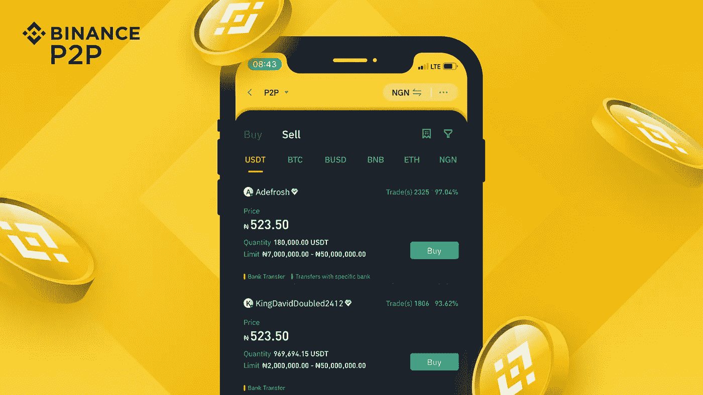

SOURCE: [Binance Blog](https://www.binance.com/en/blog/p2p/10-reasons-why-p2p-is-the-best-way-to-buy-local-bitcoin-in-your-currency-421499824684903068)

# 什么是币安 P2P？

币安 P2P 是一个支持使用当地货币进行比特币等加密货币点对点交易的市场。本质上，P2P 代表点对点，作为一种交易形式，它涉及与其他加密持有者的直接联系，以便在不使用传统加密交易所中的图表和订单的情况下交换资产。如今，币安 P2P 是最受欢迎的 P2P 市场之一，该平台拥有大量用户，日交易量高达 5400 万美元。

该平台拥有许多出色的功能，如零费用的广告帖子，允许用户回顾他们的体验的评论功能，还支持喜欢的人进行面对面交易。在币安 P2P 上交易有很多好处。现在，让我们进入币安 P2P 的这些优势，这些优势使该平台成为新手买卖比特币和其他加密货币的最佳方式。

# 为什么 P2P 是新手用本国货币购买比特币的最佳方式

## 实时贸易聊天

币安 P2P 的实时交易聊天功能旨在帮助解决潜在的交易问题，允许交易对手之间直接沟通。使用此功能，您可以与您的交易对手沟通，以澄清付款要求，跟进延迟的交易，甚至只是了解您的交易对象。

## 零费用

币安 P2P 的所有交易都是零费用，你可以得到你所支付的。虽然传统的加密交易所通常会从所有加密交易中收取少量中介费用，但币安 P2P 允许你免费买卖加密货币。

## 多种支付方式

币安 P2P 提供一系列交易支付方式。币安 P2P 平台通过全球 300 多个支付渠道为、瑞士联邦理工学院、、、戴和提供 P2P 加密交换交易，支持 70 多种当地货币。

## 客户支持

使用币安 P2P 时遇到的任何问题都可以通过寻求币安客户支持团队的帮助来解决，他们将通过电子邮件与您联系。如果您与您的 P2P 交易对手有问题，专门的客户支持团队将介入调解双方并解决问题。

## 托管服务

虽然 P2P 交易有其好处，例如它比传统的加密交易更方便，但它也有自己的风险，特别是因为它涉及直接与其他用户进行交易。鉴于这些风险，币安 P2P 提供托管服务，以确保平台上的安全和公平交易。平台暂时持有卖家的加密货币，等待双方确认交易成功。

> 交易新手？试试[加密交易机器人](/coinmonks/crypto-trading-bot-c2ffce8acb2a)或者[复制交易](/coinmonks/top-10-crypto-copy-trading-platforms-for-beginners-d0c37c7d698c)

# 如何在币安 P2P 上买卖加密货币

在你进入币安 p2p 的买卖之前，你需要完成身份验证程序(KYC:了解你的客户)。这是为了给平台上的交易提供一个安全层。此外，还有一个对潜在 P2P 商家的筛选过程，目的是核实他们的身份和业务。这也有助于使平台尽可能安全。一旦你做到了这一点，下一件事就是设置你的支付方式。为此，请遵循以下步骤:

在币安应用程序的主页上，点击屏幕左上角的用户图标，完成身份验证。然后点击**【支付方式】**，完成短信认证并设置您的支付方式。

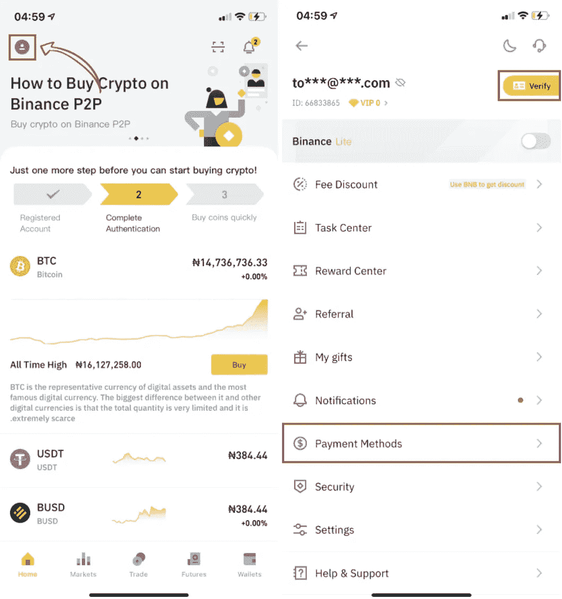

SOURCE: [Binance Support](https://www.binance.com/en/support/faq/360039384951)

# 如何购买

## 第一步

你需要做的第一件事就是进入主页，点击**【P2P 交易】**。(1)进入 P2P 页面后，点击**【购买】**标签。(2)选择您想要购买的加密软件(例如下图中的 USDT)。(3)从可用选项中选择您喜欢的广告后，点击**【购买】**。

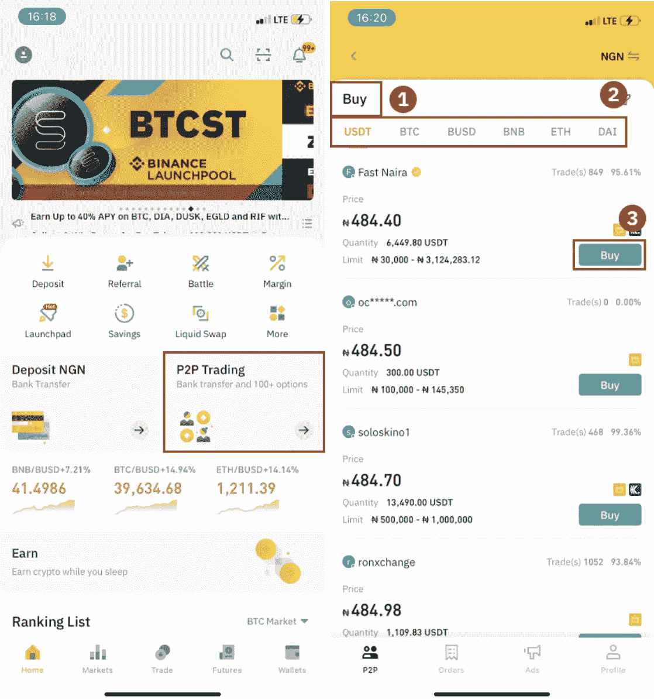

SOURCE: [Binance Support](https://www.binance.com/en/support/faq/360039384951)

## 第二步

输入你想购买的密码数量。接下来，确认卖家的付款方式，并点击**【购买 USDT】**。

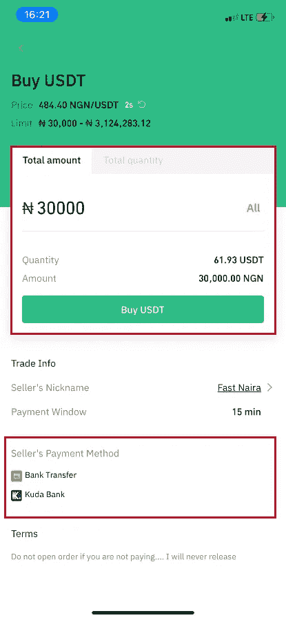

SOURCE: [Binance Support](https://www.binance.com/en/support/faq/360039384951)

## 第三步

使用卖家提供的付款信息，在规定的期限内将款项转账给卖家，然后点击**【转账】**。接下来，点击您进行转账的付款方式，然后点击**【已转账，下一步】**。

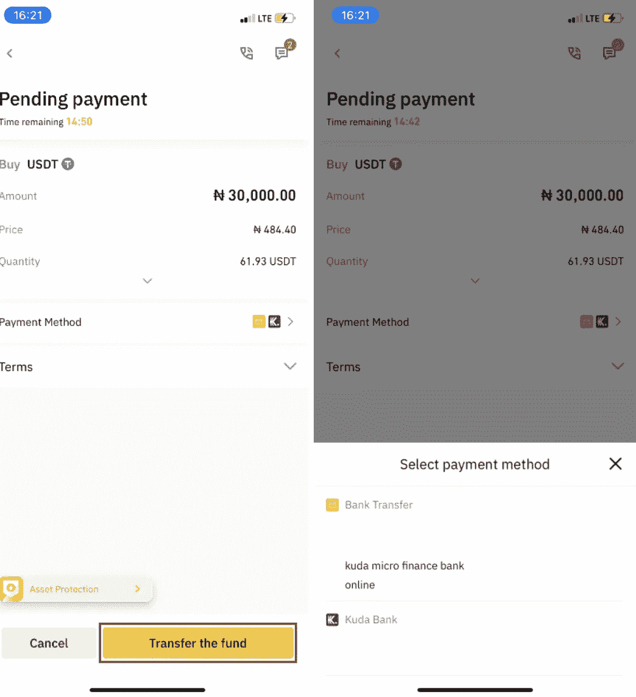

SOURCE: [Binance Support](https://www.binance.com/en/support/faq/360039384951)

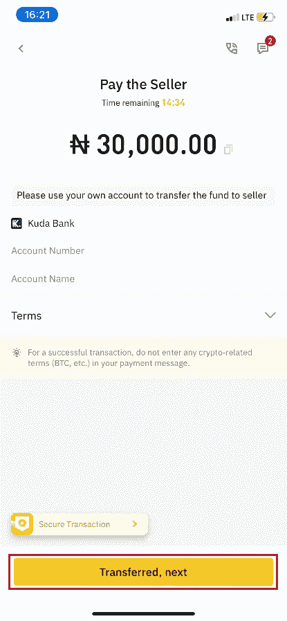

SOURCE: [Binance Support](https://www.binance.com/en/support/faq/360039384951)

*请注意，您在币安上设置了付款方式，并不意味着您点击* ***【转账，下一步】*** *付款就会自动进入卖家账户。相反，你需要自己付款，通过银行转账或根据卖家提供的付款信息通过另一个第三方支付平台将资金直接转给卖家。请不要点击* ***【已转移，下一步】*** *，否则将违反*[*P2P 用户交易政策*](https://www.binance.com/ng/support/faq/360041066751) *。*

## 第四步

此时，交易状态将为**“释放”**，一旦卖家看到付款并释放加密货币，交易就完成了。

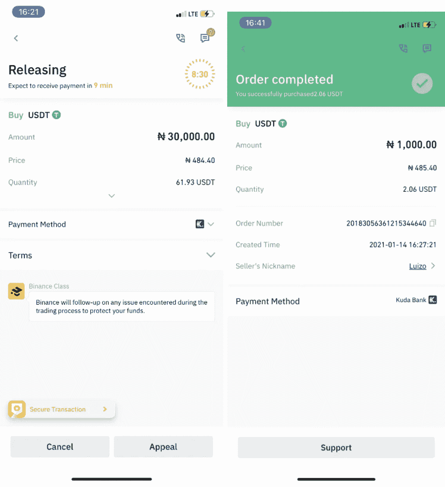

SOURCE: [Binance Support](https://www.binance.com/en/support/faq/360039384951)

*但在点击* ***【已转账，下一步】****15 分钟内没有收到加密货币的情况下，可以通过点击顶部的电话或聊天图标联系卖家。或者，您可以点击* ***【上诉】*** *，选择您的上诉理由，然后上传证明。币安客户支持团队将协助您处理订单。*

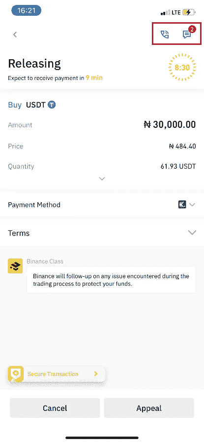

SOURCE: [Binance Support](https://www.binance.com/en/support/faq/360039384951)

# 如何销售

## 第一步

(1)转到**【钱包】**标签。(2)打开钱包选项卡后，打开**【资助】**选项卡。(3) **【转移】**你要卖给你资金钱包的加密。

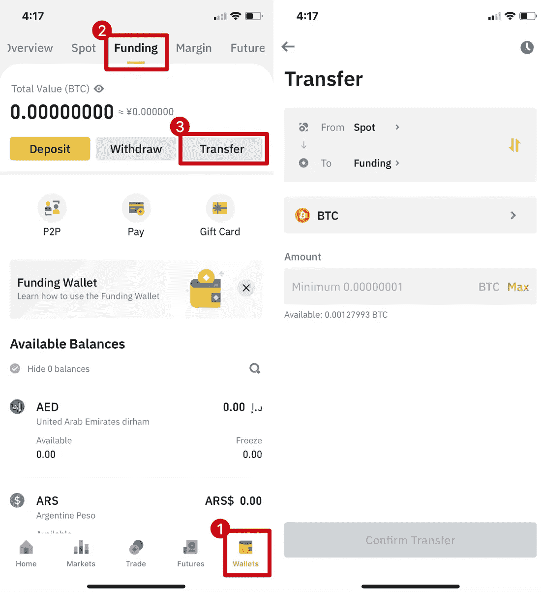

SOURCE: [Binance Support](https://www.binance.com/en/support/faq/360039385091)

## 第二步

一旦你的密码进入资金钱包，进入主页，选择**【P2P 交易】**进入交易页面。在交易页面顶部，点击**【卖出】**，选择一枚硬币。浏览可用广告并选择您喜欢的商家，然后点击**【出售】**按钮。

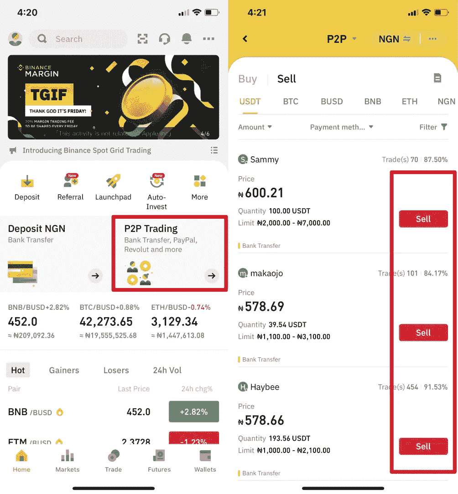

SOURCE: [Binance Support](https://www.binance.com/en/support/faq/360039385091)

## 第三步

(1)输入你想出售的数量。(2)选择您的首选付款方式。(3)点击**【卖出 USDT】**下单。

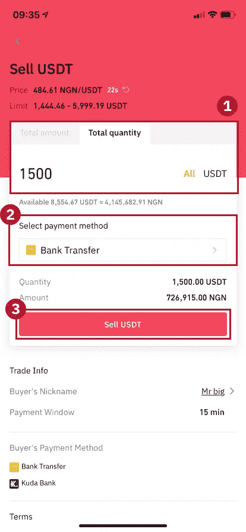

SOURCE: [Binance Support](https://www.binance.com/en/support/faq/360039385091)

## 第四步

此时，交易状态将为**“待付款”**。买家付款后，交易会显示**【确认收货】**。但是，在点击**【确认收到】**按钮之前，请确保您已经实际收到付款，以避免任何财务损失。确认收到付款后，点击**【付款已收到】**，然后点击**【确认】**释放加密。

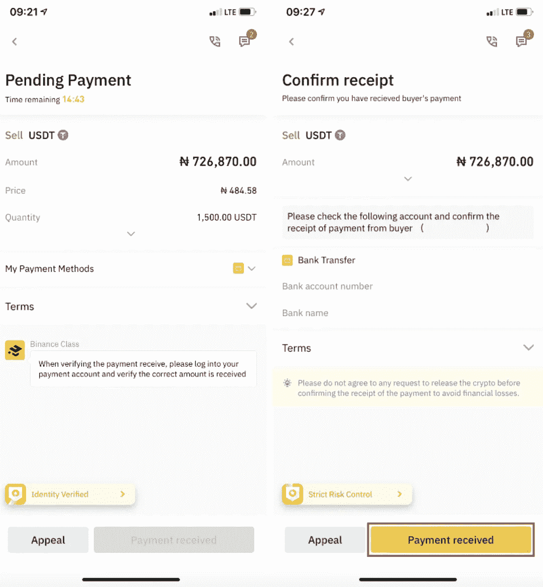

SOURCE: [Binance Support](https://www.binance.com/en/support/faq/360039385091)

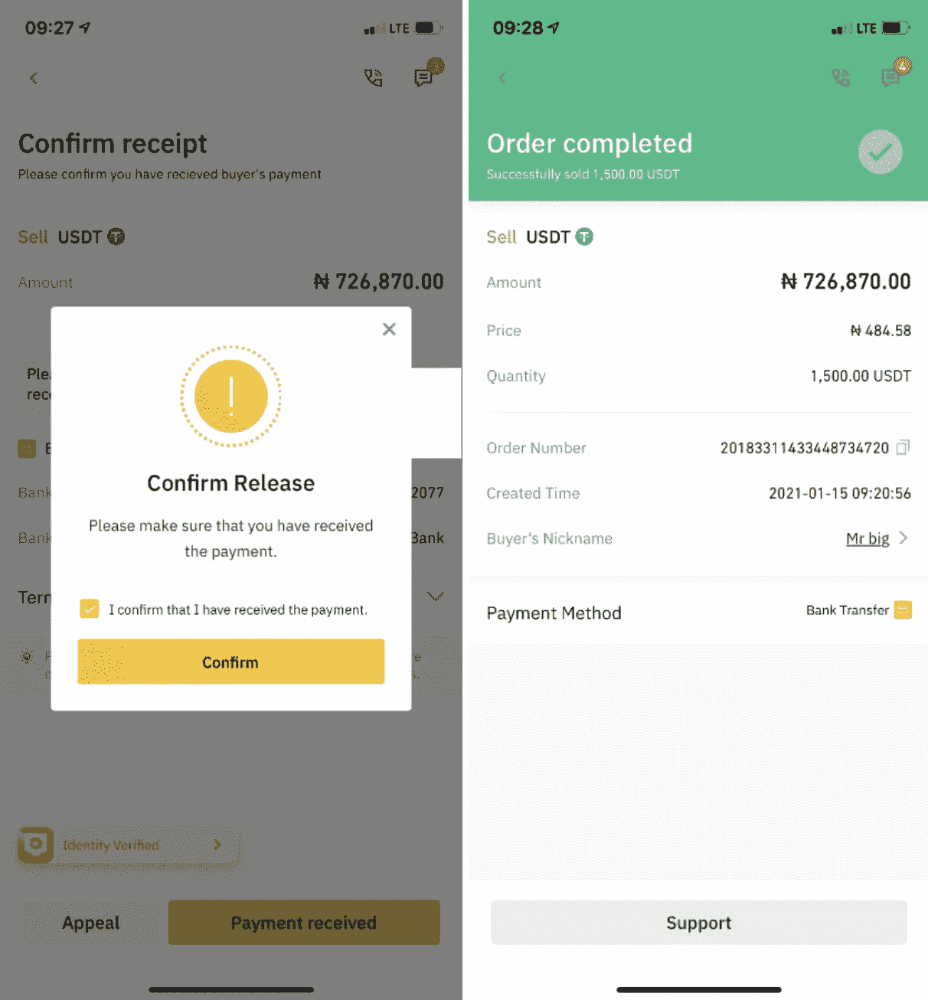

SOURCE: [Binance Support](https://www.binance.com/en/support/faq/360039385091)

*如果您在交易过程中有任何问题，您可以使用聊天功能联系您的交易对手。或者，您可以点击* ***【上诉】*** *，获得币安客服团队的协助。*

不言而喻，币安 P2P 平台是目前加密领域最好的 P2P 市场。然而，为了能够访问币安 P2P 平台并进行第一笔交易，你需要在币安上注册。*如果你还没有一个币安账户，你可以通过以下链接来开一个:*[*https://accounts.binance.me/en/register?ref=YA35VD1V*](https://accounts.binance.me/en/register?ref=YA35VD1V)

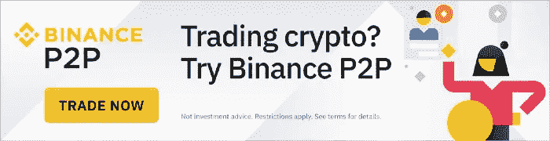

一旦您开立账户并完成 kyc，只需按照上述步骤进行第一笔交易。*那么你还在等什么？今天开始使用币安 P2P:*[*https://p2p.binance.com/*](https://p2p.binance.com/?ref=HXO5UJ01)[*？ref = ya 35 vd1 v*](https://accounts.binance.me/en/register?ref=YA35VD1V)

# 参考

 [## 为什么 P2P 是用你的货币购买本地比特币的最佳方式的 10 个理由|币安博客

### 加密交易所并不是购买比特币和其他加密货币的唯一途径。了解为什么点对点市场…

www.binance.com](https://www.binance.com/en/blog/p2p/10-reasons-why-p2p-is-the-best-way-to-buy-local-bitcoin-in-your-currency-421499824684903068)  [## 如何在币安 P2P (App)上购买加密货币？币安

### 点击视频，了解如何在币安 P2P 上购买加密货币，或者查看下面的详细指南，开始您的…

www.binance.com](https://www.binance.com/en/support/faq/360039384951)  [## 如何在币安 P2P (App)上销售加密货币？币安

### 在币安 P2P 平台上销售加密货币，即时且安全！查看下面的指南，进行您的第一次…

www.binance.com](https://www.binance.com/en/support/faq/360039385091) 

> 加入 Coinmonks [电报频道](https://t.me/coincodecap)和 [Youtube 频道](https://www.youtube.com/c/coinmonks/videos)了解加密交易和投资

# 另外，阅读

*   [币安期货交易](https://coincodecap.com/binance-futures-trading)|[3 commas vs Mudrex vs eToro](https://coincodecap.com/mudrex-3commas-etoro)
*   [如何购买 Monero](https://coincodecap.com/buy-monero) | [IDEX 评论](https://coincodecap.com/idex-review) | [BitKan 交易机器人](https://coincodecap.com/bitkan-trading-bot)
*   [CoinDCX 评论](/coinmonks/coindcx-review-8444db3621a2) | [加密保证金交易交易所](https://coincodecap.com/crypto-margin-trading-exchanges)
*   [红狗赌场评论](https://coincodecap.com/red-dog-casino-review) | [Swyftx 评论](https://coincodecap.com/swyftx-review) | [CoinGate 评论](https://coincodecap.com/coingate-review)
*   [Bookmap 评论](https://coincodecap.com/bookmap-review-2021-best-trading-software) | [美国 5 大最佳加密交易所](https://coincodecap.com/crypto-exchange-usa)
*   [如何在 FTX 交易所交易期货](https://coincodecap.com/ftx-futures-trading) | [OKEx vs 币安](https://coincodecap.com/okex-vs-binance)