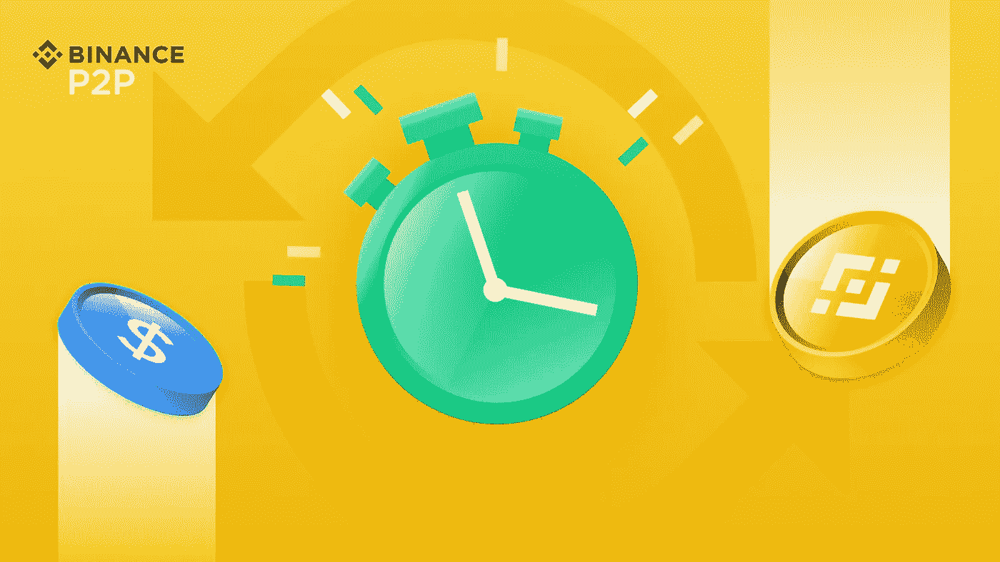

# 币安 P2P 快递:如何保护自己

> 原文：<https://medium.com/coinmonks/binance-p2p-express-how-to-protect-yourself-7f9ea8d3adfc?source=collection_archive---------25----------------------->

币安的 P2P 平台允许你用当地货币以 0 手续费购买比特币和其他加密货币。在币安 P2P 上，你可以自由选择交易的首选对手和支付方式，加密资产由币安托管。使用币安 P2P 快速模式，用户可以通过输入固定或加密金额和首选支付方式直接下单。订单根据 P2P 市场上的最佳加密价格进行匹配。

如果你是 P2P 交易的新手，请阅读这些提示，了解为什么 P2P 需要意识和防范，然后再采取具体行动来对付骗子。

技巧 1:在 KYC 中使用可信平台

了解你的客户(KYC)

所有币安 P2P 交易者必须完成基本的身份验证，这大大降低了使用假账户或盗用身份进行交易的风险。

提示 2:为你的 P2P 账户使用唯一的电子邮件和密码

创建一个新的电子邮件地址只需要几分钟，许多电子邮件提供商会免费提供给你——Gmail、Protonmail 或 Outlook 等等。

要创建和存储唯一且安全的密码，您可以使用免费的密码管理器，如 LastPass、Bitwarden 或 Dashlane。

确保他们的安全。

提示 3:不要分享你的敏感数据

窃取他人资金的最简单方法是获取他们的登录信息。如果账户所有者愿意与黑客分享这些细节，那就更容易了。

不要与交易对手分享您的登录信息，也不要向任何人提供您的密码。甚至没有给客户支持。

币安客户支持绝不会询问您的密码

提示 4:不要在 P2P 平台之外交易

交易对手可能会要求您在交易平台之外继续交易。他们会辩解说，这样，你们双方都可以节省费用(币安 P2P 是零费用)，但大多数情况下，这只是骗子试图引诱你远离币安 P2P 的安全性。

一旦您开始与币安 P2P 之外的交易对手进行沟通，币安将无法保护您或帮助您解决因这种沟通而可能产生的任何问题。

> 交易新手？试试[加密交易机器人](/coinmonks/crypto-trading-bot-c2ffce8acb2a)或者[复制交易](/coinmonks/top-10-crypto-copy-trading-platforms-for-beginners-d0c37c7d698c)

提示 5:与经过验证的商家交易

如果你是新手，我们建议你在币安 P2P 上与经过认证的商家交易，你可以通过他们的黄色徽章快速识别他们

提示 6:如果你认为交易对手是骗子，就取消交易

我们还建议您阅读币安用户交易政策。我们知道法律信息不是最容易阅读的东西，但这是关于你的钱，你需要了解 P2P 交易的权利和责任。

提示 7:确保商家信息相符

一定要仔细检查和你交易的人和你汇款的人是否有相同的 ID。我们要求商户使用的支付方式上的账户持有人姓名与商户在币安上的真实姓名(KYC 姓名)相同。

最重要的是，在完成交易前一定要确认付款。

点击这里关注我们了解更多故事[。](http://t.me/etellworld)