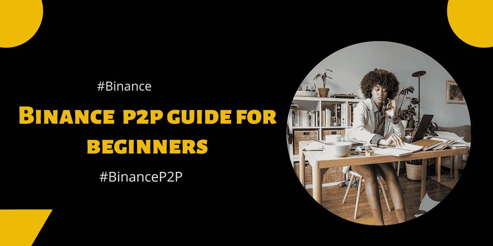
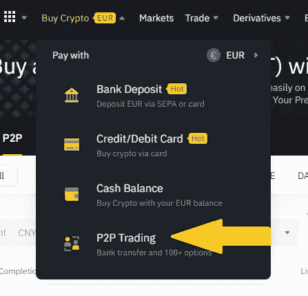
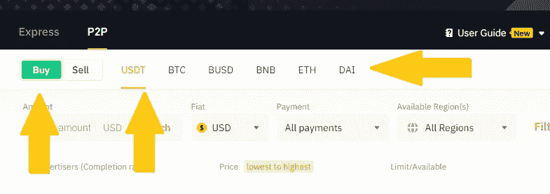
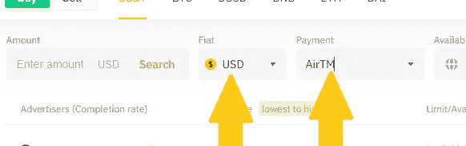
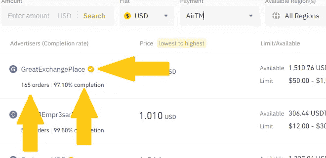
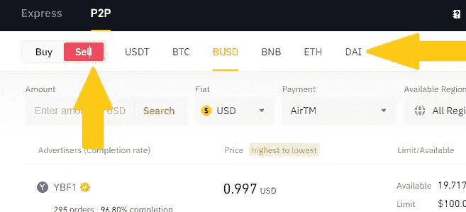
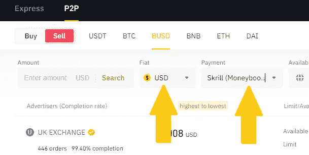

# 币安 P2P 初学者指南

> 原文：<https://medium.com/coinmonks/binance-p2p-guide-for-beginners-c02dbd75deb2?source=collection_archive---------51----------------------->

币安 P2P 是币安的一个平台，让用户能够使用他们喜欢的支付方式和当地货币在点对点模式下进行加密交易。

世界上不同的地区有他们想要的支付方式。币安 P2P 的出现是为了满足不同人群的支付需求和特点。

如果你只是一个币安的初学者，想用你的当地货币购买一些 BTC，币安 P2P 肯定会有神奇的效果。

***以下是币安 P2P 将成为你获得最大、最分散的数字货币之一(比特币)的最佳平台的一些原因:***

1.  ***实时交易聊天***——实时交易聊天功能打破了买卖双方在交易时的障碍。此外，您可以与供应商解决任何交易问题。
2.  *——虽然听起来好得令人难以置信，但交易币安 P2P 是零费用的。因此，这是一个终极平台，让你开始他们的加密交易之旅。*
3.  ****多种支付方式***——加密交易所提供的支付方式总是有限的，尤其是对来自第三世界国家的人。币安 P2P 平台目前有 300 多种支付方式和 70 多种当地货币。这一因素确保了币安 P2P 迎合全球观众。*
4.  ****客户支持***——与交易对手交易时，遇到问题也不必担心；因为币安 P2P 有活跃的客户支持。币安支持团队将迅速解决您的问题，并为您在币安 P2P 的交易努力提供指导。*
5.  ****托管服务***——币安 P2P 充当中间人，确保交易安全公平。因此，用户几乎不可能遇到骗局。这是币安 P2P 在安全和保护数字资产方面的核心功能之一。*

## *如何在币安 P2P 上买卖密码*

****在币安 P2P 上购买密码****

1.  *为了导航到 P2P，点击“*购买密码*”下的“ *P2P 交易*”。*

**

*2.一旦进入 P2P 交易页面，确保“*购买*”按钮处于活动状态，然后选择您想要购买的特定密码。*

**

*3.在 fiat 下，继续选择您的当地货币并选择付款方式。*

**

*4.在出现的结果上，建议你找一个经过验证且完成率高的 p2p 交易者。*

**

*5.在确定你理想的 P2P 交易者后，开始启动交易并完成支付。您的加密资产将被存入您的帐户。*

****在币安 P2P 上卖密码****

1.  *要在币安 P2P 上出售您的数字资产，请点击“*出售*按钮。继续，然后选择您打算出售的特定加密资产。*

**

*2.选择特定的法定货币并选择支付方式。*

**

*3.根据完成率和完成的订单选择你想要的 P2P 交易者。*

****NB:*** *如果您的加密资产在现货钱包中，您需要将它们转移到您的资金钱包中才能出售。**

*[***今日币安 P2P 入门> >***](https://p2p.binance.com/en/trade/all-payments/USDT?fiat=USD?ref=431277160)*

*[***打开你的币安账户> >***](https://accounts.binance.com/en/register?ref=431277160)*

****关联披露:*** *本帖包含关联链接。如果您使用这些链接购买一些东西，我们可能会赚取佣金，对您没有额外的费用。感谢*。*

> *交易新手？尝试[加密交易机器人](/coinmonks/crypto-trading-bot-c2ffce8acb2a)或[复制交易](/coinmonks/top-10-crypto-copy-trading-platforms-for-beginners-d0c37c7d698c)*