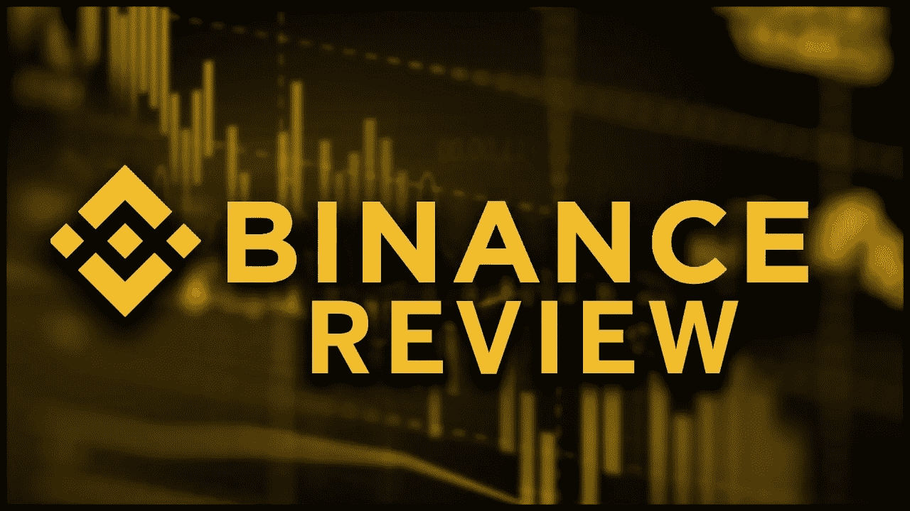

# 2022 年币安评论

> 原文：<https://medium.com/coinmonks/binance-review-for-2022-3918c08bcc61?source=collection_archive---------39----------------------->

币安[加密货币交易所](https://36crypto.com/crypto-exchanges/)的内部审查。

鉴于币安在交易和电子货币领域相对较新，它是一个非常受欢迎的加密货币交易所。

它可能不是最容易理解的，尤其是对新手来说，但是它确实提供了很好的特性。它指导新来者直到他们掌握它。

币安是目前世界上最受欢迎的加密货币交易门户，也是加密货币日交易量最大的地方。

当你试图在平台上交易或兑换货币时，很容易找到解决方案，也许正如一些人所说，因为当你使用一个受欢迎的平台时，你可以在每个角落找到帮手，无论是内部还是外部。

币安于 2017 年 7 月由 44 岁的开发者和软件爱好者赵昌鹏创立。就在他阅读了[比特币](https://36crypto.com/bitcoin/)白皮书并想象出它将如何改变世界，包括人们如何用钱交易之后，他加入了他们的游行队伍，在[区块链科技](https://www.36crypto.com/blockchain/blockchain-definition-what-is-blockchain-technology-and-how-does-it-work/)上为自己开辟了一个空间，并在这个过程中创造了一种硬币和一个交易所。

币安交易所的网站和应用程序可能很容易导航，但这绝不意味着使用简单，尤其是对从未使用过交易所平台的人来说。

(懂了吗？币安很容易使用，但对于那些对易用性的定义超越了无缝导航到语言的简单明了和功能的较小融合的人来说，它可能是一种痛苦。

因此，我们为您呈现一些**币安最突出的特色:**

*   不可替换令牌
*   币安赚取(持有您的加密货币，开始赚取)
*   币安支付(通过加密支付实现更无缝的商业交易)
*   币安市场(通过加密支付扩大业务范围)
*   移动应用
*   高级数据加密
*   保障用户资产资金安全
*   个性化访问控制
*   全天候聊天支持

下面是交易商和加密货币持有者使用币安进行交易的一些**原因:**

*   币安交易所托管了超过 370 种加密货币
*   币安有超过 9000 万注册用户
*   令人印象深刻的一系列市场图表
*   大量交易选项，包括期货和其他订单类型
*   低至 0.10%的服务费(我们知道没有比这更低的交易费用。大多数顶级交易所收取约 0.25%的交易费)
*   闪存级别的速度、安全性和用户保护
*   技术匠心等。

尽管如此，令人印象深刻的选项和功能文件并非在所有使用币安的国家都可用(事实上，币安目前正在美国接受调查)。此外，目前在币安上市的 370 多种加密货币中，只有 65 多种目前可以在美国使用。一些币安交易期权和订单类型在美国也是不允许的

> 交易新手？试试[加密交易机器人](/coinmonks/crypto-trading-bot-c2ffce8acb2a)或者[复制交易](/coinmonks/top-10-crypto-copy-trading-platforms-for-beginners-d0c37c7d698c)

**利弊**

像所有其他的交易平台一样，币安有它的优点(优势，正面)和缺点(劣势，负面)。以下是最引人注目的几个:

**上升**

1.  **优质的硬币阵容:**币安不仅为您提供超过 370 种加密货币和代币选项，还汇集了一些最好的。币安似乎在追求客户兴趣和大众需求，因此有许多高质量的交易和购买选择。
2.  **交易手续费低:**币安服务费低至 0.10%。我们不知道有什么收费更低的交流平台。大多数顶级交易所收取约 0.25%的交易费。
3.  **一连串的交易选项、功能和订单类型:**在上面提到的大量功能中，币安用令人生畏的交易选项和订单类型包围着你:点对点交易、现货交易和保证金交易。提供的一些订单类型有限价订单、限价止损订单、市价订单、跟踪止损订单、一个取消另一个订单、止损市价订单和仅事后订单。

**不利方面**

1.  **有限的美国版本:**由于监管原因，在超过 370 种上市的加密货币中，只有 65 种以上的加密货币可供美国客户使用，并且一些币安交易选项和订单类型也无法在美国使用
2.  **多功能问题:**币安有许多功能、交易选项和订单类型，可能最终会让交易者和硬币持有者感到困惑。他们有时被证明是势不可挡的，让人无法忍受。
3.  **缺少内置钱包:**顶级加密货币交易所通常都有内置虚拟钱包来存放临时货币。然而，币安没有。虽然它建议[信托钱包](https://trustwallet.com)，信托钱包是独立于币安，因此需要你在交换过程中处理两个独立的平台。
4.  **监管问题:**币安始于中国。自那以后，随着它的名声，它受到了来自不同国家的猛烈攻击，击退了一些投资者，剥夺了其他人的平台的绝对功能。

**判决结果**

根据我们对客户服务、客户满意度、跨数字平台的用户体验、账户访问和管理、服务质量、功能、导航便利性以及与其他交易所相比的评级的考虑，评估显示币安是有经验的投资者和交易者的首选。尽管如此，在支持币安之前，我们鼓励个人研究、发现和仔细审查各种选择。

***免责声明:*** *以上币安评论代表撰写该博文的投稿人的意见。我们不会把任何想法强加给你，也不打算定义你的经历。因此，我们建议，无论你对这篇博文做什么，无论你对作者的观点作何反应，都应该纯粹基于你自己的研究和个人信念——你对这些信息做什么完全是你自己的决定。*

最初发布于 [36crypto](https://36crypto.com/crypto-exchanges/binance-review-for-2022/)

> 加入 Coinmonks [电报频道](https://t.me/coincodecap)和 [Youtube 频道](https://www.youtube.com/c/coinmonks/videos)了解加密交易和投资

# 另外，阅读

*   [Bookmap 评论](https://coincodecap.com/bookmap-review-2021-best-trading-software) | [美国 5 大最佳加密交易所](https://coincodecap.com/crypto-exchange-usa)
*   [密码交易机器人](/coinmonks/crypto-trading-bot-c2ffce8acb2a) | [硬币门评论](https://coincodecap.com/coingate-review)
*   最佳加密[硬件钱包](/coinmonks/hardware-wallets-dfa1211730c6) | [Bitbns 评论](/coinmonks/bitbns-review-38256a07e161)
*   [新加坡十大最佳加密交易所](https://coincodecap.com/crypto-exchange-in-singapore) | [购买 AXS](https://coincodecap.com/buy-axs-token)
*   [红狗赌场评论](https://coincodecap.com/red-dog-casino-review) | [Swyftx 评论](https://coincodecap.com/swyftx-review)
*   [投资印度的最佳密码](https://coincodecap.com/best-crypto-to-invest-in-india-in-2021)|[WazirX P2P](https://coincodecap.com/wazirx-p2p)|[Hi Dollar Review](https://coincodecap.com/hi-dollar-review)