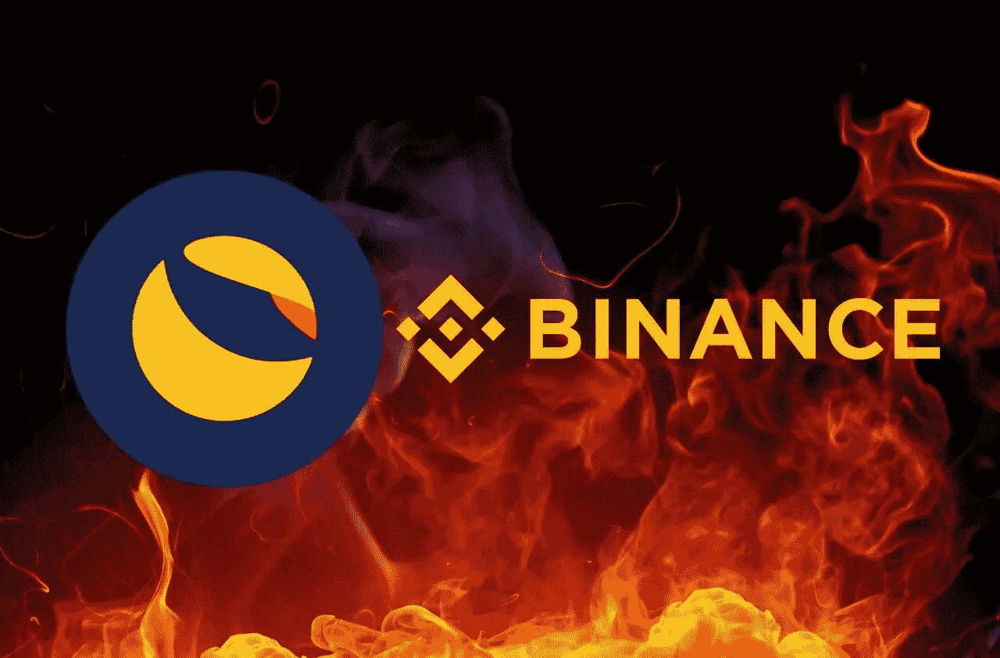

# 币安·洛克的《月神之舟》

> 原文：<https://medium.com/coinmonks/binance-rocks-the-boat-for-terra-luna-classic-lunc-3b797a52a6f3?source=collection_archive---------4----------------------->

币安对 Terra Luna Classic (LUNC)的这一出人意料的举动震动了市场，该公司昨日上午宣布，将在其交易所内“燃烧”LUNC 交易费用。

由[领先的加密货币交易所](https://bitnewsbot.com/best-trading-platform-for-cryptocurrency/)做出的决定得到了 [Terra Luna Classic](https://bitnewsbot.com/tag/lunc) 社区的极大满意，因为它认为此举能够为大幅减少目前流通的 LUNC 硬币数量做出决定性贡献。

之前,[币安](https://bitnewsbot.com/recommends/binance/)因其提出的最初提议而受到了 Terra Luna Classic 社区的大量批评，我们在之前的一期中讨论过该提议。

根据该交易所的官方声明，它在以下情况后改变了提议:

a)实施最初的提议需要时间，

Terra Luna Classic 社区的大多数人不喜欢原始提案，并且

c)该提议不会通过贸易商。

# 新提案陈述了什么

根据币安的新提议，它将不再收取 LUNC 和 USTC 的交易费，而是将它们转化为 LUNC 并“烧掉”以贡献给社区。

也就是说，交易者不必支付比目前更高的费用，但币安将失去这些收益，并“牺牲”它们来帮助减少 LUNC 硬币的数量。

币安将在周一至周一(一周)收取所有费用，将其转换为 LUNC 并“烧掉”。每周二，它将更新“消耗”的 LUNC 总量。

因此，第一次更新预计在一周后，下周二。在那里，人们将首次看到币安对税收流失的贡献有多大。

# 数学已经开始了

一听到这个提议，Terra Luna Classic 社区就开始了……数学计算，以得出币安每周“烧掉”的 LUNC 数量。

交易所对每笔交易收取 0.1%的费用，对 VIP 会员收取 0.01%的费用。这个百分比可能看起来很小，但是当你考虑到在币安交易所交易的数百万人时，你就会明白每周会有相当数量的 LUNC 被“烧掉”。

# 当前正在刻录多少个 LUNCs 以及前景

在实施 1.2%的燃油税的最初几天，每天“燃烧”约 350，000.000 伦琴。

到目前为止，已经“烧掉”了 6，378，647，394 伦克(不仅仅是烧税)，占硬币总数的 0.092402%。

毫无疑问，币安的决定预计将增加平均每天将退出流通的肺活量。它将到达什么点，以及其他交易所是否会遵循同样的道路，还有待观察。

提醒一下，Terra Luna Classic 社区的目标是将 LUNC 硬币的数量从原来的 7 万亿减少到 100 亿。

*原载于 2022 年 9 月 28 日*[*【https://bitnewsbot.com】*](https://bitnewsbot.com/binance-rocks-the-boat-for-terra-luna-classic-lunc/)*。*

> 交易新手？尝试[加密交易机器人](/coinmonks/crypto-trading-bot-c2ffce8acb2a)或[复制交易](/coinmonks/top-10-crypto-copy-trading-platforms-for-beginners-d0c37c7d698c)