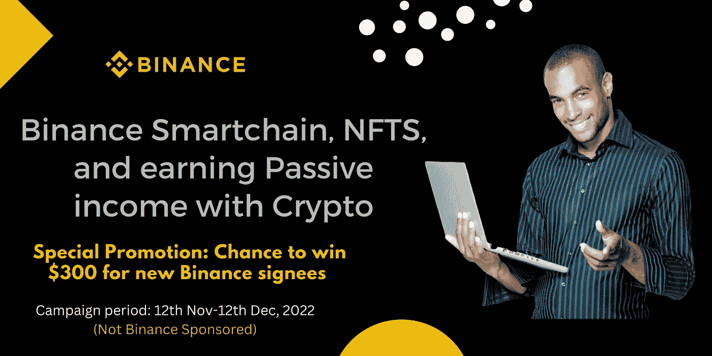

# 币安智能链、NFTs 以及如何通过加密获得被动收入

> 原文：<https://medium.com/coinmonks/binance-smart-chain-nfts-and-how-to-earn-passive-income-with-crypto-242ad274a24d?source=collection_archive---------38----------------------->

在加密的世界里，你必须不断学习。新的术语总是会出现，这取决于你是否能跟上潮流，否则你一定会失去机会。是啊！

尤其是如果你在非洲，这些“*发生的事情*很可能不会出现在你的社交媒体时间表中。

尽管非洲的加密技术正在兴起，但你还是想一头扎进“*”*。你想了解粉丝代币，元宇宙项目和这个空间里任何热门的 T4 项目。它会彻底改变你的生活。

*太多了？*

基础怎么样？

让我们谈谈币安智能链。

## **币安智能假人链**

为了全面了解币安智能链，我们必须“*沿着记忆的小路*，回到 2018 年。

那是 2018 年 4 月。币安决定推出自己的区块链，“*币安连锁*”。

*又有何不可；尽管币安仅仅存在了大约 10 个月，但它已经成为密码交易所的头条新闻。*

币安链背后的关键想法是创建一个高速区块链，能够支持大型交易。

他们使用“ *Tendermint 共识模型*”来实现即时终结，并且只关注其主要应用程序“*币安 Dex* ”。

另一方面，以太坊上的 Defi 正在蓬勃发展，而币安·德克斯几乎没有得到任何认可。

然而，币安链团队很快注意到，币安链的缺失因素是无法运行智能合同，并允许用户/团队部署他们的应用程序。

智能合约是用于自动交易的计算机程序/协议，存储在区块链上，在满足特定条件时运行。就是专家定义的“代码即法律”。

实际上，币安决定在 2020 年 9 月推出另一款名为“*币安智能链*”的区块链，而不是在币安链上添加“*智能合同*”功能。

币安智能链的形式是可编程的，并支持智能合同。

尽管如此，理解从零开始建立一个全新的智能合同需要大量的时间和研究是至关重要的。

因此，币安决定利用用户和开发者对以太坊和 fork *(一分为二)*以太坊的 *GETH* 。

然而，币安热衷于通过低费用和高交易量来优化自己的连锁店，因此比区块链以太坊更有优势。

*币安通过将以太坊的工作共识证明模型替换为利益相关者权威证明模型，放弃了网络的去中心化和审查抵抗特性，从而实现了这一点。*

这就是币安智能链条的由来。

## NFTs 及其优势

对大多数人来说，NFT 就像一个大笑话。

我的意思是，谁会把一堆"*猿图片*"当回事？它们是合理的，但从长远来看并不合理。为什么？因为 NFTs 的真正本质在于背后的技术。

这种“*技术*是采用 Web 3.0 的核心功能。

*什么技术？*

这种技术可以追踪每个 NFT 实体的所有权和交易历史，具有不可复制的代码和唯一 ID。

NFTs 展现了区块链技术中所有权、真实性和原创性的重要性。

[https://Twitter . com/cryptolord 254/status/1549710048112287747](https://twitter.com/cryptolord254/status/1549710048112287747)

**NFTs 的优势**

1.  **所有权** -所有权证明是区块链的关键要素之一。以及 NFT 不可分割的事实，在不同的所有者之间共享 NFT 实际上是不可能的。此外，真正的所有者感到安全和放心，不会担心假冒的复制品。

这在艺术界尤其有用。仅仅因为有人可以下载蒙娜丽莎的一些“T12”幻象，并不一定就给了他们所有权。

**2。真实性** -由于非功能性食物是在区块链上创造的，它们具有独特的特征，因此提供了一个“*价值*方面。正是这一特征确保了具有“*高度独特的*”特征的特定 NFT 的稀缺性，并因此增加了价值。

由于存储 NFT 的区块链具有不可改变的性质，您可以确信您的 NFT 不会失去真实性。不可能修改、删除或替换。

**3。可转让性** -这个因素在游戏产业中发挥作用。游戏玩家不断购买游戏中的资产，以利用他们的游戏体验。

然而，不可能在特定的游戏环境之外利用这些游戏中的资产。

通过 NFTs，游戏设计者和开发者可以以 NFTs 的形式发布这些游戏中的物品，玩家可以将它们放在他们的数字钱包中。

此外，可以在游戏环境之外使用资产，或者出售资产。随着智能合同的使用，所有权转移变得容易。

**4。建立经济机会-** 内容创作者(*大多是数字艺术家*)经常面临平台获取利润的挑战。有了 NFTs，它可以帮助 a 创造一个全新的创造者经济；创作者可以避免将所有权转移到他们用来宣传内容的平台上。

## 用密码赚取被动收入

使用 Crypto 的好处是你可以在 hoDLing 的时候获得一些被动收入。听起来绝对是一石二鸟。

那是因为它确实是。

虽然你的银行可能试图给你一点利息，但结果往往是一种嘲弄。

*年息 4%的情况下，你到底该怎么办？*

而赚取有保证的更高利益的最好地方之一，就是用[的**产品赚取**的](https://www.binance.com/en/earn?ref=431277160)产品。

币安非洲不仅仅是一个"*购买比特币*"的平台，你可以用你的加密组合做很多事情。

[**币安赚**](https://www.binance.com/en/earn?ref=431277160) 特色加密产品，会让你赚到一个体面的 APY，通常从 5%的 APY 甚至高达 102%的 APY。

你可以根据你的风险偏好选择你想要的产品。(*APY 高的产品风险高*)。

不过，大多数 [**币安赚**](https://www.binance.com/en/earn?ref=431277160) 产品都是无风险的。

## 为我的新币安签名者提供特别优惠

如果你还没有在币安开账户，现在正是最佳时机。我碰巧是币安的会员，如果你使用下面的链接注册币安，你就有机会赢得 300 美元 ***(不是币安赞助的，这是我的币安签名者的独家优惠)*** *。注册帐户后，请确保使用下面的链接填写表格中的详细信息。*

[***在这里开一个币安账户> >***](https://accounts.binance.com/en-IN/register?ref=431277160)

[***报名后在这里填写您的详细信息> >***](https://adsworld101.com/index.php/binance-300-promotion/)

[***以东非为基地？在这里加入币安东非电报集团> >***](https://web.telegram.org/k/#@BinanceEastAfrica)

**免责声明**:本文仅用于教育目的，不应被理解为投资建议。

***关联披露:*** *本帖可能包含关联链接* s。

> 交易新手？尝试[加密交易机器人](/coinmonks/crypto-trading-bot-c2ffce8acb2a)或[复制交易](/coinmonks/top-10-crypto-copy-trading-platforms-for-beginners-d0c37c7d698c)