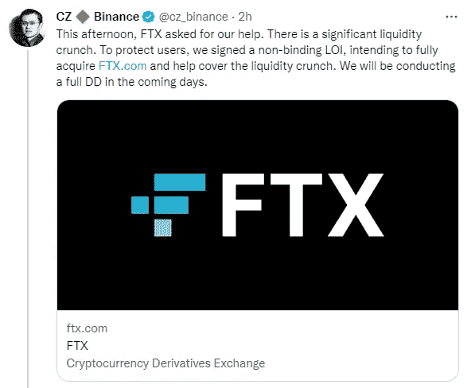

# 领先的加密交易所币安将收购苦苦挣扎的竞争对手 FTX。

> 原文：<https://medium.com/coinmonks/binance-the-leading-crypto-exchange-will-acquire-ftx-a-struggling-competitor-2c0412d776dc?source=collection_archive---------32----------------------->

Source photo [CZ 🔶 Binance (@cz_binance) / Twitter](https://twitter.com/cz_binance)

周二，Twitter 上宣布，全球最大的加密货币交易所币安已达成协议，收购陷入财务困境的竞争对手 FTX.com。

币安首席执行官赵昌鹏在推特上表示，该公司已经签署了一份非约束性意向书，“全面收购加密货币 FTX.com”